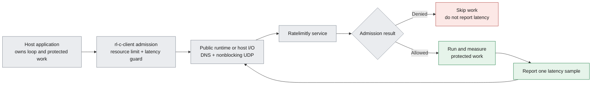

# Ratelimitly C Client

> **Prerequisites.** You can read C and understand basic sockets, DNS, and
> callback-driven event loops. Everything specific to Ratelimitly and this
> client is explained here.

## TL;DR

`rl-c-client` is a C11 library that lets a host application combine resource
rate limiting with latency-based admission, then report the protected work's
latency without surrendering ownership of its event loop, sockets, or timers.

## Architecture at a glance

The optional public runtime supplies the common UDP and DNS plumbing used by
the examples. Advanced embedders can instead provide the same I/O callbacks
directly to the core client.



## Choose the integration layer

The repository exposes three layers. Pick the lowest layer whose ownership
contract matches the host application; using the public runtime is optional.

| Layer | What it owns | What the host still owns |
| --- | --- | --- |
| Core client (`r_client.h` + `r_client_io.h`) | Packets, authentication, request policy, deadlines, and response selection | UDP I/O, DNS callbacks, timers, and logging |
| Admission workflow (`r_client_workflow.h`) | Coordination of one resource check plus one latency guard and the matching latency report | The core client's I/O plus protected-work timing and lifetime |
| Public runtime (`r_client_runtime.h`) | Core client, nonblocking IPv4/IPv6 UDP sockets, and synchronous DNS discovery | Readiness watchers, deadline callbacks, application work, and logging policy |

The normal asynchronous request API copies request inputs. The borrowed API
avoids those copies, so its input buffers must remain valid until callback or
cancellation. In both forms, copy any result data needed after the completion
callback returns; the request handle and result arrays expire with that
callback.

Proxy modules and other high-throughput embedders commonly choose the core and
borrowed APIs. The examples choose the workflow and public runtime so each
framework README can focus on its readiness, timer, and shutdown rules.

## Features

- Async rate-limit checks over UDP.
- Fire-and-forget latency reports for load-shedding feedback.
- API key credentials in Bech32 form: `rl-cookie...` or `rl-aes...`.
- Cookie and AES-256-GCM authentication using OpenSSL libcrypto.
- SRV discovery for `_ratelimitly._udp.<configured-dns-name>`, followed by A/AAAA
  resolution for returned SRV targets.
- Per-request deadlines, timeout/retry policy, quorum policy, and server
  response selection.
- Optional metrics labels.
- Optional steering feedback callback for source-port rebinding.
- Static and shared library builds.

This repository contains the public C API and integration contract. Applications
do not construct or parse Ratelimitly packets directly; the library owns packet
encoding, authentication, response parsing, retry policy, and server selection.
Integrators provide credentials, resource IDs, latency data, UDP I/O, DNS, and
timers through the APIs documented here.

## Build

Requirements:

- C11 compiler
- `make`
- OpenSSL development headers and libcrypto
- resolver and pthread libraries on POSIX systems

Build the static and shared libraries:

```sh
make
```

Outputs:

- `librclient.a`
- `librclient.so`

## Run the first combined example

The latency-tracker example is the smallest executable path that performs both
a resource rate-limit check and a latency guard, runs protected work only after
admission, and reports one measured latency sample:

```sh
make
make -C examples/latency_tracker
RATELIMITLY_AUTH_KEY=rl-aes1... \
  ./examples/latency_tracker/latency-tracker-example
```

For a credential-free deterministic run against the repository's synthetic
responder, execute:

```sh
bash tests/test_latency_tracker.sh
```

Build the perf client:

```sh
make perf_client
```

Run local tests:

```sh
make test
```

Build the optional deterministic protocol fixture used by downstream
integration tests:

```sh
make test-responder
```

Its test-support contract and deterministic scenarios are documented in
[docs/test-responder.md](docs/test-responder.md). The executable is not part of
the production library API and contains only synthetic credentials.

Clean generated files:

```sh
make clean
```

On macOS with Homebrew OpenSSL, the Makefile defaults `OPENSSL_PREFIX` to
`/opt/homebrew/opt/openssl@3`. Override it when needed:

```sh
OPENSSL_PREFIX=/custom/openssl make
```

## Public API

The public headers are:

- `include/r_client.h`
- `include/r_client_io.h`
- `include/r_client_workflow.h`
- `include/r_client_runtime.h`

Do not include files from `src/`; they are private implementation details.

Core operations:

- `r_client_create` / `r_client_destroy`
- `r_client_check_rate_limit_async`
- `r_client_check_rate_limit_async_borrowed`
- `r_client_report_latency`
- `r_client_on_datagram`
- `r_client_request_deadline_ms`
- `r_client_on_timeout`
- `r_client_cancel_request`
- `r_client_default_request_policy`
- `r_client_hash_id`
- `r_client_parse_auth_key`
- `r_client_admission_start` / `r_client_admission_report_latency`
- `r_runtime_client_init` / `r_runtime_client_on_readable`

See [docs/api.md](docs/api.md) for the API contract and
[IO_ABSTRACTION.md](IO_ABSTRACTION.md) for event-loop integration.

## Integration Examples

[examples/README.md](examples/README.md) contains buildable, commented
integrations using only public headers. Start with the example matching the
host application's ownership model:

- latency tracker: guard admission, protected-work timing, and reporting;
- event loops: libuv, libevent, GLib/GIO, libev, sd-event, kqueue,
  libdispatch, Win32, libhv, liburing, direct epoll, and raw io_uring;
- HTTP servers: Mongoose, CivetWeb, GNU libmicrohttpd, H2O, Lwan, libreactor,
  facil.io, Onion, Kore, and Ulfius; and
- parser only: llhttp fragmented input and pipelining backpressure.

Each source begins with numbered control flow and explicit ownership rules.
The integration guide adds dependency-specific build commands, run commands,
shutdown behavior, limitations, and production notes. Repository tests verify
the inventory, public-header boundary, and standalone latency workflow.

## API Key Credentials

Ratelimitly API key credentials are Bech32 strings:

- `rl-cookie...`: 32-byte cookie secret
- `rl-aes...`: 32-byte AES-256-GCM key

Use `rl-aes...` credentials for deployments that require packet
confidentiality and integrity over an untrusted network. Cookie mode is a
private-network mode: the cookie is sent on the wire and does not authenticate
the packet contents, so it must be used only where on-path modification and
capture are outside the deployment threat model.

The encoded key is the source of truth for the tenant key ID, authentication
type, and quota values. The default production tenant DNS name is
`c-<key-id>.p0.ratelimitly.com`, so normal configuration needs only the key:

```c
r_client_config_t cfg = {0};
cfg.tenant.auth.secret = auth_key;
```

Set `cfg.tenant.dns_name` only to override production discovery for a custom,
development, or staging DNS zone. Nonzero `cfg.tenant.key_id` and
`cfg.tenant.auth.type` values are optional assertions; when supplied, they
must match the encoded key. `r_client_parse_auth_key` remains available for
callers that want to inspect key metadata before creating a client.

`cfg.tenant.auth.secret` is the encoded Bech32 credential string, not raw
secret bytes. Leave `cfg.tenant.auth.secret_len` as `0` for a normal
null-terminated credential string, or set it to the encoded string length if
the credential is not null-terminated. The client decodes the raw 32-byte
cookie/AES material internally after validating the Bech32 credential.

Do not log `info.secret`; it contains raw credential material for cookie and
AES keys.

## Core event-loop model

The core client never waits on a socket and does not create threads. Host I/O
and resolver callbacks may complete synchronously, and the optional public
runtime performs synchronous DNS during initialization or refresh. A custom
core integration must:

1. Provide `r_io_ops_t` with UDP send, current time, optional logging, and
   optional steering feedback.
2. Provide `r_resolver_ops_t` for SRV and A/AAAA lookup.
3. Call `r_client_check_rate_limit_async` or the borrowed variant.
4. Schedule the deadline from `r_client_request_deadline_ms`.
5. Deliver UDP responses through `r_client_on_datagram`.
6. Call `r_client_on_timeout` when request timers fire.

Response replay protection is scoped to this request lifecycle: AES responses
must carry a matching authenticated `unique_id` for an in-flight request, and
datagrams for completed, timed-out, or canceled requests are ignored.

For integrations with request-scoped memory pools, use
`r_client_check_rate_limit_async_borrowed` when request buffers live until
callback completion.

## ID Hashing

Applications map their own strings to Ratelimitly IDs:

- bucket strings become `r_resource_request_t.bucket_id`
- service strings become `r_latency_guard_t.service_id`

Use `r_client_hash_id(input, out_id)` to produce the required 16-byte ID.

## Perf Client

The perf client is a standalone load generator and smoke-test tool.

Examples:

```sh
bin/perf_client --clients=50 --requests=10000 --auth=rl-aes1...
bin/perf_client --duration=60 --auth=rl-aes1...
bin/perf_client --srv=api-key.example.com --duration=30 --clients=50 --auth=rl-aes1...
RCLIENT_DNS_SERVER=127.0.0.1:5353 bin/perf_client --auth=rl-aes1...
bin/perf_client --attempt-timeout-ms=750 --retry-attempts=2 --retry-on=timeout --auth=rl-aes1...
```

Without `--srv`, the perf client derives
`c-<key-id>.p0.ratelimitly.com` from `--auth`, matching the library default.
Use `--srv` only for a custom, development, or staging DNS zone.

Retry-related flags:

- `--attempt-timeout-ms=<n>`
- `--retry-attempts=<n>`
- `--retry-on=timeout|quorum|inconsistent|never`
- `--retry-resend=all|missing`
- `--retry-total-timeout-ms=<n>`
- `--retry-refresh-dns`

## Glossary

| Term | Meaning |
| --- | --- |
| admission | The combined decision made before protected work starts. An admission may contain resource limits, latency guards, or both. |
| resource rate limit | A quota check for a named bucket, such as requests allowed per interval. |
| bucket | Stable resource identity whose configured quota is consumed by matching requests. |
| latency guard | A request to shed new work when the tracker's recent service latency reaches its configured threshold. |
| latency tracker | Server-side sample window identified by a service ID and configured by threshold, lifetime, sample count, and buffer size. |
| tenant | Isolated Ratelimitly account identified by metadata encoded in the API key. |
| host loop | The application's existing event loop; it owns readiness callbacks and timers around the client. |
| public runtime | Optional adapter that owns nonblocking UDP sockets and production DNS discovery while exposing readiness and deadlines to the host loop. |
| SRV | DNS service record that locates a service by returning target hostnames and ports. |
| AAAA | DNS address record that maps a hostname to an IPv6 address. |
| IPv4 | Internet Protocol version 4, the widely deployed 32-bit network address format. |
| IPv6 | Internet Protocol version 6, the modern network address format represented by an AAAA record. |
| Bech32 credential | Checksummed, human-readable key encoding used for `rl-cookie...` and `rl-aes...` credentials. |
| AES | Advanced Encryption Standard, the symmetric cipher used by `rl-aes...` credentials. |
| GCM | Galois/Counter Mode, which adds authentication to AES encryption. |
| POSIX | Portable Operating System Interface, the Unix-like APIs used by Linux and macOS builds. |
| backpressure | Pausing new input or work until a downstream operation has capacity again. |
| quorum | Minimum number of consistent server responses required before the client accepts a decision. |
| steering feedback | Server hint that lets a host rebind a UDP source port for later requests. |

## References

- [Public API contract](docs/api.md) defines request lifetimes, callbacks,
  decisions, and latency reporting.
- [I/O abstraction](IO_ABSTRACTION.md) defines the host/client ownership
  boundary for custom event-loop integrations.
- [Integration examples](examples/README.md) compares supported event loops,
  HTTP frameworks, parsers, and platforms.
- [`r_client.h`](include/r_client.h), [`r_client_workflow.h`](include/r_client_workflow.h),
  and [`r_client_runtime.h`](include/r_client_runtime.h) are the public source
  contracts behind this overview.
- [Core request lifetimes](include/r_client.h) (`include/r_client.h:192-260`)
  and the [public-runtime ownership contract](include/r_client_runtime.h)
  (`include/r_client_runtime.h:26-31`) were reverified at merged baseline
  `05053b4` for this explanation.
- [DNS SRV records](https://www.rfc-editor.org/info/rfc2782) and
  [OpenSSL authenticated-encryption guidance](https://docs.openssl.org/3.0/man3/EVP_EncryptInit/)
  provide the external definitions used above.

## Repository Status

This repository is licensed under the MIT License; see [LICENSE](LICENSE).
