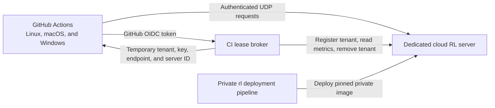

# Cloud-Hosted Server Integration Test Plan

Status: proposed

## Decision

Run a dedicated, non-production Ratelimitly server in the cloud and test every
example against it from GitHub Actions. Keep the server source, image, and
binary private. Do not build, download, or publish the server from the public
`rl-c-client` repository.

Put a small HTTPS lease broker in front of server administration. GitHub
Actions authenticates to the broker with OpenID Connect (OIDC). The broker
creates a short-lived, low-privilege tenant for each CI shard and returns only
the information needed by the examples.



## Goals

- Exercise all examples against the real `rl` server protocol in CI.
- Prove every example sends both a rate-limit request and a latency report.
- Cover Linux, macOS, native Windows with Microsoft compilers, and MinGW/Wine.
- Keep private server source and binaries out of public CI artifacts and logs.
- Support concurrent pull-request runs without shared counters or rate buckets.
- Avoid long-lived server or administrator credentials in GitHub.
- Keep failures diagnosable, bounded, and reproducible.

## Non-goals

- Replacing deterministic protocol tests that use the synthetic responder.
- Load, soak, capacity, failover, or production availability testing.
- Giving public pull-request code any server-administration capability.
- Testing the production Ratelimitly deployment.

## Trust and Security Model

Treat all pull-request code, build scripts, and produced binaries as untrusted.
Any credential visible to an example may be copied or deliberately misused.
The design must remain safe under that assumption.

The lease broker must:

- Validate the GitHub OIDC issuer and a broker-specific audience.
- Require the expected repository ID, repository owner, event, and trusted
  reusable-workflow identity.
- Prefer immutable repository IDs over repository names alone.
- Issue one random, never-reused tenant and key per matrix shard.
- Apply a short expiry, low quotas, issuance limits, and infrastructure-level
  packet/QPS limits.
- Never return the server administrator key.
- Never expose global server metrics or unrestricted server logs.
- Keep a lease database and remove expired tenants even when CI is cancelled.

Use the `pull_request` event. Never combine `pull_request_target` or a
privileged `workflow_run` job with checkout or execution of untrusted pull
request code.

OIDC removes the need for a long-lived cloud credential in GitHub, but the
tenant key returned by the broker is still visible to the test process.
Therefore, tenant isolation, low quotas, short expiry, and garbage collection
are mandatory.

If GitHub withholds OIDC tokens from a forked pull request, keep synthetic tests
on that pull request and run the live suite after maintainer approval or after
merge. Do not weaken the trust policy to make fork execution work.

References:

- [GitHub Actions OIDC reference](https://docs.github.com/en/actions/reference/security/oidc)
- [GitHub Actions secure-use reference](https://docs.github.com/en/actions/reference/security/secure-use)

## Cloud Fixture

### Deployment

Deploy from the private `rl` repository into a private image registry and a
dedicated CI environment. The public repository receives no registry access.

The deployment should:

- Run a pinned, recorded `rl` commit for pull-request tests.
- Use the normal UDP data plane with a dedicated public hostname and port.
- Use a stable DNS name even when the underlying instance changes.
- Restrict administrative traffic to the lease broker.
- Export health, lease count, cleanup failures, packet rate, and error metrics
  to private monitoring.
- Retain sanitized operational logs for a short period.
- Publish its deployed revision and current server epoch through the broker.

Run a separate scheduled compatibility workflow against the newest deployed
`rl/main`. This detects protocol drift without making pull-request results
depend on a moving server revision.

### Server Epoch

The real server identity changes when the server restarts, and in-memory test
tenants are lost. The broker must associate every lease with a server epoch.

On an epoch change:

1. Invalidate all outstanding leases.
2. Refuse their metric and cleanup operations with an explicit
   `epoch_changed` result.
3. Let CI retry the entire affected shard once with a new lease.
4. Never continue counter assertions across epochs.

### Lease API

Exact names may change during implementation, but the behavior should remain
stable.

#### Create

`POST /v1/leases`

- Authenticate with a GitHub OIDC bearer token.
- Derive repository and workflow identity from the token, not request fields.
- Accept a bounded shard name such as `linux-one-shot` or `windows-msvc`.
- Allow at most one active lease for a run ID, run attempt, and shard tuple.

Example response:

```json
{
  "lease_id": "01J...",
  "expires_at": "2026-07-18T12:30:00Z",
  "server_revision": "3fc876d...",
  "server_epoch": "epoch-...",
  "tenant": "ci-...ratelimitly.invalid",
  "auth_key": "rl-aes1...",
  "host": "udp-ci.example.net",
  "port": 38080,
  "server_id": 123456789
}
```

Recommended lease duration: 30 minutes, extendable once to a hard maximum of
45 minutes. Use random tenant IDs and AES keys. Never reuse tenant IDs.

Recommended initial tenant limits:

- 64 rate buckets
- 64 latency services
- 64 metric labels
- 32 latency-buffer entries
- 300 ms deduplication TTL
- Enough request allowance for one shard, with a small safety margin

These are tenant resource limits, not infrastructure abuse protection. Enforce
independent packet and request ceilings before traffic reaches the server.

#### Metrics

`GET /v1/leases/{lease_id}/metrics`

Return only metrics belonging to the leased tenant. Do not return the
administrator key, other tenants, global counters, memory contents, or raw
server logs.

The response must contain enough information to prove, per example:

- One accepted rate-limit request.
- One successful decision.
- One accepted latency report.
- No new authentication failure.
- No new protocol parse error.

Metric reads must tolerate eventual processing of the fire-and-forget latency
report. CI should poll with a short deadline and fail with the last sanitized
metric snapshot.

#### Delete

`DELETE /v1/leases/{lease_id}`

Remove the tenant and verify removal. CI calls this from an `always()` cleanup
job. Broker garbage collection remains authoritative because workflows can be
cancelled or runners can disappear before cleanup.

## Required Client Runtime Change

The fixed-endpoint example runtime currently constructs a synthetic server
target with server ID `1`. The real server rejects a response when its identity
does not match the client target.

Add:

```text
RATELIMITLY_EXAMPLE_SERVER_ID=<unsigned server identity>
```

The lease broker returns the current value. Preserve ID `1` as the default so
existing synthetic-responder tests remain compatible.

RED tests must cover:

- A valid non-`1` server ID.
- Missing value falling back to `1`.
- Empty, malformed, signed, and trailing-character input.
- Overflow and platform-width behavior.
- Clean behavior on POSIX and Win32/MSVC builds.

Relevant code:

- [`src/r_client_runtime.c`](../src/r_client_runtime.c)
- [`include/r_client_runtime.h`](../include/r_client_runtime.h)
- [`tests/test_responder.py`](../tests/test_responder.py)

## CI Environment Contract

After acquiring a lease, the test harness exports:

```sh
RATELIMITLY_TENANT="$LEASE_TENANT"
RATELIMITLY_AUTH_KEY="$LEASE_AUTH_KEY"
RATELIMITLY_EXAMPLE_SERVER_HOST="$LEASE_HOST"
RATELIMITLY_EXAMPLE_SERVER_PORT="$LEASE_PORT"
RATELIMITLY_EXAMPLE_SERVER_ID="$LEASE_SERVER_ID"
```

Mask the tenant key before placing it in the environment. Never print the
environment wholesale. Redact the key from command traces and uploaded logs.

Before executing examples, perform a bounded protocol preflight. Fail as a
fixture error when DNS, UDP reachability, lease validity, server revision, or
server epoch is wrong. Keep fixture failures distinct from example failures.

## Example Coverage Matrix

Every entry in [`examples/manifest.txt`](../examples/manifest.txt) must be
assigned to at least one live-server shard. A contract test fails when an entry
is missing or an unknown entry appears.

### Linux one-shot shard

Runner: `ubuntu-24.04`

- `latency_tracker`
- `libuv`
- `libevent`
- `glib`
- `libev`
- `sd_event`
- `libhv`
- `liburing`
- `epoll`
- `io_uring`
- `llhttp`

Each executable runs with a bounded timeout. Expected output must show an
allowed decision and a latency-report path. After every executable, poll the
lease metrics and assert exact per-example deltas.

### Linux HTTP shard A

Runner: `ubuntu-24.04`

- `mongoose`
- `civetweb`
- `libmicrohttpd`
- `ulfius`

### Linux HTTP shard B

Runner: `ubuntu-24.04`

- `h2o`
- `lwan`
- `libreactor`

### Linux HTTP shard C

Runner: `ubuntu-24.04`

- `facil_io`
- `onion`
- `kore`

For every HTTP framework:

1. Start the framework with logs redirected to a per-example file.
2. Poll a local readiness endpoint instead of sleeping a fixed duration.
3. Request `/limited` and require HTTP 200 plus the documented allowed body.
4. Poll tenant metrics for the rate request and latency report.
5. Send `TERM`, wait with a deadline, then use `KILL` only as fallback.

Run HTTP examples sequentially inside each shard because several use the same
local port. Separate shards may run concurrently because each receives a
different tenant lease.

### macOS native shard

Runner: `macos-latest`

- `kqueue`
- `libdispatch`

This shard exercises native event-loop behavior while using the same remote
UDP fixture.

### Windows MSVC shard

Runner: `windows-latest`

- Build the `win32` example using Microsoft C/C++ tools.
- Run the resulting executable natively against the cloud fixture.
- Assert both rate and latency behavior through tenant metrics.

This is the primary Win32 live integration test.

### MinGW/Wine compatibility shard

Runner: `ubuntu-24.04`

- Cross-compile the `win32` example with MinGW.
- Run it under Wine against the same cloud fixture contract.
- Keep this as additional toolchain/compatibility coverage, not a substitute
  for native MSVC execution.

Use the Dell runner only if GitHub's hosted Linux kernel demonstrably blocks
the `io_uring` example. Cloud-hosting the Ratelimitly server does not change the
local kernel requirements of an event-loop example.

## Assertions

### Client-side assertions

- Process exits successfully.
- No unbounded waits or background processes remain.
- One-shot examples print their documented allowed and latency messages.
- HTTP examples return HTTP 200 from `/limited` with the documented body.
- No example silently falls back to a synthetic endpoint.

### Server-side assertions

For each example, require lease-scoped deltas:

- rate requests: `+1`
- successful rate decisions: `+1`
- accepted latency reports: `+1`
- authentication failures: unchanged
- parse errors: unchanged

Use unique per-example bucket, service, or metric labels when the protocol
allows them. Never prove success using global server counters on the shared
cloud instance.

### Failure artifacts

Upload only sanitized artifacts:

- example stdout/stderr
- build logs
- HTTP response status and body
- final lease-scoped metric snapshot
- fixture error category and server revision/epoch

Do not upload tenant keys, OIDC tokens, administrator traffic, private server
logs, binaries, core dumps, or environment dumps.

## Existing Synthetic Tests Remain Required

Keep the local responder suite for deterministic coverage of:

- Allowed and denied decisions.
- Malformed or mismatched replies.
- Timeouts and retry behavior.
- Server-ID validation.
- No latency report after a denied decision.
- Win32 behavior without external network availability.

The cloud suite proves real client/server compatibility. It must not replace
fast, deterministic failure-path tests.

## Reliability Rules

- Pin all GitHub Actions to immutable commit SHAs.
- Pin framework versions or source commits.
- Reject a fixture whose deployed server revision differs from the expected
  pull-request revision.
- Give every network operation a deadline.
- Retry lease creation and metric propagation only for classified transient
  failures.
- Do not hide example failures with blanket command retries.
- Retry a complete shard at most once after a confirmed server-epoch change.
- Use GitHub concurrency controls to cancel superseded runs while relying on
  broker garbage collection for tenant cleanup.
- Add external health monitoring so an unavailable fixture is detected before
  many unrelated pull requests fail.

## TDD and Commit Discipline

For every logical change:

1. Add or modify the smallest relevant test.
2. Run it and record the expected RED result.
3. Implement only that behavior.
4. Run focused and regression tests until GREEN.
5. Commit the test and implementation together as one logical change.

Never commit a deliberately red tree. Never combine unrelated changes. One
change equals one commit.

Proposed client-repository commits:

1. `feat(runtime): configure fixed server identity`
2. `test(integration): define cloud fixture contract`
3. `test(integration): exercise one-shot examples`
4. `test(integration): exercise HTTP examples`
5. `ci(examples): add Linux cloud shards`
6. `ci(examples): add macOS cloud shard`
7. `ci(examples): add native MSVC cloud shard`
8. `ci(examples): add MinGW Wine cloud shard`
9. `docs(ci): document cloud integration tests`

Proposed private server/infrastructure commits should also remain atomic:

1. OIDC validation and lease authorization.
2. Tenant lease creation with quotas and expiry metadata.
3. Lease-scoped metric projection.
4. Verified tenant removal and retrying garbage collection.
5. Private pinned server deployment.
6. Monitoring, alerts, and scheduled compatibility workflow.

Each repository must remain GREEN after every commit.

## Rollout

### Phase 1: Runtime compatibility

- Add configurable fixed server identity using RED/GREEN TDD.
- Extend the synthetic responder tests with a real, non-`1` identity.
- Verify POSIX, MinGW/Wine, and MSVC builds.

### Phase 2: Private cloud fixture

- Deploy pinned server revision privately.
- Implement OIDC lease authorization.
- Implement isolated tenant provisioning, scoped metrics, cleanup, and GC.
- Validate restart/epoch behavior and abuse limits.

### Phase 3: Harness

- Add a provider-neutral client test harness consuming the lease contract.
- Add manifest completeness tests.
- Add one-shot and HTTP execution drivers with bounded cleanup.
- Prove harness failure categories using a fake broker or contract fixture.

### Phase 4: Platform CI

- Enable Linux shards.
- Enable macOS shard.
- Enable native MSVC shard.
- Enable MinGW/Wine shard.
- Use the Dell runner for `io_uring` only if hosted-runner evidence requires it.

### Phase 5: Drift detection

- Keep pull-request tests pinned.
- Add scheduled testing against newest compatible server deployment.
- Alert on server/client protocol drift without destabilizing pull requests.

## Acceptance Criteria

- All 24 manifest examples build in their supported environment.
- All 24 examples pass against the real cloud server.
- Every live example proves one successful rate-limit request and one accepted
  latency report through lease-scoped server metrics.
- Win32 passes natively with MSVC and additionally under MinGW/Wine.
- Concurrent CI shards cannot affect one another's buckets or assertions.
- Cancelled workflows leave no permanent tenants.
- Server restarts produce explicit fixture errors and safe whole-shard retry.
- No server source, image, binary, administrator key, or private server log is
  exposed by public CI.
- Fork pull requests never receive durable credentials or privileged access.
- Synthetic denial and malformed-response coverage remains GREEN.
- CI documentation explains local, cloud, fork, retry, and failure behavior.

## Inputs Needed Before Implementation

- Cloud provider and region.
- Public UDP hostname and port.
- HTTPS hostname for the lease broker.
- Expected maximum concurrent CI shards.
- Repository ID and trusted reusable-workflow identity for OIDC policy.
- Initial pinned `rl` server revision.
- Desired retention period for sanitized fixture metrics and logs.

These choices affect deployment configuration, not the client-side lease
contract or test harness design.

## Rejected Alternatives

### Public server bundle

Rejected because publishing a bundle exposes the private server binary.

### Private-repository checkout from public pull-request CI

Rejected because it requires privileged repository credentials in a workflow
that executes untrusted code.

### Shared static tenant and key

Rejected because the key becomes effectively public, concurrent runs interfere
with one another, exact metrics become nondeterministic, and cleanup is weak.

### `pull_request_target` with secrets

Rejected because privileged workflow context must never execute untrusted pull
request code.

