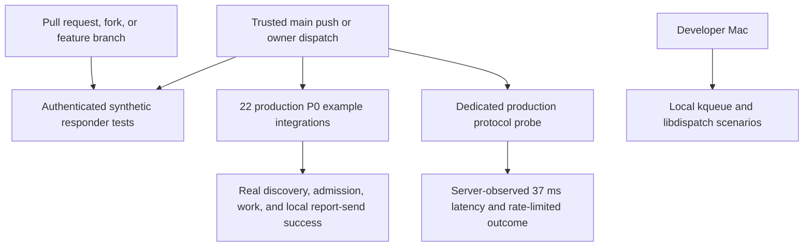

# Production P0 Example Integration CI

Status: implemented

## Decision

The example suite uses the existing production P0 service for trusted CI runs.
GitHub Actions supplies `RATELIMITLY_AUTH_KEY` from a CI-only repository secret.
The client decodes the key ID, builds the key-derived tenant name, performs SRV
discovery under P0, and resolves the selected server. The workflow does not
store a concrete tenant, host, port, or server identity.

The public repository never checks out, downloads, builds, or publishes the
private server binary or source. CI interacts only with the public DNS and UDP
data plane exposed to normal clients.

Live traffic is restricted to trusted main pushes and manual runs of `main` by
`edescourtis`. Pull requests, forks, and feature-branch dispatches are
synthetic-only. This prevents code that has not reached the trusted branch from
receiving the production credential.



## Why the validation is layered

No single check proves every useful property safely and deterministically. The
suite combines three layers:

1. The synthetic responder proves each example's observable packet behavior
   and all allow/deny branches without depending on cloud state.
2. Each production example proves key-derived discovery, authenticated P0
   admission, protected work, and a successful local latency-report send path.
3. A dedicated production probe proves server-observable rate and latency
   semantics with isolated names.

This distinction matters because `r_client_report_latency()` is
fire-and-forget. A successful return proves that the client encoded and sent the
datagram; it is not a server acknowledgement. Therefore, an individual
production example run does not prove that production accepted its report. The
dedicated probe closes that protocol-level gap by reading the reported value
back through a later admission request.

## Event and trust policy

| Trigger | Revision trusted? | Synthetic tests | Production P0 | Secret exposed to a test step? |
| --- | --- | --- | --- | --- |
| Pull request, including a fork | No | Yes | No | No |
| Feature-branch push | No | Workflow is not triggered | No | No |
| Feature-branch dispatch | No | Yes | No | No |
| Push to `main` | Yes | Yes | Yes | Only the bounded live steps |
| Manual dispatch of `main` by `edescourtis` | Yes | Yes | Yes | Only the bounded live steps |
| Manual dispatch of `main` by another actor | Revision is trusted, actor is not authorized | Yes | No | No |

The workflow uses read-only repository contents permission. Production step
conditions are evaluated before the repository secret is attached to the step.
There is no `pull_request_target` or privileged follow-up workflow that executes
pull-request code with the key.

## Coverage

### Linux one-shot matrix

The 11 one-shot entries run on Ubuntu:

- latency tracker
- libuv
- libevent
- GLib/GIO
- libev
- sd-event
- libhv
- liburing
- pure epoll
- pure io_uring
- llhttp

The executable source of truth is
[`tests/linux-one-shot-examples.txt`](../tests/linux-one-shot-examples.txt).

### Linux HTTP matrix

The 10 HTTP integrations run in three Ubuntu shards:

- Mongoose
- CivetWeb
- GNU libmicrohttpd
- Ulfius
- H2O
- Lwan
- libreactor
- facil.io
- Onion
- Kore

The executable source of truth is
[`tests/linux-http-examples.txt`](../tests/linux-http-examples.txt). Each row
records its shard, executable, local HTTP port, metrics label, expected
resource-denial status, and launch model.

### Windows matrix

The Win32 example has two independent production lanes:

- a 64-bit MinGW executable runs through MinGW/Wine on Ubuntu; and
- a native MSVC executable runs on `windows-latest`.

The Wine build uses a Windows-targeted static OpenSSL archive, checks the PE
architecture, and rejects dynamic OpenSSL imports. The native lane verifies
that CMake selected the Microsoft C compiler and also builds a portable
Mongoose example with MSVC.

### macOS scope

The core library still builds and runs its unit tests on `macos-latest`.
Platform-specific kqueue and libdispatch remain local-only because that was the
chosen CI boundary. On a developer Mac, run:

```sh
bash tests/test_macos_examples.sh
```

That local matrix executes the same deterministic admitted, resource-denied,
and latency-denied behaviors. It does not use the production secret.

## What is proved for every example

### Deterministic responder layer

Every Linux matrix entry and the Win32 integration runs against the repository's
authenticated synthetic UDP responder. Each example must demonstrate:

- exactly one rate-request event containing one resource and one latency guard;
- the documented metrics label, guard threshold, and tracker TTL, sample,
  buffer, and activation settings;
- an admitted result that runs protected work and emits exactly one
  latency-report event paired with the preceding guard;
- a resource denial that does not run or report protected work;
- a latency-guard denial that does not run or report protected work; and
- no duplicate or forbidden late latency-report events after response and
  shutdown drains.

The HTTP harness also verifies the framework's documented status mapping and
that an unprotected readiness route emits no Ratelimitly traffic. This is the
per-example proof that both the rate limiter and latency tracker are wired
correctly.

### Per-example production layer

Each of the 22 CI-eligible examples then starts with only the authentication key
and no tenant or fixed-endpoint override. The live runner requires:

- successful key-derived P0 DNS discovery and authenticated admission;
- an allowed decision from the real service;
- exact protected-work and measured-latency output for one-shot and Win32
  examples;
- an allowed protected-work response from each HTTP framework; and
- no local latency-report error before clean, bounded shutdown.

This layer deliberately does not force every shared production bucket into a
denial state. Deterministic tests cover that branch per example without making
cloud tests race or leave disruptive counters behind.

### Dedicated production protocol layer

[`tests/production_p0_probe.c`](../tests/production_p0_probe.c) uses names scoped
to the GitHub run and attempt. It performs two independent proofs:

1. Admit a latency-guarded request, report exactly 37 ms, then poll fresh
   admissions until the server returns that exact current latency.
2. Configure a one-token, 60-second rate bucket, require the first request to
   pass, and require the immediate second outcome to set `rate_limited`, carry a
   positive token deficit, and leave `latency_limited` clear.

This probe is the server-observed semantic check. Its unique names avoid stale
state without requiring administrative APIs or access to private server logs.

## Shared production state and concurrency

The repository credential identifies shared production state, so repeated runs
of the same fixed example identities must not overlap. CI uses non-cancelling
concurrency groups:

- one group for the dedicated protocol probe;
- one group for the one-shot matrix;
- one group per HTTP shard; and
- one shared group for Wine and native Windows.

These groups are intentionally not one global lock. The HTTP shards use distinct
framework bucket and service names and can run concurrently. A feature-branch
dispatch uses a revision-specific non-production group, so it cannot delay a
trusted production run.

Example latency trackers retain samples for ten seconds. Matrix runners wait 11
seconds before their first live request, which lets state from a cancelled or
failed predecessor expire. They wait once per matrix rather than once per
example because each example owns distinct bucket and service identities.

## Credential handling

The key is never placed in a command argument, committed file, artifact, or
fixed endpoint. The runners reject and unset `RATELIMITLY_TENANT`,
`RATELIMITLY_EXAMPLE_SERVER_HOST`, and
`RATELIMITLY_EXAMPLE_SERVER_PORT` so live tests cannot silently bypass
key-derived discovery.

Handling differs by platform because process APIs differ:

- HTTP shards remove the key from the exported environment, retain it in a
  non-exported shell variable, pass it over descriptor 3, close that descriptor
  immediately, and add it only to the framework child.
- Wine uses a fresh 64-bit prefix, gives the key only to the Wine launch/client
  process tree, disables core dumps, sanitizes diagnostics, and stops the
  bounded wineserver tree before deleting the prefix.
- Native Windows creates an explicit `ProcessStartInfo` environment for the
  MSVC child, removes discovery overrides, and clears the key from that object
  immediately after `CreateProcess` copies it.
- The Linux one-shot matrix consumes the step environment directly; its bounded
  child diagnostics redact both the exact key and credential-shaped text.
- The dedicated probe also consumes the step environment directly and emits
  only fixed, non-secret phase/status diagnostics. Its wrapper has no general
  output sanitizer, so documentation does not claim one for that lane.

HTTP and Wine runners fail closed if core dumps cannot be disabled. All live
runners enforce process deadlines and avoid printing the environment wholesale.
Any runner that replays child or dependency output sanitizes it first.

## Failure interpretation

| Failure | Likely layer | First evidence to inspect |
| --- | --- | --- |
| Synthetic allow/deny assertion | Example integration | Scenario name and sanitized responder records |
| DNS or admission timeout across many examples | Production fixture or network | First failing matrix and runtime status |
| One framework times out while peers pass | Framework lifecycle or sandbox | Framework log and forced-shutdown result |
| Local latency-report error | Example/runtime send path | Sanitized framework stderr |
| Exact 37 ms read-back fails | Server latency semantics | Dedicated probe's last observed value |
| Second one-token request is not rate-limited | Server rate semantics or stale identity | Dedicated probe's rate/deficit fields |

A broad production outage can make trusted-main CI red even when deterministic
tests pass. That is expected: the production layer is a compatibility smoke
test, not a hermetic unit test. The deterministic layer remains the primary
diagnostic for example regressions.

## Relevant files

| Purpose | File |
| --- | --- |
| Workflow and trust conditions | [`.github/workflows/ci.yml`](../.github/workflows/ci.yml) |
| One-shot deterministic matrix | [`tests/test_linux_one_shot_examples.sh`](../tests/test_linux_one_shot_examples.sh) |
| HTTP deterministic matrix | [`tests/test_linux_http_examples.sh`](../tests/test_linux_http_examples.sh) |
| One-shot production runner | [`tests/test_production_p0_one_shot_examples.sh`](../tests/test_production_p0_one_shot_examples.sh) |
| HTTP production matrix | [`tests/test_production_p0_http_examples.sh`](../tests/test_production_p0_http_examples.sh) |
| Per-framework production runner | [`tests/run_production_p0_http_example.sh`](../tests/run_production_p0_http_example.sh) |
| Native Windows production runner | [`tests/test_production_p0_win32_example.ps1`](../tests/test_production_p0_win32_example.ps1) |
| Wine production runner | [`tests/test_production_p0_win32_wine.sh`](../tests/test_production_p0_win32_wine.sh) |
| Dedicated semantic probe | [`tests/test_production_p0.sh`](../tests/test_production_p0.sh) |
| CI and documentation contract | [`tests/test_examples.sh`](../tests/test_examples.sh) |

## Maintenance checklist

When adding or changing an example:

1. Add it to exactly one deterministic matrix and preserve allow, resource
   denial, latency denial, paired-report, and late-packet assertions.
2. Add the corresponding trusted-main production invocation when the platform
   is CI-eligible.
3. Give it stable, unique bucket, service, and metrics names.
4. Keep the key out of arguments and diagnostics; preserve the platform's
   bounded cleanup path.
5. Update the coverage counts and this proof boundary.
6. Run RED/GREEN contract tests before the implementation change and keep the
   change in one focused commit.

When rotating the CI key, update only the `RATELIMITLY_AUTH_KEY` repository
secret. Do not add the derived tenant or resolved server endpoints to the
workflow. A key change naturally selects new key-derived state, so the next
trusted run should be treated as a fresh compatibility check.
