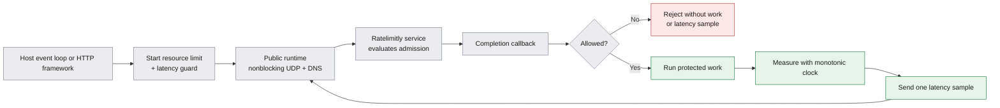
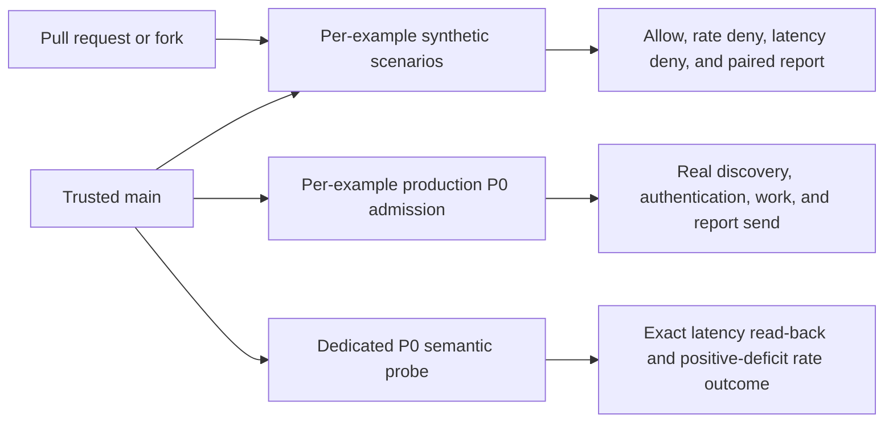

# Integration examples

> **Prerequisites.** You can read C and know the basic purpose of an event
> loop or HTTP server. This guide defines the Ratelimitly workflow, ownership
> models, platform boundaries, and framework-specific terms it uses.

## TL;DR

The [24 self-contained integrations](manifest.txt) each combine a resource
rate-limit check with a latency guard, run only admitted work, and report that
work's measured latency; choose by ownership model and platform, then check the
[test-evidence table](#ci-validation-layers).

## What this guide covers

These examples show how to drive `rl-c-client` from common C event loops, HTTP
servers, and parsers. They use only the public client headers under `include/`.
Each source file starts with a numbered flow and an ownership summary; read
those comments before transplanting the integration into an application.

## Integration lifecycle



| Example | Integration model | Main technique |
| --- | --- | --- |
| [Latency tracker](latency_tracker/) | Guard and reporting workflow | Gate work, measure it, then report one sample |
| [libuv](libuv/) | Native event loop | `uv_poll_t` plus a one-shot `uv_timer_t` |
| [libevent](libevent/) | Native event loop | Persistent `EV_READ` plus `evtimer` |
| [GLib/GIO](glib/) | Portable main loop | Non-owning `GIOChannel` watches plus timeout source |
| [libev](libev/) | Compact event loop | `ev_io` watchers plus a one-shot `ev_timer` |
| [sd-event](sd_event/) | systemd event loop | `sd_event_add_io` plus monotonic time source |
| [kqueue](kqueue/) | Native macOS/BSD readiness | Direct `kevent` wait plus request deadline |
| [libdispatch](libdispatch/) | Serial dispatch queue | Read sources plus a one-shot timer source |
| [Win32](win32/) | Native WinSock wait loop | `WSAEVENT` readiness plus deadline timeout |
| [libhv](libhv/) | Native event loop | `hio_t` readiness plus `htimer_t` |
| [liburing](liburing/) | Linux completion ring | `IORING_OP_POLL_ADD` through liburing |
| [epoll](epoll/) | Linux readiness API | Direct `epoll_wait` with a request deadline |
| [io_uring](io_uring/) | Raw Linux completion ring | Syscalls and shared ring mappings |
| [Mongoose](mongoose/) | Single-thread HTTP loop | Pending connection state on `mg_mgr_poll` |
| [CivetWeb](civetweb/) | Worker-thread HTTP server | Queue plus a dedicated client thread |
| [GNU libmicrohttpd](libmicrohttpd/) | External HTTP loop | Suspended connections and merged `select` |
| [H2O](h2o/) | Native HTTP event loop | Descriptor watchers and pool cleanup |
| [Lwan](lwan/) | Coroutine HTTP server | Yielding handlers and a dedicated client thread |
| [libreactor](libreactor/) | Native HTTP event loop | Descriptor and timer objects on one thread |
| [facil.io](facil_io/) | Native HTTP event loop | Pause/resume handles with retained timers |
| [Onion](onion/) | Worker-thread HTTP server | `OCS_YIELD` long-poll lifecycle |
| [Kore](kore/) | Task-based HTTP server | Sleeping requests and task-channel results |
| [Ulfius](ulfius/) | Threaded HTTP server | A private client in each endpoint callback |
| [llhttp](llhttp/) | Parser only | Fragmented input and resumable backpressure |

## Platform matrix

“Yes” means this example's source and build files directly support the platform,
not merely that the upstream framework can run there. “Conditional” identifies a
dependency or handle-width caveat explained in that folder's README. A dash means
the platform API is unavailable or this particular ownership pattern is scoped
more narrowly; choose the linked native or portable alternative instead.

| Example | Linux | macOS | Windows | Scope note |
| --- | --- | --- | --- | --- |
| [Latency tracker](latency_tracker/) | Yes | Yes | — | POSIX `poll`; use Win32 for the same workflow on Windows. |
| [libuv](libuv/) | Yes | Yes | Yes | Uses `uv_poll_init_socket` to preserve WinSock handles. |
| [libevent](libevent/) | Yes | Yes | Yes | Keeps sockets in `evutil_socket_t`. |
| [GLib/GIO](glib/) | Yes | Yes | Conditional | GLib exposes a Win32 socket constructor, but this source still needs a native handle-width proof and Windows execution test. |
| [libev](libev/) | Yes | Yes | — | This source targets libev's Unix fd backends. |
| [sd-event](sd_event/) | Yes | — | — | libsystemd API. |
| [kqueue](kqueue/) | — | Yes | — | Also applies to BSD hosts. |
| [libdispatch](libdispatch/) | Conditional | Yes | — | Open-source libdispatch is required on Linux. |
| [Win32](win32/) | — | — | Yes | Native `WSAEVENT`; Wine/CrossOver test harness included. |
| [libhv](libhv/) | Yes | Yes | Conditional | Verify that the libhv build preserves 64-bit `SOCKET` width. |
| [liburing](liburing/) | Yes | — | — | Linux io_uring wrapper. |
| [epoll](epoll/) | Yes | — | — | Linux kernel readiness API. |
| [io_uring](io_uring/) | Yes | — | — | Raw Linux UAPI; `IORING_ENTER_EXT_ARG` requires Linux 5.11 or newer. |
| [Mongoose](mongoose/) | Yes | Yes | Yes | Portable single-threaded server loop. |
| [CivetWeb](civetweb/) | Yes | Yes | — | This bridge uses pthreads, `pipe`, and `poll`. |
| [GNU libmicrohttpd](libmicrohttpd/) | Yes | Yes | — | This source uses the POSIX external-`select` model. |
| [H2O](h2o/) | Yes | Yes | — | Selects epoll or kqueue. |
| [Lwan](lwan/) | Yes | — | — | Linux coroutine server. |
| [libreactor](libreactor/) | Yes | — | — | Linux-focused descriptor API. |
| [facil.io](facil_io/) | Yes | Yes | — | facil.io 0.7 POSIX descriptor model. |
| [Onion](onion/) | Yes | Conditional | — | Onion v0.8 needs compatibility fixes for current macOS Clang. |
| [Kore](kore/) | Yes | Yes | — | ELF module on Linux; bundle on macOS. |
| [Ulfius](ulfius/) | Yes | Yes | — | This source deliberately uses POSIX `poll`. |
| [llhttp](llhttp/) | Yes | Yes | Yes | Parser adapter plus a portable `select` host driver. |

## Choose an integration pattern

The examples intentionally cover several ownership models. Choose based on the
concurrency model already used by the host application.

| Host architecture | Start with | Trade-off |
| --- | --- | --- |
| Any host using latency load shedding | Latency tracker, then the matching loop or framework | Shows policy and measurement lifecycle separately from framework plumbing. |
| One event-loop thread | libuv, libevent, libhv, epoll, io_uring, Mongoose, H2O, libreactor, or facil.io | No client lock is needed when all calls stay on the loop thread. |
| Worker-thread HTTP server | CivetWeb, Lwan, or Onion | A dedicated bridge thread serializes client access; queue and shutdown ownership need care. |
| Isolated request tasks | Kore | Each task owns its client and reports through the framework's task channel. |
| Lowest-complexity threaded handler | Ulfius | A private client is simple, but the handler waits and client setup repeats per request. |
| HTTP parser without a loop | llhttp | The host must provide TCP I/O, UDP readiness, deadlines, and connection lifetime. |

Prefer a single long-lived client per event loop or bridge thread in a busy
service. The per-request Ulfius pattern is included because its ownership is
especially easy to understand, not because it minimizes setup cost.

## Public runtime and configuration

Every example uses the public `r_client_runtime.h` helper to keep transport
setup separate from its framework-specific control flow. The runtime:

- owns nonblocking IPv4 and IPv6 UDP sockets;
- performs SRV and A/AAAA discovery;
- passes readable datagrams to `r_client_on_datagram()`; and
- exposes the current request deadline to the host loop.

DNS resolution is synchronous to keep the examples focused. Production event
loops should normally substitute their asynchronous resolver during startup or
configuration refresh.

Set the authentication key before running an example:

```sh
export RATELIMITLY_AUTH_KEY=rl-aes1...
```

The runtime decodes the tenant key ID and discovers
`_ratelimitly._udp.c-<key-id>.p0.ratelimitly.com`. Set
`RATELIMITLY_TENANT` only to override production discovery for another DNS
zone:

```sh
export RATELIMITLY_TENANT=tenant.example.com
```

For local development, bypass DNS and point the runtime at the repository's
synthetic responder:

```sh
export RATELIMITLY_EXAMPLE_SERVER_HOST=127.0.0.1
export RATELIMITLY_EXAMPLE_SERVER_PORT=39082
```

Leave the fixed endpoint variables unset in a normal deployment. The runtime
then discovers `_ratelimitly._udp.<tenant>` SRV records.

Build the library from the repository root, then enter one example folder:

```sh
make
cd examples/libuv
make
```

Each folder has its own `README.md`, `Makefile`, and `CMakeLists.txt`. Exact
framework compiler flags can vary by distribution; the build files use names
exported by upstream projects or common system packages and expose override
variables where a dependency is built from source.

Run all repository tests, including the example inventory and public runtime
tests, from the repository root:

```sh
make test
```

CI also builds every Linux one-shot integration against its real event-loop or
parser dependency. [`tests/linux-one-shot-examples.txt`](../tests/linux-one-shot-examples.txt)
is the executable matrix. Each binary runs against the authenticated synthetic
responder in three deterministic scenarios:

- admitted resource and latency guards: protected work runs and one matching
  latency observation is emitted;
- resource denial: protected work and latency reporting remain absent; and
- latency-guard denial: protected work and latency reporting remain absent.

The responder checks tracker TTL, sample limits, buffer size, threshold, and
that the report uses the same private service identity as the preceding guard.
Service IDs and credentials never appear in test logs.

The HTTP integrations have the same behavioral coverage in three parallel CI
shards. [`tests/linux-http-examples.txt`](../tests/linux-http-examples.txt)
records each executable, listener port, metrics label, and framework-specific
resource-denial status. For every server, CI makes real HTTP requests and
requires all of the following:

- an admitted request returns `200`, executes protected work, and emits exactly
  one latency report for the guard's tracker;
- a resource denial returns `429` (`403` for Lwan) without work or a report;
- a latency denial returns `503` without work or a report; and
- an unprotected readiness request causes no RateLimitly traffic.

Each server runs in its own process group. The harness drains UDP after the
response and again during shutdown, so worker processes cannot hide duplicate
or forbidden late reports from the responder assertions.

## CI validation layers

The example suite separates deterministic integration behavior from real P0
compatibility. Pull requests and forks receive only the synthetic responder;
trusted `main` pushes and owner-dispatched `main` runs add production checks.



| Layer | Scope | What it proves |
| --- | --- | --- |
| Synthetic responder | 11 Linux one-shot, 10 Linux HTTP, and Win32 | Every example wires one resource and one latency guard, blocks denied work, and reports exactly once only after admission. |
| Per-example P0 | The same 22 CI-eligible integrations; Win32 under Wine and native MSVC | Key-derived production discovery, authenticated admission, protected work, and a locally successful fire-and-forget report path. |
| Dedicated P0 probe | Names unique to the CI run | Production reads back exactly 37 ms and returns a one-token rate-limited outcome with a positive deficit. |
| Local macOS | kqueue and libdispatch | The same deterministic contract on a developer Mac; no production credential. |

The per-example P0 lane does not claim server acknowledgement of every latency
datagram: latency reporting is fire-and-forget. Server-observed semantics belong
to the dedicated read-back probe. See the
[production P0 CI guide](../docs/cloud-server-ci-plan.md) for trust boundaries,
credential handling, concurrency, exact coverage, and failure interpretation.

kqueue and libdispatch are intentionally verified only on a developer Mac.
They are absent from the CI workflow; run their strict builds and the same
allow/resource-deny/latency-deny contract locally with:

```sh
bash tests/test_macos_examples.sh
```

[`tests/macos-local-examples.txt`](../tests/macos-local-examples.txt) is the
small source of truth for that local-only matrix.

## Latency tracking workflow

[`latency_tracker/main.c`](latency_tracker/main.c) demonstrates both halves of
latency-based load shedding:

1. Hash a stable service name into `r_latency_guard_t.service_id`.
2. Include that guard in the rate-limit request.
3. Copy the guard decision during the completion callback; result arrays are
   owned by `rl-c-client` and expire when the callback returns.
4. Perform protected work only when the combined resource and guard result
   passes.
5. Measure only that work with `CLOCK_MONOTONIC`.
6. Send the observation with `r_client_admission_report_latency()`. The
   admission object preserves the matching service ID and tracker configuration
   and prevents a second report for the same admitted request.

Never report latency for work rejected by the guard. No operation occurred, so
a zero or synthetic sample would corrupt the service tracker. Likewise, do not
measure the RateLimitly request round trip unless that round trip is itself the
service whose latency should control admission.

The guard's policy fields have distinct purposes:

| Field | Meaning |
| --- | --- |
| `threshold_ms` | Reject protected work when tracked service latency reaches this value. |
| `ttl_ms` | Maximum age of samples retained for this tracker. |
| `max_samples` | Maximum sample count considered by the tracker. |
| `buffer_size` | Tracker storage request; must fit the credential quota. |
| `min_sample_threshold` | Samples required before the tracker estimate controls admission. |

The report repeats `service_id`, `ttl_ms`, `max_samples`, `buffer_size`, and
`min_sample_threshold` so it updates the same tracker. `threshold_ms` belongs
only to the guard decision.

Build and run the standalone workflow:

```sh
cd latency_tracker
make

# Optional: simulated protected-work duration; default is 25 ms.
export RATELIMITLY_EXAMPLE_WORK_MS=25
./latency-tracker-example
```

Passing output resembles:

```text
guard passed: resource and latency checks admitted the work
latency reported: service=example-inventory-backend observed=<elapsed> ms
```

`<elapsed>` is a monotonic measurement and can be greater than the configured
sleep because scheduler delay is part of the elapsed time.

The sleep represents a backend call only in this command-line demonstration.
Production event loops should start the real asynchronous operation after the
guard passes, record its monotonic start time, and report from its completion
callback. `r_client_report_latency()` is fire-and-forget: it uses the client's
UDP send hook immediately and creates no request deadline or response watcher.

## Event-loop examples

The examples in this section submit one combined admission check, print its
decision, run and measure admitted work, report one latency sample, and exit.
They are small references for readiness and deadline integration rather than
HTTP servers.

### libuv

**Model.** [`libuv/main.c`](libuv/main.c) registers both UDP sockets with
`uv_poll_t`. A one-shot
`uv_timer_t` is rearmed from the current request deadline after every event.
The loop thread owns the client and all watcher callbacks.

```sh
cd libuv
make
./libuv-example
```

**Production note.** Keep watcher teardown on the loop thread. Do not destroy
the shared client while a poll or timer callback can still run.

### libevent

**Model.** [`libevent/main.c`](libevent/main.c) uses persistent `EV_READ` events
for UDP ingress and an `evtimer` for the active request. The event-base thread
owns the client.

```sh
cd libevent
make
./libevent-example
```

**Production note.** Free every successfully created event, including partial
initialization paths, before destroying the client.

### GLib/GIO

**Model.** `glib/main.c` attaches non-owning `GIOChannel` watches for the
runtime's UDP sockets and uses a one-shot GLib timeout for the request deadline.
The same source supports Unix sockets and WinSock handles.

```sh
cd glib
make
./glib-example
```

**Production note.** Remove every source and unref every non-owning channel
before destroying the runtime that owns the underlying sockets.

### libev

**Model.** `libev/main.c` uses `ev_io` for UDP readiness and re-arms a one-shot
`ev_timer` from the current admission deadline.

```sh
cd libev
make
./libev-example
```

**Production note.** Stop all fd watchers before destroying runtime sockets.
This example targets Unix fd backends rather than narrowing WinSock handles.

### sd-event (Linux)

**Model.** `sd_event/main.c` combines `sd_event_add_io` socket sources with a
one-shot monotonic time source derived from the relative admission delay.

```sh
cd sd_event
make
./sd-event-example
```

**Production note.** Keep wall-clock client deadlines and monotonic timer
timestamps in separate domains; convert through a relative delay.

### kqueue (macOS/BSD)

**Model.** `kqueue/main.c` registers runtime UDP sockets with `EVFILT_READ` and
passes the current relative admission delay directly to `kevent`.

```sh
cd kqueue
make
./kqueue-example
```

**Production note.** Treat `EV_ERROR` and terminal `EV_EOF` as watcher errors,
and close the kqueue before destroying runtime-owned sockets.

### libdispatch

**Model.** `libdispatch/main.c` serializes client calls on a private queue,
using read sources for UDP sockets and a timer source for admission deadlines.

```sh
cd libdispatch
make
./libdispatch-example
```

**Production note.** Cancel sources and serialize runtime teardown on the same
queue. A semaphore gives this teaching program a finite shutdown path.

### Win32

**Model.** `win32/main.c` associates each native `SOCKET` with a `WSAEVENT` and
passes the admission delay to `WSAWaitForMultipleEvents`.

```sh
cd win32
make CC=x86_64-w64-mingw32-gcc \
  RL_CLIENT_LIBRARY=/path/to/windows/librclient.a \
  OPENSSL_PREFIX=/path/to/mingw/openssl
```

**Production note.** Preserve pointer-width `SOCKET` values. Clear event
associations before closing events or destroying runtime-owned sockets.

### libhv

**Model.** [`libhv/main.c`](libhv/main.c) attaches each client descriptor with
`hio_add(..., HV_READ)` and maps the request deadline to a one-shot `htimer_t`.
All client calls remain on the libhv loop thread.

```sh
cd libhv
make LIBHV_ROOT=/path/to/libhv
./libhv-example
```

**Production note.** If application work can run on other threads, marshal it
onto this loop instead of calling the shared client concurrently.

### liburing (Linux)

**Model.** [`liburing/main.c`](liburing/main.c) submits one
`IORING_OP_POLL_ADD` per UDP socket and
uses `io_uring_wait_cqe_timeout()` to cap each wait at the request deadline.
Each completion is consumed before the corresponding poll is rearmed.

```sh
cd liburing
make
./liburing-example
```

**Production note.** User-data values identify watcher completions. Reserve a
non-overlapping namespace if the same ring also serves application I/O.

### epoll (Linux)

**Model.** [`epoll/main.c`](epoll/main.c) registers the nonblocking UDP
descriptors directly. It recomputes the timeout passed to `epoll_wait()` from
the client deadline on every iteration.

```sh
cd epoll
make
./epoll-example
```

**Production note.** Treat `EPOLLERR` and `EPOLLHUP` as terminal watcher
failures; repeatedly retrying a broken descriptor creates a busy loop.

### io_uring without liburing (Linux)

**Model.** [`io_uring/main.c`](io_uring/main.c) uses Linux UAPI headers and
syscalls directly. It maps the submission and completion rings, submits
`IORING_OP_POLL_ADD`, and supplies the deadline through `IORING_ENTER_EXT_ARG`.

```sh
cd io_uring
make
./io-uring-example
```

**Production note.** This is an educational raw-ring implementation. liburing
is usually the safer compatibility layer for production code, especially when
supporting several kernel versions or sharing a ring with other operations.

## HTTP framework examples

Unless a section says otherwise, these examples listen on port 8000. Send
`GET /limited` to run a check. Non-GET requests are rejected before starting a
check, and an abandoned request is cancelled where the framework exposes a
reliable disconnect lifecycle.

### Mongoose

**Model.** [`mongoose/main.c`](mongoose/main.c) leaves an HTTP connection pending
while its check runs. `mg_mgr_poll()` drains client UDP sockets, advances request
deadlines, and cancels the check if the connection closes. One Mongoose thread
owns all state.

```sh
cd mongoose
make MONGOOSE_ROOT=/path/to/mongoose
./mongoose-example
curl -i http://127.0.0.1:8000/limited
```

**Production note.** The sample uses a 10 ms Mongoose poll interval. A host
with stricter latency or power requirements should derive its wait from both
Mongoose work and the nearest client deadline.

### CivetWeb

**Model.** [`civetweb/main.c`](civetweb/main.c) keeps the client on one dedicated
poll thread. CivetWeb workers enqueue jobs and wait on per-request condition
variables, so no two threads enter the client concurrently. An admitted request
runs measured protected work on the bridge and reports it to the latency tracker.
Server workers stop before bridge state is destroyed.

```sh
cd civetweb
make CIVETWEB_ROOT=/path/to/civetweb
./civetweb-example
curl -i http://127.0.0.1:8000/limited
```

**Production note.** Waiting consumes one CivetWeb worker per in-flight check.
Size the worker pool for the expected concurrency or adapt the bridge to an
asynchronous response API if the service holds many simultaneous requests.

### GNU libmicrohttpd

**Model.** [`libmicrohttpd/main.c`](libmicrohttpd/main.c) runs MHD in
external-`select` mode. It suspends an HTTP connection during the asynchronous
combined admission check, measures and reports admitted protected work, resumes
the connection from the callback, and merges MHD's timeout with the client
request deadline.

```sh
cd libmicrohttpd
make
./libmicrohttpd-example
curl -i http://127.0.0.1:8000/limited
```

**Production note.** Always call the MHD timeout API again after processing
activity; both MHD and the client can move their nearest deadline.

### H2O

**Model.** [`h2o/main.c`](h2o/main.c) wraps duplicate UDP descriptors with
`H2O_SOCKET_FLAG_DONT_READ`, so H2O reports readiness while the public runtime
consumes datagrams from the original sockets. Request-pool destructors cancel
abandoned checks, one-shot H2O timers enforce deadlines, and admitted protected
work is measured and reported to the latency tracker.

```sh
cd h2o
make
./h2o-example
curl -i http://127.0.0.1:8000/limited
```

**Production note.** The duplicate descriptors transfer readiness observation,
not datagram ownership. Only the adapter should read the original client
sockets, and its state must outlive every H2O watcher.

### Lwan

**Model.** [`lwan/main.c`](lwan/main.c) keeps client state off Lwan's small
coroutine stacks. A dedicated thread owns the runtime and UDP sockets; handlers
enqueue combined admission checks and yield with `lwan_request_sleep()` until
completion. Reference-counted jobs remain valid after disconnect, and admitted
protected work is measured and reported on the bridge.

Build Lwan, then compile against its generated configuration and static library:

```sh
cd lwan
make LWAN_ROOT=/path/to/lwan LWAN_BUILD=/path/to/lwan/build
./lwan-example
curl -i http://127.0.0.1:8080/limited
```

The whole-archive flags retain Lwan's linker-discovered module table. A shared
installation can instead use its generated `lwan.pc`. Lwan listens on port
8080 by default; change its normal configuration if that port is unsuitable.

**Production note.** Lwan's public status table omits 429, so this example
returns 403 for a denied check. Using an unknown numeric status triggers an
assertion in supported Lwan versions.

### libreactor

**Model.** [`libreactor/main.c`](libreactor/main.c) runs HTTP, UDP readiness,
and deadlines on one reactor thread. Duplicate descriptors observe readiness
while the public runtime owns datagram reads. Synchronous completions are
deferred so callback state is not freed while a client operation remains on the
stack. Allowed protected work is measured and reported before response.

```sh
cd libreactor
make
./libreactor-example
curl -i http://127.0.0.1:8000/limited
```

**Production note.** Preserve deferred completion if surrounding code can
complete a request synchronously; immediate destruction would make reentrant
callbacks unsafe.

### facil.io

**Model.** [`facil_io/main.c`](facil_io/main.c) attaches duplicate UDP
descriptors as facil.io protocols and uses HTTP pause/resume for combined
admission checks. Timer callbacks retain request state through `on_finish`,
preventing a use-after-free when a UDP response races its deadline. One event
loop thread serializes client calls and reports admitted protected-work latency.

```sh
cd facil_io
make -C /path/to/facil.io lib
make FACIL_ROOT=/path/to/facil.io
./facil-io-example
curl -i http://127.0.0.1:8000/limited
```

**Production note.** Keep the explicit retain/release pairs around scheduled
timers. A failed schedule must release the timer's reference immediately.

### Onion

**Model.** [`onion/main.c`](onion/main.c) returns `OCS_YIELD`, so Onion workers
do not poll client sockets. A dedicated thread owns the runtime, runs combined
admission, and completes each yielded response through Onion's long-poll
lifecycle. Shutdown cancels active checks and releases every yielded request
exactly once; admitted work is measured and reported before response.

```sh
cd onion
make ONION_ROOT=/path/to/onion-install
./onion-example
curl -i http://127.0.0.1:8000/limited
```

**Production note.** Keep response writes in the completion path documented by
the Onion version being used. A bridge failure must wake all yielded requests
with an error rather than leaving them suspended.

### Kore

**Model.** [`kore/main.c`](kore/main.c) runs each exchange as a `kore_task`,
putting the HTTP request to sleep until the task channel reports a combined
admission result. Task-local runtime ownership avoids cross-thread access and
reports admitted protected-work latency. The Linux module also declares the
extra socket syscalls required by Kore's seccomp filter.

Build Kore with task support and its no-TLS backend, then build the module:

```sh
cd kore
make KORE_ROOT=/path/to/kore
kore -fnrc kore.conf
curl -i http://127.0.0.1:8000/limited
```

**Production note.** `kore.conf` grants the module's plain-HTTP route and task
thread count. Reconcile the syscall declarations with a hardened deployment's
own Kore build and sandbox policy.

### Ulfius

**Model.** [`ulfius/main.c`](ulfius/main.c) gives each endpoint callback a
private runtime and polls its UDP sockets on that callback's libmicrohttpd
worker. This avoids shared mutable state, does not block the listener thread,
and measures/reports admitted protected work.

```sh
cd ulfius
make
./ulfius-example
curl -i http://127.0.0.1:8000/limited
```

**Production note.** One worker remains occupied and one client is initialized
per request. For high concurrency, prefer a shared dedicated-thread bridge such
as the CivetWeb or Onion pattern.

## llhttp parser adapter

`llhttp` parses HTTP but does not provide an event loop. The self-contained
[`llhttp/`](llhttp/) example collects URL fragments, removes query data from the
bucket key, and starts a combined resource-limit and latency-guard check when a
request completes. Its small `select()` driver makes the host contract runnable;
replace that driver with the TCP loop already used by your application.

Build the library and example after installing llhttp and its pkg-config file:

```sh
cd llhttp
make
./llhttp-example
```

The host lifecycle is:

1. Call `rl_llhttp_adapter_init()` once per accepted connection and check its
   return status.
2. Pass every TCP fragment to `rl_llhttp_adapter_feed()`.
3. If it returns `HPE_PAUSED`, keep bytes at and after the returned `consumed`
   offset. One check is already active.
4. Drive the shared client's UDP descriptors and the adapter request's deadline
   using one of the loop patterns above.
5. The result callback runs after the adapter calls `llhttp_resume()`. Feed the
   retained bytes only after that callback begins.
6. Call `rl_llhttp_adapter_finish()` on clean TCP EOF, then
   `rl_llhttp_adapter_dispose()` before releasing connection state.

The pause is resumable backpressure for a pipelined next request; validation
failures use `HPE_USER` and are terminal parser errors. Allowed protected work
is timed monotonically and reported to the same tracker, while denied work is
never run or reported. The host owns TCP I/O, retained bytes, UDP readiness,
deadlines, and the adapter allocation. See
[`llhttp/README.md`](llhttp/README.md) for complete ownership, build, platform,
and error-handling details.

## Glossary

| Term | Meaning |
| --- | --- |
| admission | Combined resource and latency decision made before protected work starts. |
| protected work | Application operation—such as a database call or response build—that runs only after admission. |
| rate bucket | Stable resource identity whose quota is consumed by matching requests. |
| latency guard | Admission check that can shed new work when recent tracked latency reaches a threshold. |
| latency tracker | Server-side window of reported service durations used by a latency guard. |
| fire-and-forget | Send with no acknowledgement callback; local success proves the datagram was handed to UDP, not that the server accepted it. |
| P0 | Production Ratelimitly DNS tier derived from an API key unless a tenant DNS override is supplied. |
| synthetic responder | Repository test server that returns deterministic allow, resource-deny, and latency-deny decisions without a production credential. |
| one-shot example | Command-line integration that performs one admission workflow and exits, rather than serving HTTP continuously. |
| SRV | DNS service record that returns target hostnames and ports. |
| AAAA | DNS address record that maps a hostname to an IPv6 address. |
| WinSock | Native Windows sockets API, whose socket handle is pointer-width on 64-bit Windows. |
| MSVC | Microsoft Visual C/C++ compiler and native Windows toolchain. |
| UAPI | Linux user-space API exposed by kernel headers, used directly by the raw io_uring example. |
| ELF | Executable and Linkable Format used for Linux binaries and shared modules. |
| EOF | End of file or stream; for a socket, the peer has ended its byte stream. |
| BSD | Family of Unix-like operating systems that provides the kqueue API. |
| GET | HTTP method used by the examples' read-only `/limited` route. |
| MHD | Prefix used by GNU libmicrohttpd's public C API. |
| IOChannel | GLib `GIOChannel` wrapper that presents a socket or file descriptor as an event source. |
| backpressure | Pausing parsing or new work until an outstanding admission decision completes. |

## References

- [Example manifest](manifest.txt) is the source of truth for the 24 folders
  listed in this guide.
- [Linux one-shot matrix](../tests/linux-one-shot-examples.txt),
  [Linux HTTP matrix](../tests/linux-http-examples.txt), and
  [local macOS matrix](../tests/macos-local-examples.txt) define executable
  coverage; [CI workflow](../.github/workflows/ci.yml) shows where each runs.
- [Production semantic probe](../tests/production_p0_probe.c) defines the exact
  latency read-back and rate-denial assertions summarized above.
- [Admission workflow](../include/r_client_workflow.h) and
  [public runtime](../include/r_client_runtime.h) define the shared client
  mechanics used by every example.
- [DNS SRV specification](https://www.rfc-editor.org/info/rfc2782/),
  [Linux `io_uring_enter(2)`](https://man7.org/linux/man-pages/man2/io_uring_enter.2.html),
  [GLib `GIOChannel`](https://docs.gtk.org/glib/struct.IOChannel.html), and
  [Microsoft `SOCKET`](https://learn.microsoft.com/en-us/windows/win32/winsock/socket-data-type-2)
  support the external platform claims called out in this guide.
