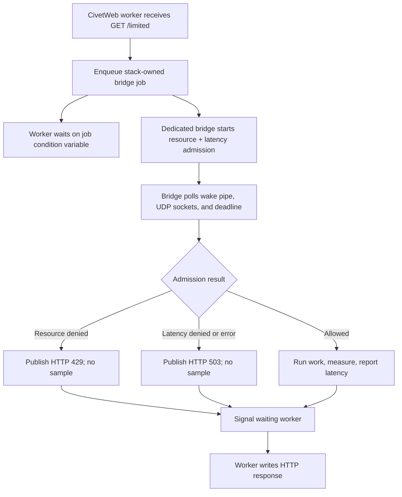

# CivetWeb worker bridge

This self-contained example serves `GET /limited` with CivetWeb's worker-thread
model while keeping the non-thread-safe client on one dedicated bridge thread.
Each request contains both a resource rate limit and a latency guard.

The bridge runs protected application work only after admission, measures that
work with a monotonic clock, and reports the sample to the latency tracker. The
small `prepare_protected_response()` function is the seam to replace with a
database call, RPC, or other operation that the endpoint needs to protect.

## Control flow



## Build and run

Check out CivetWeb and point `CIVETWEB_ROOT` to its source tree. This example is
validated against the stable `v1.16` release:

```sh
make -C ../..
git clone --depth 1 --branch v1.16 \
  https://github.com/civetweb/civetweb.git /tmp/civetweb-v1.16
make CIVETWEB_ROOT=/tmp/civetweb-v1.16
RATELIMITLY_TENANT=example \
RATELIMITLY_AUTH_KEY=secret \
./civetweb-example
curl -i http://127.0.0.1:8000/limited
```

The equivalent CMake build is:

```sh
cmake -S . -B build -DCIVETWEB_ROOT=/path/to/civetweb
cmake --build build
./build/civetweb-example
```

The example builds CivetWeb without its optional TLS support because the local
listener is plain HTTP. This does not affect rl-c-client's authenticated UDP
protocol, which still links OpenSSL's crypto library.

## Decisions and latency

- `200`: admitted; protected work completed and its latency was reported.
- `429`: rejected by the resource limit, or by both checks.
- `503`: rejected by the latency guard alone, or the client was unavailable.

Denied and failed requests never emit a latency sample. A telemetry send error
is logged after completed work but does not turn that completed request into an
HTTP failure.

## Threading, lifetime, and shutdown

Workers enqueue stack-owned jobs and wait on per-job condition variables. The
bridge alone owns admission requests, deadlines, UDP readiness, and the client.
`mg_stop()` must remain before `bridge_stop()`: it joins every HTTP worker before
the bridge can cancel jobs and release client state.

Waiting consumes one CivetWeb worker for every in-flight admission check. Size
the pool for expected concurrency, or use an asynchronous host integration for
high numbers of long-lived requests.

## Platform support

This bridge uses pthreads, `pipe()`, and `poll()`, so its supported hosts are
Linux and macOS. CivetWeb itself supports Windows, but this particular ownership
pattern deliberately does not hide a second Windows implementation. For native
Windows, start with the self-contained Mongoose or Win32 example.
