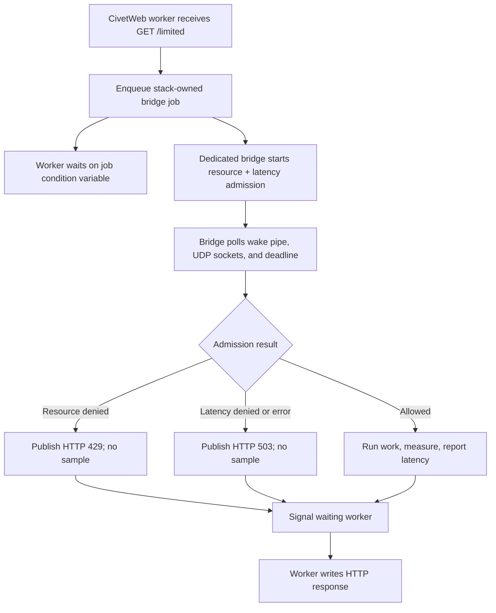

# CivetWeb worker bridge

> **Prerequisites.** You can read C and understand HTTP handlers, POSIX threads,
> and condition variables. Everything specific to CivetWeb and Ratelimitly is
> defined here.

## TL;DR

Each CivetWeb worker delegates a combined resource rate-limit and latency-guard
check to one client-owning bridge thread; only admitted work runs, and only its
measured latency is reported to the tracker.

## What this example teaches

This self-contained example serves `GET /limited` with CivetWeb's worker-thread
model while keeping the non-thread-safe client on one dedicated bridge thread.
Each request contains both a resource rate limit and a latency guard.

The bridge runs protected application work only after admission, measures that
work with a monotonic clock, and reports the sample to the latency tracker. The
small `prepare_protected_response()` function is the seam to replace with a
database call, RPC, or other operation that the endpoint needs to protect.

## Control flow



## Build and run

Check out CivetWeb and point `CIVETWEB_ROOT` to its source tree. This example is
validated against the stable `v1.16` release:

```sh
make -C ../..
git clone --depth 1 --branch v1.16 \
  https://github.com/civetweb/civetweb.git /tmp/civetweb-v1.16
make CIVETWEB_ROOT=/tmp/civetweb-v1.16
RATELIMITLY_AUTH_KEY=rl-aes1... \
./civetweb-example
curl -i http://127.0.0.1:8000/limited
```

The encoded key supplies the tenant ID and defaults discovery to
`_ratelimitly._udp.c-<key-id>.p0.ratelimitly.com`. Set optional
`RATELIMITLY_TENANT` only to override that production DNS name.

For a local synthetic responder, set both fixed-endpoint variables; setting
only one is a configuration error:

```sh
export RATELIMITLY_EXAMPLE_SERVER_HOST=127.0.0.1
export RATELIMITLY_EXAMPLE_SERVER_PORT=39082
```

The equivalent CMake build is:

```sh
cmake -S . -B build -DCIVETWEB_ROOT=/path/to/civetweb
cmake --build build
./build/civetweb-example
```

The example builds CivetWeb without its optional TLS support because the local
listener is plain HTTP. This does not affect rl-c-client's authenticated UDP
protocol, which still links OpenSSL's crypto library.

## Decisions and latency

- `200`: admission allowed. The current adapter then attempts protected work,
  measurement, and reporting, but does not propagate a failure from that helper
  into the HTTP status.
- `429`: rejected by the resource limit, or by both checks.
- `503`: rejected by the latency guard alone, or the client was unavailable.

Denied requests never emit a latency sample. On an admitted request,
`r_runtime_admission_run_and_report()` can fail before work, during work,
during the second clock read, or while submitting the report; this example logs
all four cases as `latency report failed` and still maps the admitted outcome to
HTTP 200. Treat that log label and status policy as demonstration limitations,
not a production error contract.

## Threading, lifetime, and shutdown

Workers enqueue stack-owned jobs and wait on per-job condition variables. The
bridge alone owns admission requests, deadlines, UDP readiness, and the client.
`mg_stop()` must remain before `bridge_stop()`: it joins every HTTP worker before
the bridge can cancel jobs and release client state.

Waiting consumes one CivetWeb worker for every in-flight admission check. Size
the pool for expected concurrency, or use an asynchronous host integration for
high numbers of long-lived requests.

`prepare_protected_response()` also runs on the bridge thread in this compact
demonstration. Production asynchronous work should retain the job, record its
monotonic start time after admission, start the operation without blocking the
bridge, and post completion back to the bridge; report latency and wake the
worker only from that completion path.

## Platform support

This bridge uses pthreads, `pipe()`, and `poll()`, so its supported hosts are
Linux and macOS. CivetWeb itself supports Windows, but this particular ownership
pattern deliberately does not hide a second Windows implementation. For native
Windows, start with the self-contained Mongoose or Win32 example.

Repository CI builds and exercises this example on Linux with allow,
resource-deny, and latency-deny scenarios. macOS is source/build support, not a
claim that this repository runs the CivetWeb scenario there automatically.

## Glossary

| Term | Meaning |
| --- | --- |
| bridge thread | Dedicated thread that alone owns and drives `rl-c-client`, so HTTP workers never enter the client concurrently. |
| CivetWeb | Embedded C web server that assigns incoming requests to a configurable worker-thread pool. |
| admission | Combined resource and latency decision made before protected work begins. |
| resource rate limit | Bucket quota check; denial maps to HTTP 429 in this example. |
| latency guard | Pre-work check that sheds new work when recent tracked latency reaches its threshold. |
| latency tracker | Server-side window updated by the post-work latency report. |
| condition variable | POSIX synchronization primitive a worker waits on until the bridge publishes a result. |

## API references

- [Example source](main.c) contains the bridge queue, admission callback,
  request handler, and shutdown order explained above.
- [CivetWeb v1.16 embedding guide](https://github.com/civetweb/civetweb/blob/v1.16/docs/Embedding.md)
  covers server startup, handlers, worker threads, and shutdown.
- [`mg_set_request_handler` in CivetWeb v1.16](https://github.com/civetweb/civetweb/blob/v1.16/docs/api/mg_set_request_handler.md)
  defines the request-handler callback contract.
- [`mg_stop` in CivetWeb v1.16](https://github.com/civetweb/civetweb/blob/v1.16/docs/api/mg_stop.md)
  defines server shutdown behavior.
