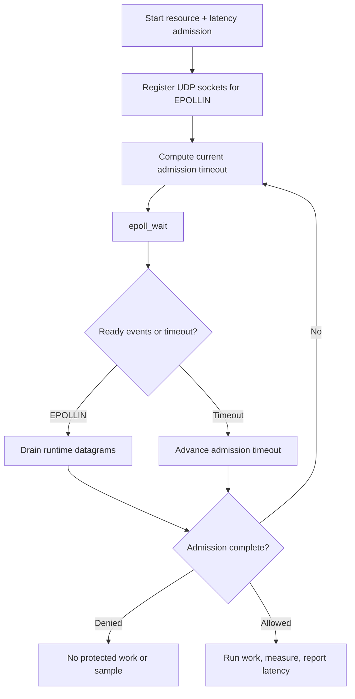

# Pure epoll integration

> **Prerequisites.** You can read C and know what a UDP socket is. Building
> requires Linux, a C11 compiler, OpenSSL development files, and Make or CMake.
> Everything else is explained here.

## TL;DR

Linux `epoll` drives a request that combines a resource rate limit with a
pre-work latency guard. Allowed work is measured afterward and reported as one
latency sample; denied, cancelled, or failed work produces no sample.

## What this example teaches

This example uses Linux `epoll` directly—no event-loop library. It registers
the public runtime's nonblocking UDP sockets for `EPOLLIN` and derives every
`epoll_wait` timeout from the current admission deadline.

The request contains both controls: the resource rate limit protects capacity,
while the latency guard checks existing tracker history before work starts. On
the allowed path, the example constructs a response synchronously, measures
only that work with a monotonic clock, and sends the completed duration back to
the same latency tracker.

## Build and run on Linux

Build the library from the repository root, then run either build path here:

```sh
make -C ../..
make
./epoll-example
```

```sh
cmake -S . -B build
cmake --build build
./build/epoll-example
```

An allowed run prints `allowed: ...; latency=... ms`. A policy denial exits
with status 2 and names the rate limit, latency guard, or both.

## Configuration

`RATELIMITLY_AUTH_KEY` is required. With no overrides, the runtime decodes the
key ID, derives `c-<key-id>.p0.ratelimitly.com`, and discovers the production
SRV record `_ratelimitly._udp.c-<key-id>.p0.ratelimitly.com`.

`RATELIMITLY_TENANT` optionally replaces the derived tenant DNS name. For a
fixed development responder, set `RATELIMITLY_EXAMPLE_SERVER_HOST` and
`RATELIMITLY_EXAMPLE_SERVER_PORT` together; setting only one is invalid. Leave
all three overrides unset for key-derived P0 discovery.

```sh
export RATELIMITLY_AUTH_KEY='rl-aes1...'
# Optional fixed development endpoint; set both or neither.
export RATELIMITLY_EXAMPLE_SERVER_HOST=127.0.0.1
export RATELIMITLY_EXAMPLE_SERVER_PORT=39082
./epoll-example
```

## Control flow



## Guard first, sample afterward

The latency guard is an admission decision based on tracker history already at
the server; it does not measure the operation waiting to run. After both the
guard and rate limit allow the request, `r_runtime_admission_run_and_report()`
measures `prepare_response()` and sends one post-work sample. It suppresses a
sample when admission is denied or when work is cancelled or fails.

The synchronous callback keeps this teaching program short. Production event
loops should start nonblocking work after admission, retain the request and a
monotonic start time, then report once from the successful completion callback;
do not block the `epoll` thread or report when asynchronous work is merely
scheduled.

## Platform and verification

`epoll` is a Linux kernel API, so this folder intentionally supports Linux
only. Ubuntu CI runs allow, resource-denial, and latency-denial scenarios
against the synthetic responder and verifies exact request/report pairing.
Trusted `main` runs also exercise key-derived production P0 discovery and
admission; because a latency report is a UDP send, that smoke test proves the
local send path, not server receipt of each report.

For production, treat `EPOLLERR` and `EPOLLHUP` as watcher failures, recompute
the timeout after every client transition, keep request storage alive until
callback or cancellation, and close the epoll descriptor before destroying the
runtime-owned sockets.

## Glossary

| Term | Meaning |
|---|---|
| `epoll` | Linux readiness API that waits for activity on registered file descriptors. |
| admission deadline | Next time the client must advance request timeout or retry state. |
| latency guard | Pre-work policy check against existing samples for the configured service. |
| latency sample | Post-work duration reported after one admitted operation completes successfully. |
| SRV | DNS service record that supplies a host and port. |

## API references

- [Example source](main.c)
- [Public runtime API](../../include/r_client_runtime.h)
- [Combined admission workflow](../../include/r_client_workflow.h)
- [Linux `epoll(7)` manual](https://man7.org/linux/man-pages/man7/epoll.7.html)
- [Linux `epoll_ctl(2)` manual](https://man7.org/linux/man-pages/man2/epoll_ctl.2.html)
- [Deterministic one-shot test runner](../../tests/run_one_shot_example.sh)
