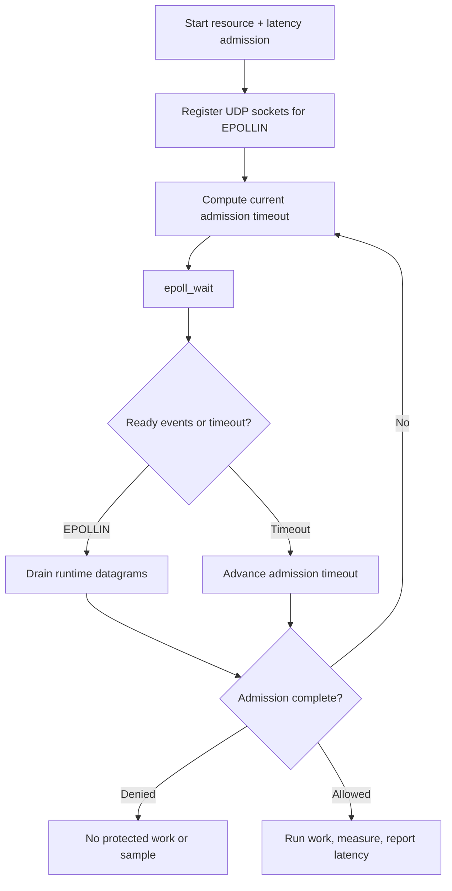

# Pure epoll integration

This example uses Linux `epoll` directly—no event-loop library. It registers
the public runtime's nonblocking UDP sockets for `EPOLLIN` and derives every
`epoll_wait` timeout from the current admission deadline.

Each admission request contains a resource rate limit and a latency guard. The
allowed path measures response construction and reports one sample. Resource
denials, guard denials, cancellation, and failed work do not report latency.

## Control flow



## Build and run on Linux

```sh
make -C ../..
make
./epoll-example
```

```sh
cmake -S . -B build
cmake --build build
./build/epoll-example
```

Set `RATELIMITLY_TENANT` and `RATELIMITLY_AUTH_KEY`. For local testing, also
set `RATELIMITLY_EXAMPLE_SERVER_HOST` and
`RATELIMITLY_EXAMPLE_SERVER_PORT`.

## Platform support

epoll is a Linux kernel API, so this example intentionally supports Linux
only. Use kqueue or libdispatch on macOS and the Win32 example on Windows.

## Production notes

- Treat `EPOLLERR` and `EPOLLHUP` as terminal watcher failures.
- Drain a ready nonblocking socket to `EAGAIN`; the runtime does this for you.
- Recompute the wait timeout after every client transition because retries can
  publish a new deadline.
- Keep the request alive until callback or cancellation, and close the epoll
  instance before destroying its referenced runtime sockets.

## API references

- [Linux `epoll(7)` manual](https://man7.org/linux/man-pages/man7/epoll.7.html)
  defines readiness models and descriptor lifetime.
- [Linux `epoll_ctl(2)` manual](https://man7.org/linux/man-pages/man2/epoll_ctl.2.html)
  defines interest-list registration and errors.
