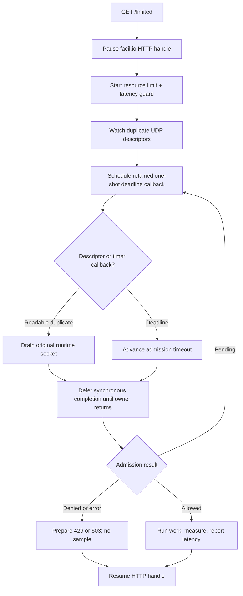

# facil.io 0.7 pause/resume integration

> **Prerequisites.** You can read C and understand HTTP callbacks and a
> single-threaded event loop. Everything specific to facil.io, Ratelimitly,
> paused handles, and retained callbacks is defined here.

## TL;DR

The facil.io loop pauses each HTTP handle while one combined resource
rate-limit and latency-guard decision is pending; admitted work runs on that
same loop, and its measured latency is then offered to the tracker.

## What this example teaches

This self-contained example serves `GET /limited` with facil.io 0.7. The HTTP
handle pauses while combined resource and latency-guard admission is pending.
facil.io watches duplicate UDP descriptors, and one-shot callbacks advance the
current admission deadline.

Allowed requests run protected work, measure it monotonically, and report its
latency before HTTP resumes. Replace `perform_protected_work()` with the
database query, RPC, or other operation the route should protect.

## Control flow



## Build and run

Build facil.io 0.7's shared library, then provide its source path:

```sh
make -C ../..
make -C /path/to/facil.io lib
make FACIL_ROOT=/path/to/facil.io
RATELIMITLY_AUTH_KEY=rl-aes1... \
./facil-io-example
curl -i http://127.0.0.1:8000/limited
```

The encoded key supplies the tenant ID and defaults discovery to
`_ratelimitly._udp.c-<key-id>.p0.ratelimitly.com`. Set optional
`RATELIMITLY_TENANT` only to override that production DNS name.

For a local synthetic responder, set both fixed-endpoint variables; setting
only one is a configuration error:

```sh
export RATELIMITLY_EXAMPLE_SERVER_HOST=127.0.0.1
export RATELIMITLY_EXAMPLE_SERVER_PORT=39082
```

The CMake build adds the facil.io source tree directly and builds its library:

```sh
cmake -S . -B example-build -DFACIL_ROOT=/path/to/facil.io
cmake --build example-build
./example-build/facil-io-example
```

Repository CI pins facil.io commit
`512a354dbd31e1895647df852d1565f9d408ed91` from the 0.7 line. Use that
revision when reproducing the validated build; facil.io 1.x exposes a
different API.

## Decision mapping

- `200`: admission allowed. The helper then attempts protected work,
  measurement, and reporting, but its failure is logged rather than reflected
  in the HTTP status.
- `429`: denied by the resource limit, alone or with the latency guard.
- `503`: denied only by latency, or admission infrastructure failed.

Denied requests never run or report protected work.

`r_runtime_admission_run_and_report()` can fail before work, during work,
during the second clock read, or while submitting the report. This example
logs all cases as `latency report failed`; treat that label and its HTTP 200
mapping as demonstration limitations, not a production error contract.

## Lifetimes and synchronous completion

The single facil.io thread owns the runtime. Duplicate descriptors transfer
readiness observation to facil.io while the public runtime retains and drains
the originals.

Each scheduled timer retains pending state until its `on_finish` callback. A
failed schedule releases that reference immediately. The paused HTTP handle
owns another reference, released after response or by the discard callback if
the peer has disappeared. Finally, `defer_completion` prevents synchronous
admission callbacks from freeing state while start or timeout code still uses
its stack frame.

`perform_protected_work()` runs synchronously on the sole facil.io thread, so
it must remain short and nonblocking here. For a database call or RPC, retain
the pending handle, record a monotonic start time after admission, start the
operation asynchronously, and resume/report only from its completion callback.

## Platform and version support

This source targets facil.io 0.7's `fio.h`/`http.h` API on Linux and macOS.
facil.io 1.x is a substantially different API and requires a separate adapter.
Native Windows is outside this POSIX descriptor model; start from Mongoose or
the Win32 example there.

Repository CI runs full allow, resource-deny, and latency-deny behavior on
Linux. macOS is declared source/build support, not an automated HTTP scenario
in this repository.

## Glossary

| Term | Meaning |
| --- | --- |
| paused handle | facil.io HTTP handle retained without sending a response while admission is pending. |
| admission | Combined resource and latency decision made before protected work begins. |
| resource rate limit | Bucket quota check; denial maps to HTTP 429 in this example. |
| latency guard | Pre-work check that can shed new work based on recent tracked latency. |
| latency tracker | Server-side sample window updated by the post-work latency report. |
| duplicate descriptor | Second file descriptor for the same UDP socket; facil.io watches the duplicate while the runtime owns and drains the original. |
| retained callback | Scheduled callback that holds a reference to pending state until execution or cancellation finishes. |

## API references

- [Example source](main.c) contains the pause/resume, descriptor watcher,
  retained timer, and completion-lifetime implementation described above.
- [Pinned facil.io 0.7 HTTP documentation](https://github.com/boazsegev/facil.io/blob/512a354dbd31e1895647df852d1565f9d408ed91/docs/_SOURCE/0.7.x/http.md)
  covers listeners and paused HTTP handles.
- [Pinned facil.io 0.7 core documentation](https://github.com/boazsegev/facil.io/blob/512a354dbd31e1895647df852d1565f9d408ed91/docs/_SOURCE/0.7.x/fio.md)
  covers descriptor attachment, timers, and lifecycle callbacks.
