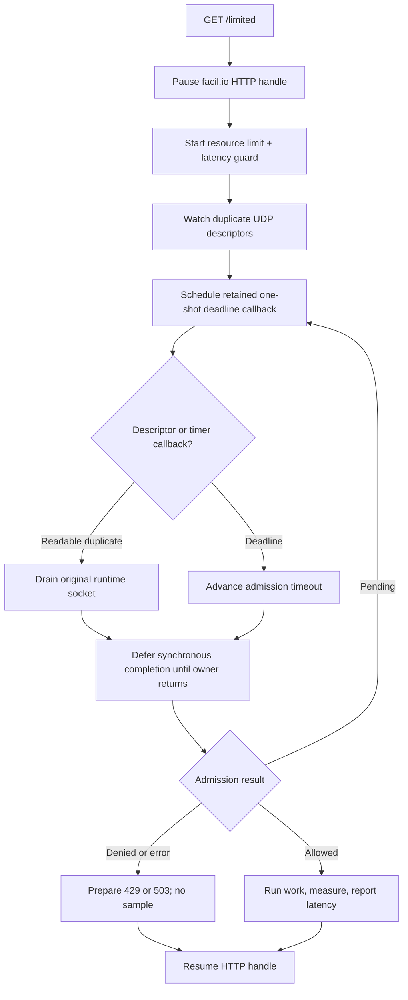

# facil.io 0.7 pause/resume integration

This self-contained example serves `GET /limited` with facil.io 0.7. The HTTP
handle pauses while combined resource and latency-guard admission is pending.
facil.io watches duplicate UDP descriptors, and one-shot callbacks advance the
current admission deadline.

Allowed requests run protected work, measure it monotonically, and report its
latency before HTTP resumes. Replace `perform_protected_work()` with the
database query, RPC, or other operation the route should protect.

## Control flow



## Build and run

Build facil.io 0.7's shared library, then provide its source path:

```sh
make -C ../..
make -C /path/to/facil.io lib
make FACIL_ROOT=/path/to/facil.io
RATELIMITLY_TENANT=example \
RATELIMITLY_AUTH_KEY=secret \
./facil-io-example
curl -i http://127.0.0.1:8000/limited
```

The CMake build adds the facil.io source tree directly and builds its library:

```sh
cmake -S . -B example-build -DFACIL_ROOT=/path/to/facil.io
cmake --build example-build
```

## Decision mapping

- `200`: admitted; protected work completed and latency was reported.
- `429`: denied by the resource limit, alone or with the latency guard.
- `503`: denied only by latency, or admission infrastructure failed.

Denied requests never run or report protected work.

## Lifetimes and synchronous completion

The single facil.io thread owns the runtime. Duplicate descriptors transfer
readiness observation to facil.io while the public runtime retains and drains
the originals.

Each scheduled timer retains pending state until its `on_finish` callback. A
failed schedule releases that reference immediately. The paused HTTP handle
owns another reference, released after response or by the discard callback if
the peer has disappeared. Finally, `defer_completion` prevents synchronous
admission callbacks from freeing state while start or timeout code still uses
its stack frame.

## Platform and version support

This source targets facil.io 0.7's `fio.h`/`http.h` API on Linux and macOS.
facil.io 1.x is a substantially different API and requires a separate adapter.
Native Windows is outside this POSIX descriptor model; start from Mongoose or
the Win32 example there.
