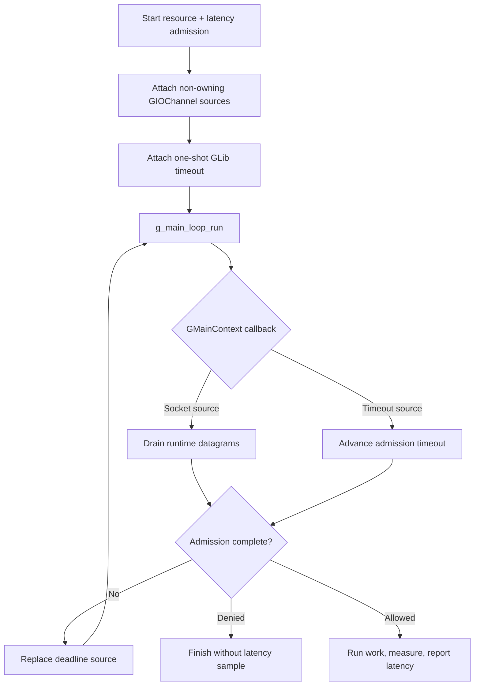

# GLib/GIO main-loop integration

> **Prerequisites.** You can read C and know what a UDP socket is. Building
> requires a C11 compiler, OpenSSL and GLib/GIO development files, `pkg-config`,
> and Make or CMake. Everything else is explained here.

## TL;DR

GLib's main loop drives a request containing a resource rate limit and a
pre-work latency guard. Allowed work is measured afterward and reported as one
latency sample; denied, cancelled, or failed work produces no sample.

## What this example teaches

This example attaches non-owning `GIOChannel` watches for the runtime's UDP
sockets to a `GMainLoop`. A one-shot GLib timeout follows the active admission
deadline, so socket readiness and client retries use the same main context.

The rate limit protects a named resource, and the latency guard checks existing
service history before protected work begins. Only admitted, successfully
completed work is measured and reported.

## Build and run

Build the library from the repository root, then use either build file:

```sh
make -C ../..
make
./glib-example
```

```sh
cmake -S . -B build
cmake --build build
./build/glib-example
```

CMake compiles the client sources with the selected compiler. Native Visual
Studio builds therefore do not consume a Unix or MinGW static archive.

## Configuration

`RATELIMITLY_AUTH_KEY` is required. With no overrides, the runtime decodes the
key ID, derives `c-<key-id>.p0.ratelimitly.com`, and discovers
`_ratelimitly._udp.c-<key-id>.p0.ratelimitly.com`.

`RATELIMITLY_TENANT` optionally replaces that derived tenant DNS name. A fixed
development responder uses `RATELIMITLY_EXAMPLE_SERVER_HOST` and
`RATELIMITLY_EXAMPLE_SERVER_PORT`; set both or neither. Leave all three
overrides unset for key-derived P0 discovery.

```sh
export RATELIMITLY_AUTH_KEY='rl-aes1...'
# Optional fixed development endpoint; set both or neither.
export RATELIMITLY_EXAMPLE_SERVER_HOST=127.0.0.1
export RATELIMITLY_EXAMPLE_SERVER_PORT=39082
./glib-example
```

## Control flow



## Guard first, sample afterward

The latency guard uses tracker history already at the server and runs before
the protected operation. After both policies allow the request,
`r_runtime_admission_run_and_report()` measures the synchronous
`prepare_response()` callback with a monotonic clock and sends one post-work
sample. Denied, cancelled, and failed operations send none.

Synchronous work makes the lifecycle visible, but real service work should not
block a `GMainContext`. Start asynchronous work after admission, retain request
identity and a monotonic start time, and report once from its successful
completion callback.

## Platform, ownership, and verification

GLib/GIO and this source have POSIX and Windows branches. Unix wraps sockets
with `g_io_channel_unix_new`; Windows calls
`g_io_channel_win32_new_socket` and links `ws2_32` plus `dnsapi`. Windows
support is conditional: GLib's constructor accepts a `gint`, while a native
WinSock `SOCKET` is pointer-width, and this source's narrowing cast has not been
proved handle-safe or executed in repository CI. Use libuv, libevent, or the
native Win32 example until that contract is verified for the target build.

Ubuntu CI verifies allow, resource denial, latency denial, and exact
request/report pairing with a synthetic responder. Trusted `main` runs also
exercise key-derived production P0 discovery and admission; the UDP report has
no application acknowledgement, so this smoke proves its local send path.

The application owns the loop, source IDs, channels, request, and copied
outcome. Remove sources and unref non-owning channels before destroying runtime
sockets, and keep client transitions on the main-context thread.

## Glossary

| Term | Meaning |
|---|---|
| `GMainLoop` | GLib object that repeatedly dispatches ready sources from a main context. |
| IOChannel | GLib `GIOChannel` wrapper used here to watch a socket without taking ownership of it. |
| source | Socket watch or timer registered with a GLib main context. |
| WinSock | Native Windows sockets API. |
| `SOCKET` | Pointer-width WinSock handle, which is not guaranteed to fit in GLib's `gint` parameter. |
| latency guard | Pre-work policy check against existing samples for a service. |
| latency sample | Post-work duration sent after admitted work succeeds. |

## API references

- [Example source](main.c)
- [Public runtime API](../../include/r_client_runtime.h)
- [Combined admission workflow](../../include/r_client_workflow.h)
- [GLib main-loop documentation](https://docs.gtk.org/glib/main-loop.html)
- [GLib `GIOChannel` platform notes](https://docs.gtk.org/glib/struct.IOChannel.html)
- [`g_io_add_watch_full`](https://docs.gtk.org/glib/func.io_add_watch_full.html)
- [Microsoft `SOCKET` type](https://learn.microsoft.com/en-us/windows/win32/winsock/socket-data-type-2)
- [Deterministic one-shot test runner](../../tests/run_one_shot_example.sh)
