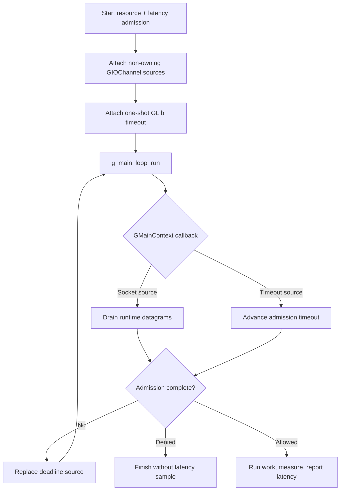

# GLib/GIO main-loop integration

This example attaches non-owning `GIOChannel` watches for the runtime's UDP
sockets to a `GMainLoop`. A one-shot GLib timeout follows the active admission
deadline. The request includes both a resource rate limit and a latency guard;
only admitted, successfully completed work is measured and reported.

## Control flow



## Build and run

Install GLib/GIO development files, build `librclient.a`, then use either build
file:

```sh
make -C ../..
make
./glib-example
```

```sh
cmake -S . -B build
cmake --build build
./build/glib-example
```

CMake compiles `rl-c-client` with the selected compiler. Native Visual Studio
builds therefore do not depend on an incompatible Unix/MinGW archive.

Set `RATELIMITLY_TENANT` and `RATELIMITLY_AUTH_KEY`. Optional fixed responder
variables bypass SRV discovery for local testing.

## Platform support

GLib/GIO supports Linux, macOS, and Windows. Unix builds use
`g_io_channel_unix_new`; Windows uses `g_io_channel_win32_new_socket`. Both
channels are explicitly non-owning so the runtime remains the sole socket
owner. Windows also links `ws2_32` and `dnsapi`.

## Ownership and production use

The application owns the loop, source IDs, channels, request, and copied
outcome. Remove sources and unref channels before destroying runtime sockets.
Keep client calls on the main-context thread. Replace `prepare_response` with
the real protected operation, or start asynchronous work after admission and
report from its completion callback.

## API references

- [GLib main loop](https://docs.gtk.org/glib/main-loop.html) covers contexts,
  sources, and dispatch.
- [GSocket source creation](https://docs.gtk.org/gio/method.Socket.create_source.html)
  defines socket conditions and source ownership.
