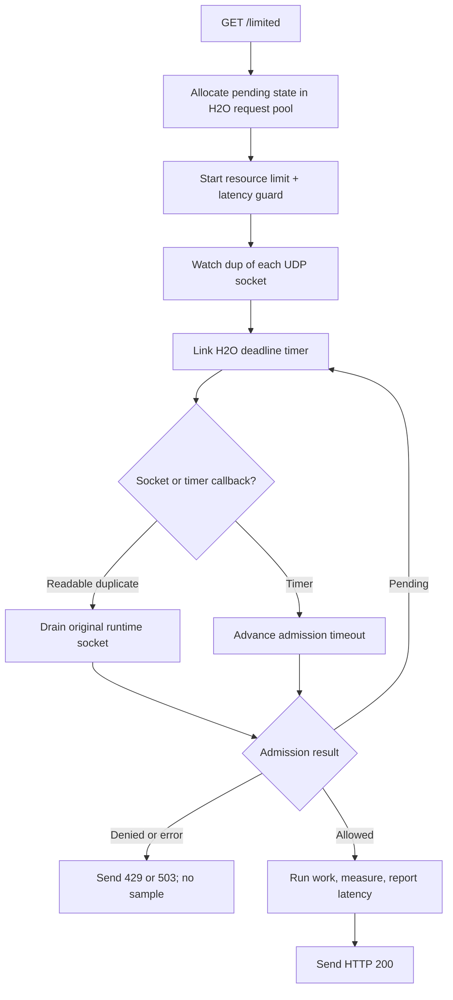

# H2O embedded event loop

This self-contained server embeds H2O's native event loop and serves `GET
/limited`. H2O watches duplicates of the runtime's UDP sockets, while one H2O
timer tracks each admission deadline. Every admission contains both a resource
rate limit and a latency guard.

Allowed requests run a protected application operation, measure it with a
monotonic clock, and report the sample before sending the HTTP response. Replace
`prepare_protected_response()` with the database query, RPC, or other work the
route should protect.

## Control flow



## Build and run

Install H2O with the `libh2o-evloop` pkg-config module, then:

```sh
make -C ../..
make
RATELIMITLY_TENANT=example \
RATELIMITLY_AUTH_KEY=secret \
./h2o-example
curl -i http://127.0.0.1:8000/limited
```

Or use CMake:

```sh
cmake -S . -B build
cmake --build build
./build/h2o-example
```

H2O's installed `libh2o-evloop.pc` does not list every dependency needed when
the library is static. Both build files therefore link OpenSSL's SSL and Crypto
libraries plus the system math library explicitly.

## Decision mapping

- `200`: admitted; protected work completed and latency was reported.
- `429`: denied by the resource limit, alone or with the latency guard.
- `503`: denied only by latency, or admission infrastructure failed.

Denied requests never run or report protected work.

## Ownership and descriptor lifetime

The H2O loop thread owns the runtime and pending admission state. H2O closes
descriptors wrapped by `h2o_evloop_socket_create()`, so each watcher receives a
`dup()` of the runtime-owned socket. Readiness on that duplicate is consumed
from the original descriptor; both refer to the same socket receive queue.

Pending state lives in the H2O request pool. Its disposer unlinks the timer and
cancels active admission on response completion, peer disconnect, or shutdown.
The source includes the timer API compatibility branch needed by H2O 2.2 and
2.3 development versions.

## Platform support

The embedded loop selects epoll on Linux and kqueue on macOS. H2O and this
example are therefore scoped to those two platforms. The CMake configuration
fails clearly on native Windows rather than silently selecting an unsupported
backend.

## API references

- [H2O embedding FAQ](https://h2o.examp1e.net/faq.html) explains building
  and linking applications with `libh2o`.
- [H2O public C header](https://github.com/h2o/h2o/blob/master/include/h2o.h)
  defines handler, request-pool, timer, and embedded-loop APIs.
