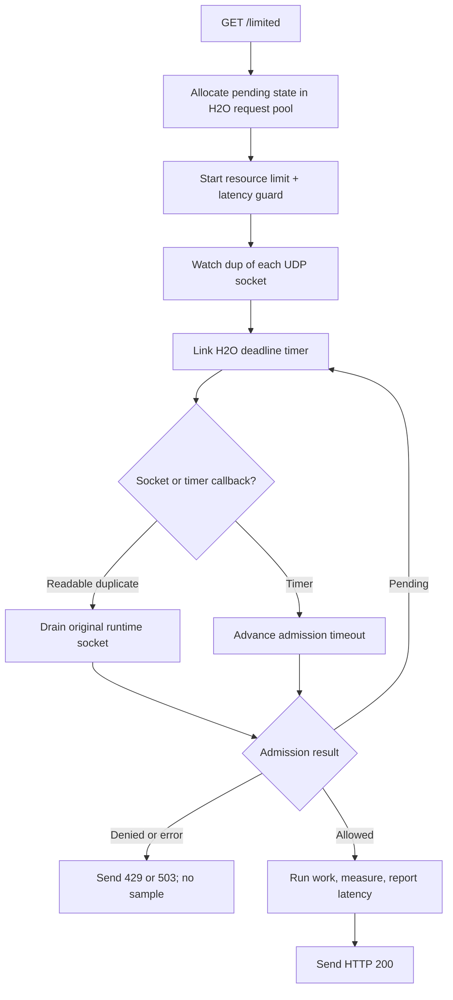

# H2O embedded event loop

> **Prerequisites.** You can read C and understand HTTP callbacks,
> nonblocking sockets, and event-loop timers. Everything specific to H2O and
> Ratelimitly is defined here.

## TL;DR

H2O pauses response completion while its own loop drives a combined resource
rate-limit and latency-guard request; admitted work runs on that loop, and its
measured latency is then offered to the tracker.

## What this example teaches

This self-contained server embeds H2O's native event loop and serves `GET
/limited`. H2O watches duplicates of the runtime's UDP sockets, while one H2O
timer tracks each admission deadline. Every admission contains both a resource
rate limit and a latency guard.

Allowed requests run a protected application operation, measure it with a
monotonic clock, and report the sample before sending the HTTP response. Replace
`prepare_protected_response()` with the database query, RPC, or other work the
route should protect.

## Control flow



## Build and run

Install H2O with the `libh2o-evloop` pkg-config module, then:

```sh
make -C ../..
make
RATELIMITLY_AUTH_KEY=rl-aes1... \
./h2o-example
curl -i http://127.0.0.1:8000/limited
```

The encoded key supplies the tenant ID and defaults discovery to
`_ratelimitly._udp.c-<key-id>.p0.ratelimitly.com`. Set optional
`RATELIMITLY_TENANT` only to override that production DNS name.

For a local synthetic responder, set both fixed-endpoint variables; setting
only one is a configuration error:

```sh
export RATELIMITLY_EXAMPLE_SERVER_HOST=127.0.0.1
export RATELIMITLY_EXAMPLE_SERVER_PORT=39082
```

Or use CMake:

```sh
cmake -S . -B build
cmake --build build
./build/h2o-example
```

H2O's installed `libh2o-evloop.pc` does not list every dependency needed when
the library is static. Both build files therefore link OpenSSL's SSL and Crypto
libraries plus the system math library explicitly.

## Decision mapping

- `200`: admission allowed. The helper then attempts protected work,
  measurement, and reporting, but its failure is logged rather than reflected
  in the HTTP status.
- `429`: denied by the resource limit, alone or with the latency guard.
- `503`: denied only by latency, or admission infrastructure failed.

Denied requests never run or report protected work.

`r_runtime_admission_run_and_report()` can fail before work, during work,
during the second clock read, or while submitting the report. This example
logs every case as `latency report failed`; treat that label and its HTTP 200
mapping as demonstration limitations, not a production error contract.

## Ownership and descriptor lifetime

The H2O loop thread owns the runtime and pending admission state. H2O closes
descriptors wrapped by `h2o_evloop_socket_create()`, so each watcher receives a
`dup()` of the runtime-owned socket. Readiness on that duplicate is consumed
from the original descriptor; both refer to the same socket receive queue.

Pending state lives in the H2O request pool. Its disposer unlinks the timer and
cancels active admission on response completion, peer disconnect, or shutdown.
The source includes the timer API compatibility branch needed by H2O 2.2 and
2.3 development versions.

`prepare_protected_response()` runs synchronously on the H2O loop and must stay
short and nonblocking. For a database call or RPC, retain request state, record
a monotonic start time after admission, start the operation asynchronously,
then measure, report, and send the response from its completion callback.

## Platform support

The embedded loop selects epoll on Linux and kqueue on macOS. H2O and this
example are therefore scoped to those two platforms. The CMake configuration
fails clearly on native Windows rather than silently selecting an unsupported
backend.

Repository CI runs full allow, resource-deny, and latency-deny behavior on
Linux. macOS is declared source/build support, not an automated HTTP scenario
in this repository. The stable API references below are pinned to H2O v2.2.6;
the source compatibility branch for 2.3 development releases is not equivalent
to a repository-wide 2.3 validation claim.

## Glossary

| Term | Meaning |
| --- | --- |
| H2O | C HTTP server library whose embeddable event loop owns the HTTP sockets and callbacks in this example. |
| GET | HTTP method used by the example's read-only `/limited` route. |
| admission | Combined resource and latency decision made before protected work begins. |
| resource rate limit | Bucket quota check; denial maps to HTTP 429 in this example. |
| latency guard | Pre-work check that can shed new work based on recent tracked latency. |
| latency tracker | Server-side sample window updated by the post-work latency report. |
| request pool | H2O-owned arena whose disposer releases pending request state when the HTTP request ends. |
| duplicate descriptor | Second file descriptor for the same UDP socket; H2O owns the duplicate while the runtime owns and drains the original. |
| CMake | Cross-platform build-system generator provided as an alternative to Make. |

## API references

- [Example source](main.c) contains the request-pool disposer, duplicate-socket
  watcher, admission callback, and timer compatibility branch explained above.
- [H2O v2.2.6 event-loop API](https://github.com/h2o/h2o/blob/v2.2.6/include/h2o/socket/evloop.h)
  defines the embedded socket loop.
- [H2O v2.2.6 timeout API](https://github.com/h2o/h2o/blob/v2.2.6/include/h2o/timeout.h)
  defines timer linking, unlinking, and lifetime.
- [H2O v2.2.6 epoll backend](https://github.com/h2o/h2o/blob/v2.2.6/lib/common/socket/evloop/epoll.c.h)
  and [kqueue backend](https://github.com/h2o/h2o/blob/v2.2.6/lib/common/socket/evloop/kqueue.c.h)
  support the Linux and macOS platform statement.
