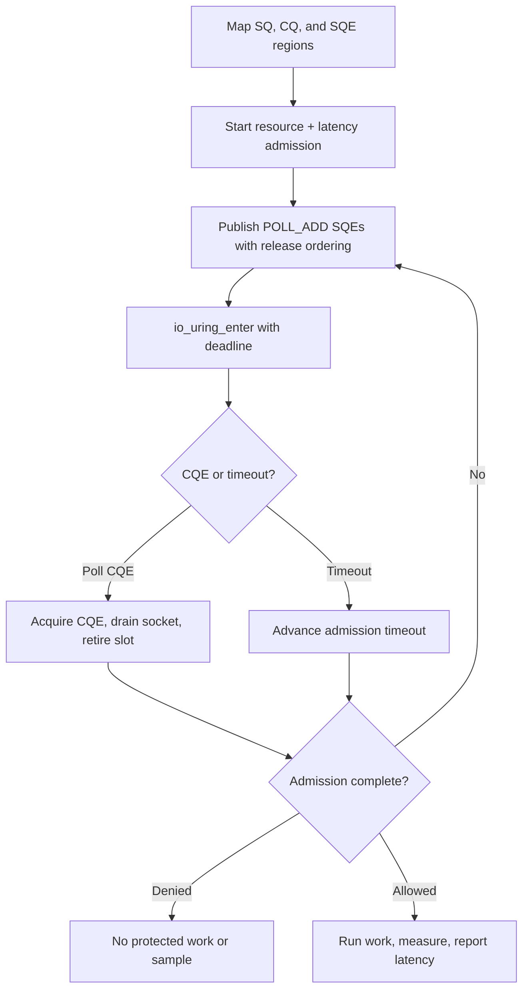

# Raw io_uring integration

> **Prerequisites.** You can read C and know what a UDP socket is. Building
> requires Linux 5.11 or newer, io_uring UAPI headers, a C11 compiler, OpenSSL
> development files, and a kernel policy that permits `io_uring_setup`.
> Everything else is explained here.

## TL;DR

Raw `io_uring` syscalls drive a request containing a resource rate limit and a
pre-work latency guard without using liburing. Allowed work is measured
afterward and reported as one latency sample; denied, cancelled, or failed work
produces no sample.

## What this example teaches

This Linux-only example uses the io_uring userspace API and syscalls directly,
without liburing. It maps the submission queue, completion queue, and submission
entry array from offsets returned by `io_uring_setup`, publishes poll requests
with release ordering, and consumes completions with acquire ordering.

The application submits both policies in one admission request. It performs
protected work only after the resource limit and latency guard allow it, then
measures and reports successful work once.

## Build and run

Linux UAPI headers are the only io_uring-specific build dependency:

```sh
make -C ../..
make
./io-uring-example
```

```sh
cmake -S . -B build
cmake --build build
./build/io-uring-example
```

If `io_uring_setup` returns `EPERM` or `ENOSYS`, check the kernel version,
container profile, seccomp policy, and host setting before debugging admission.

## Configuration

`RATELIMITLY_AUTH_KEY` is required. With no overrides, the runtime decodes the
key ID, derives `c-<key-id>.p0.ratelimitly.com`, and discovers
`_ratelimitly._udp.c-<key-id>.p0.ratelimitly.com`.

`RATELIMITLY_TENANT` optionally replaces the key-derived tenant DNS name. For
a fixed development responder, set `RATELIMITLY_EXAMPLE_SERVER_HOST` and
`RATELIMITLY_EXAMPLE_SERVER_PORT` together; setting only one is invalid. Leave
all three overrides unset for key-derived P0 discovery.

```sh
export RATELIMITLY_AUTH_KEY='rl-aes1...'
# Optional fixed development endpoint; set both or neither.
export RATELIMITLY_EXAMPLE_SERVER_HOST=127.0.0.1
export RATELIMITLY_EXAMPLE_SERVER_PORT=39082
./io-uring-example
```

## Control flow



## Guard first, sample afterward

The latency guard checks server-side history before work starts; it is separate
from timing the current operation. Once the rate limit and guard both allow the
request, `r_runtime_admission_run_and_report()` measures the synchronous
`prepare_response()` callback with a monotonic clock and sends one post-work
sample. It sends none for denied, cancelled, or failed work.

This callback is synchronous only to keep the ring mechanics readable. A
production loop should start asynchronous work after admission, retain the
request identity and monotonic start time, and report once from successful
completion rather than blocking the ring thread.

## Platform, ring invariants, and verification

This source is Linux-only and uses `IORING_ENTER_EXT_ARG`, whose extended
argument form was added in Linux 5.11. liburing wraps the same kernel interface
and adds compatibility helpers; use it when supporting older kernel/API
combinations matters more than demonstrating the raw mappings.

Ring offsets supplied by the kernel define the mappings. Queue counters are
monotonic and wrap through their masks; a release store publishes a complete
submission, and an acquire load observes a complete completion. `POLL_ADD` is
one-shot, so the example re-arms it after draining the socket and destroys the
ring before closing runtime-owned sockets.

This folder is Linux-only. Ubuntu CI runs allow, resource-denial, and
latency-denial scenarios against the synthetic responder and verifies exact
request/report pairing. Trusted `main` runs also test key-derived production P0
discovery and admission; the unacknowledged UDP report proves only its local
send path in that smoke test.

## Glossary

| Term | Meaning |
|---|---|
| UAPI | User-space API exposed by Linux kernel headers. |
| SQE | Submission queue entry describing one operation for the kernel. |
| CQE | Completion queue entry containing an operation's result and user data. |
| `POLL_ADD` | One-shot io_uring operation that completes when a descriptor becomes ready. |
| acquire/release ordering | Atomic ordering that makes shared queue writes visible before publication and reads complete before reuse. |
| latency guard | Pre-work check against existing service-latency samples. |

## API references

- [Example source](main.c)
- [Public runtime API](../../include/r_client_runtime.h)
- [Combined admission workflow](../../include/r_client_workflow.h)
- [`io_uring_setup(2)`](https://man7.org/linux/man-pages/man2/io_uring_setup.2.html)
- [`io_uring_enter(2)`](https://man7.org/linux/man-pages/man2/io_uring_enter.2.html)
- [Linux io_uring documentation](https://docs.kernel.org/io_uring/index.html)
- [Deterministic one-shot test runner](../../tests/run_one_shot_example.sh)
