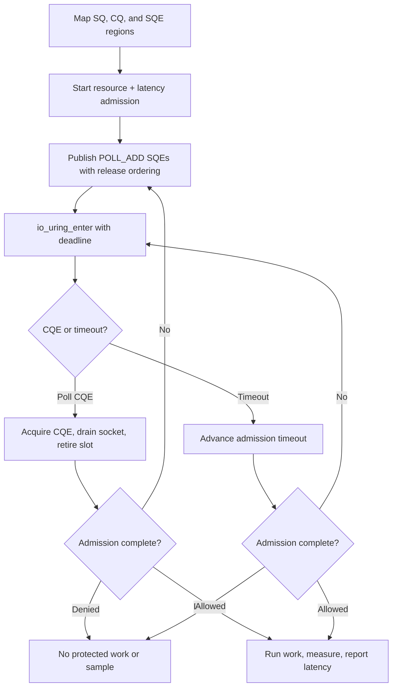

# Raw io_uring integration

This Linux-only example uses the io_uring UAPI and syscalls directly, without
liburing. It maps the submission queue, completion queue, and SQE array from
the offsets returned by `io_uring_setup`, publishes poll requests with release
ordering, and consumes completions with acquire ordering.

The application layer submits one resource and one latency guard. Only admitted
work runs; completed work is measured and reported once. Denied, cancelled, or
failed work produces no latency sample.

## Control flow



## Build and run

Linux UAPI headers are the only io_uring dependency:

```sh
make -C ../..
make
./io-uring-example
```

```sh
cmake -S . -B build
cmake --build build
./build/io-uring-example
```

Set `RATELIMITLY_TENANT` and `RATELIMITLY_AUTH_KEY`; fixed responder variables
are optional for local tests.

## Platform support

io_uring is Linux-only. The kernel and its security policy must allow
`io_uring_setup`. This example uses `IORING_ENTER_EXT_ARG`, available on modern
kernels; liburing is the safer compatibility layer for production software.

## Read this code carefully

- Ring offsets returned by the kernel define mapping layout.
- SQ and CQ counters are monotonic and wrap through each ring mask.
- A release store publishes a fully initialized SQE.
- An acquire load observes a complete CQE before its slot is retired.
- `POLL_ADD` is one-shot and must be re-armed after draining the socket.
- Ring poll requests are torn down before runtime sockets are closed.
