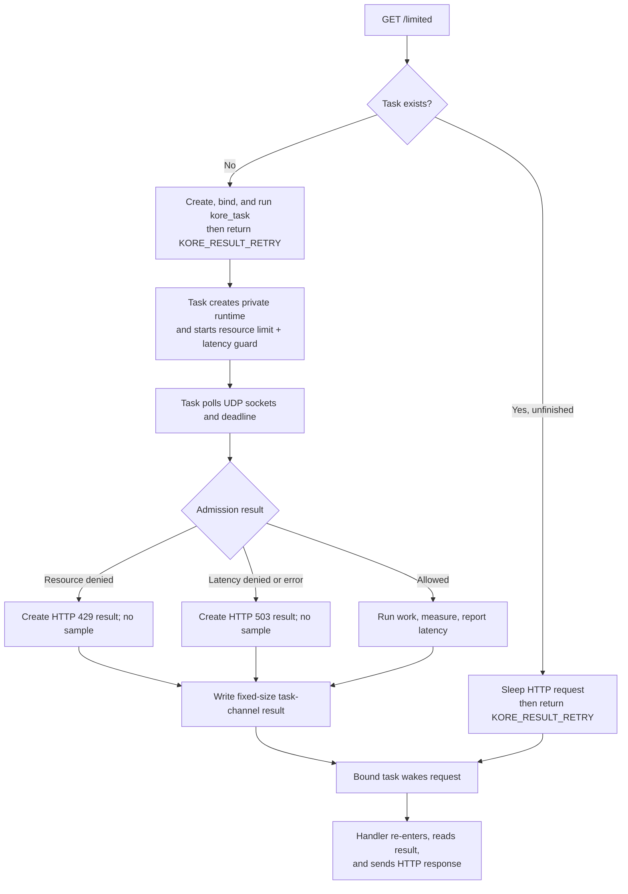

# Kore task integration

> **Prerequisites.** You can read C and understand HTTP callbacks, worker
> processes, and background tasks. Everything specific to Kore, Ratelimitly,
> task channels, and the Linux sandbox is defined here.

## TL;DR

Each `/limited` request starts a Kore task with a private client for one combined
resource rate-limit and latency-guard decision; admitted work runs in that task,
and its measured latency is then offered to the tracker.

## What this example teaches

This self-contained folder is a Kore module plus its runnable `kore.conf`.
`GET /limited` starts a `kore_task` and returns `KORE_RESULT_RETRY`. If a later
handler invocation finds the task unfinished, it sleeps the HTTP request until
the bound task wakes it. The task polls combined resource and latency-guard
admission without sharing mutable client state across Kore threads.

Allowed requests run protected work, measure it monotonically, and report the
sample before the task sends its fixed-size result through the channel. Replace
`perform_protected_work()` with the database query, RPC, or other operation the
route should protect.

## Control flow



## Build and run

Build Kore with task support and its no-TLS backend, then build the module:

```sh
make -C /path/to/kore TASKS=1 TLS_BACKEND=none
make -C ../..
make KORE_ROOT=/path/to/kore
RATELIMITLY_AUTH_KEY=rl-aes1... \
/path/to/kore/kore -fnrc kore.conf
curl -i http://127.0.0.1:8000/limited
```

The encoded key supplies the tenant ID and defaults discovery to
`_ratelimitly._udp.c-<key-id>.p0.ratelimitly.com`. Set optional
`RATELIMITLY_TENANT` only to override that production DNS name.

For a local synthetic responder, set both fixed-endpoint variables; setting
only one is a configuration error:

```sh
export RATELIMITLY_EXAMPLE_SERVER_HOST=127.0.0.1
export RATELIMITLY_EXAMPLE_SERVER_PORT=39082
```

Or build the module with CMake:

```sh
cmake -S . -B build -DKORE_ROOT=/path/to/kore
cmake --build build
cp build/kore-example.so .
```

Kore resolves module symbols at load time, so the shared object deliberately
does not link the Kore executable itself.

## Decision mapping

- `200`: admission allowed. The task then attempts protected work,
  measurement, and reporting, but its helper failure is logged rather than
  reflected in the fixed-size result's admission status.
- `429`: denied by the resource limit, alone or with the latency guard.
- `503`: denied only by latency, or the task/admission infrastructure failed.

Denied requests never run or report protected work.

`r_runtime_admission_run_and_report()` can fail before work, during work,
during the second clock read, or while submitting the report. This module logs
every case as `latency report failed`; treat that label and its HTTP 200 mapping
as demonstration limitations, not a production error contract.

## Task and sandbox ownership

Each task owns its runtime, sockets, admission state, and polling loop. Kore owns
`hdlr_extra` and frees it with the request. This per-request model is easy to
audit but creates a client and resolver context for every exchange; high-volume
services should use one long-lived task with a channel-fed queue.

`perform_protected_work()` is synchronous and occupies the request's task
thread. That isolates the Kore worker but still consumes one task slot; for
long operations, size the task pool deliberately or move to the long-lived
queue design and report from the operation's completion path.

Linux Kore workers use seccomp. The module extends Kore's base filter with the
glibc resolver path used by key-derived discovery: connected UDP DNS and
batched A/AAAA queries. The local `AF_UNIX` nscd probe receives `ENOENT`, and
the optional `AF_NETLINK` interface probe receives `EAFNOSUPPORT`; glibc then
uses its normal DNS and address-sorting fallbacks without gaining access to
either socket family. Kore's existing `ioctl` denial also remains intact;
glibc grows its DNS receive buffer when `FIONREAD` is unavailable. Kore's base
filter already supplies poll, ordinary UDP send/receive, fcntl, and file
lookup. Reconcile this list with the exact Kore build and libc used by a
hardened deployment.

## Platform support

Kore supports Linux and macOS, and the build files handle ELF shared modules and
Darwin bundles. The seccomp declarations compile only on Linux. Native Windows
is outside Kore's supported module model.

Repository CI pins Kore commit
`ba9bc3b56e24c3652f4cd808463ad45f78579ba8` and runs full allow,
resource-deny, and latency-deny behavior on Linux. macOS is declared module
build support, not an automated HTTP scenario in this repository.

## Glossary

| Term | Meaning |
| --- | --- |
| Kore task | Background task object that can be bound to an HTTP request and communicate through a channel. |
| sleeping request | Kore request temporarily removed from normal processing until an event wakes it for another handler invocation. |
| task channel | Kore-managed byte channel used here to return one fixed-size admission result to the HTTP handler. |
| admission | Combined resource and latency decision made before protected work begins. |
| resource rate limit | Bucket quota check; denial maps to HTTP 429 in this example. |
| latency guard | Pre-work check that can shed new work based on recent tracked latency. |
| latency tracker | Server-side sample window updated by the post-work latency report. |
| seccomp | Linux syscall filter that restricts what a Kore worker process may ask the kernel to do. |
| AAAA | DNS address record that maps a hostname to an IPv6 address. |
| IPv6 | Internet Protocol version 6, the address format returned by a DNS AAAA record. |
| ELF | Executable and Linkable Format used by Linux shared modules. |

## API references

- [Example source](main.c) contains the task start/retry/sleep order, channel
  result, and least-privilege resolver filter explained above.
- [Kore task documentation](https://docs.kore.io/4.2.0/api/tasks.html) covers
  request binding, task state, channels, and wakeups.
- [Kore HTTP documentation](https://docs.kore.io/4.2.0/api/http.html) defines
  request sleep and handler retry behavior.
- [Kore seccomp documentation](https://docs.kore.io/4.0.0/api/seccomp.html)
  explains how application modules extend the worker allow-list.
- [Pinned Kore seccomp source](https://github.com/jorisvink/kore/blob/ba9bc3b56e24c3652f4cd808463ad45f78579ba8/src/seccomp.c)
  is the upstream implementation used by the validated Linux build.
