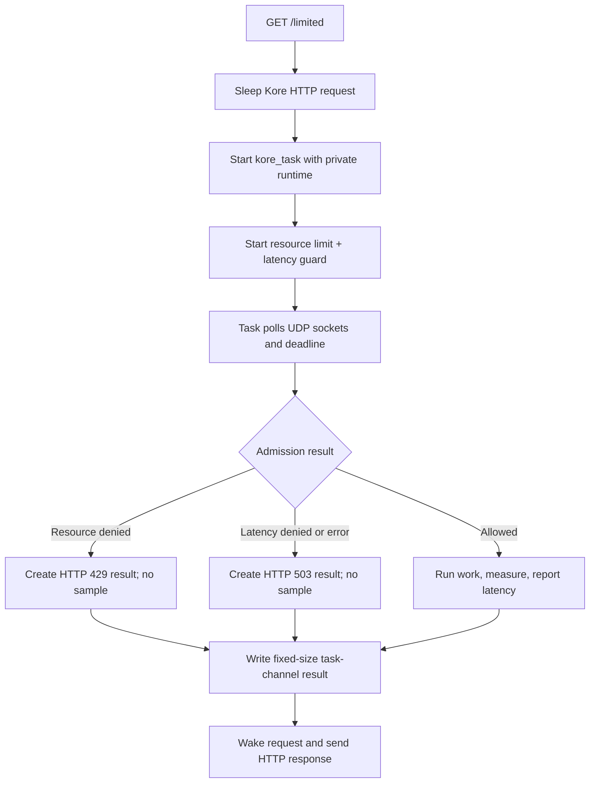

# Kore task integration

This self-contained folder is a Kore module plus its runnable `kore.conf`.
`GET /limited` starts a `kore_task`, sleeps the HTTP request, and gives that task
a private runtime. The task polls combined resource and latency-guard admission
without sharing mutable client state across Kore threads.

Allowed requests run protected work, measure it monotonically, and report the
sample before the task sends its fixed-size result through the channel. Replace
`perform_protected_work()` with the database query, RPC, or other operation the
route should protect.

## Control flow



## Build and run

Build Kore with task support and its no-TLS backend, then build the module:

```sh
make -C /path/to/kore TASKS=1 TLS_BACKEND=none
make -C ../..
make KORE_ROOT=/path/to/kore
RATELIMITLY_TENANT=example \
RATELIMITLY_AUTH_KEY=secret \
/path/to/kore/kore -fnrc kore.conf
curl -i http://127.0.0.1:8000/limited
```

Or build the module with CMake:

```sh
cmake -S . -B build -DKORE_ROOT=/path/to/kore
cmake --build build
cp build/kore-example.so .
```

Kore resolves module symbols at load time, so the shared object deliberately
does not link the Kore executable itself.

## Decision mapping

- `200`: admitted; protected work completed and latency was reported.
- `429`: denied by the resource limit, alone or with the latency guard.
- `503`: denied only by latency, or the task/admission infrastructure failed.

Denied requests never run or report protected work.

## Task and sandbox ownership

Each task owns its runtime, sockets, admission state, and polling loop. Kore owns
`hdlr_extra` and frees it with the request. This per-request model is easy to
audit but creates a client and resolver context for every exchange; high-volume
services should use one long-lived task with a channel-fed queue.

Linux Kore workers use seccomp. The module declares socket creation, bind, and
`getsockname`; Kore's base filter supplies poll, UDP send/receive, fcntl, and
lookup syscalls. Reconcile this list with the exact Kore build and resolver used
by a hardened deployment.

## Platform support

Kore supports Linux and macOS, and the build files handle ELF shared modules and
Darwin bundles. The seccomp declarations compile only on Linux. Native Windows
is outside Kore's supported module model.

## API references

- [Kore API documentation](https://docs.kore.io/4.2.3/api.html) covers
  requests, tasks, channels, and module lifecycle.
- [Kore upstream source](https://github.com/jorisvink/kore) documents platform
  support and current framework behavior.
