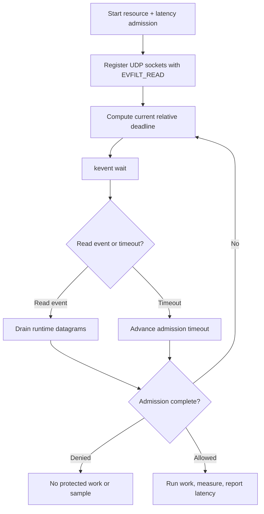

# Pure kqueue integration

This example uses kqueue directly, without an event-loop library. It registers
runtime-owned UDP sockets with `EVFILT_READ` and supplies each current admission
delay as the `kevent` timeout. The request contains one resource rate limit and
one latency guard; only admitted, completed work produces a latency report.

## Control flow



## Build and run

On macOS or a BSD with kqueue:

```sh
make -C ../..
make
./kqueue-example
```

```sh
cmake -S . -B build
cmake --build build
./build/kqueue-example
```

From the repository root, run the strict local behavioral suite with
`bash tests/test_macos_examples.sh`. It checks allow, resource denial, latency
denial, and exact latency-report pairing against the synthetic responder. This
macOS-only suite is deliberately not part of CI.

Set `RATELIMITLY_AUTH_KEY`. The key defaults discovery to
`_ratelimitly._udp.c-<key-id>.p0.ratelimitly.com`; optional
`RATELIMITLY_TENANT` overrides it. Fixed responder variables are optional for
local tests.

## Platform support

kqueue is available on macOS and the BSD family. It is not a native Linux or
Windows API; use epoll/io_uring on Linux and the Win32 example on Windows.

## Production notes

- Treat `EV_ERROR` and terminal `EV_EOF` results as watcher failures.
- Drain readable datagram sockets to `EAGAIN`.
- Recompute the relative timeout after every client transition.
- Close the kqueue before destroying runtime-owned sockets.
- Keep request storage alive until callback or explicit cancellation.

## API references

- [FreeBSD `kqueue(2)` manual](https://man.freebsd.org/cgi/man.cgi?query=kevent&sektion=2)
  defines filter registration, `EV_ERROR`, `EV_EOF`, and timeout behavior.
