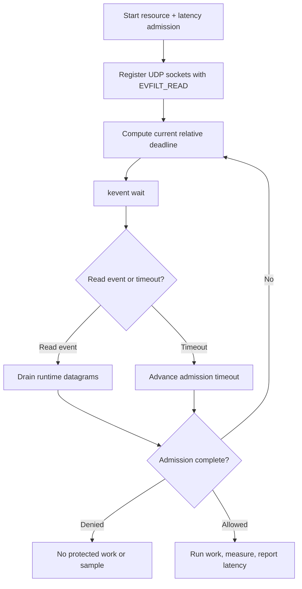

# Pure kqueue integration

> **Prerequisites.** You can read C and know what a UDP socket is. Building
> requires macOS or BSD with kqueue, a C11 compiler, OpenSSL development files,
> and Make or CMake. Everything else is explained here.

## TL;DR

`kqueue` drives a request containing a resource rate limit and a pre-work
latency guard without an event-loop library. Allowed work is measured afterward
and reported as one latency sample; denied, cancelled, or failed work produces
no sample.

## What this example teaches

This example uses kqueue directly. It registers runtime-owned UDP sockets with
`EVFILT_READ` and supplies the current admission delay as the `kevent` timeout.

The rate limit and latency guard are submitted together. Only admitted,
successfully completed work is measured and reported to the latency tracker.

## Build and run

On macOS or a BSD with kqueue, build the library and this folder:

```sh
make -C ../..
make
./kqueue-example
```

```sh
cmake -S . -B build
cmake --build build
./build/kqueue-example
```

## Configuration

`RATELIMITLY_AUTH_KEY` is required. With no overrides, the runtime decodes the
key ID, derives `c-<key-id>.p0.ratelimitly.com`, and discovers
`_ratelimitly._udp.c-<key-id>.p0.ratelimitly.com`.

`RATELIMITLY_TENANT` optionally replaces the derived tenant DNS name. For a
fixed development responder, set `RATELIMITLY_EXAMPLE_SERVER_HOST` and
`RATELIMITLY_EXAMPLE_SERVER_PORT` together; setting only one is invalid. Leave
all three overrides unset for key-derived P0 discovery.

```sh
export RATELIMITLY_AUTH_KEY='rl-aes1...'
# Optional fixed development endpoint; set both or neither.
export RATELIMITLY_EXAMPLE_SERVER_HOST=127.0.0.1
export RATELIMITLY_EXAMPLE_SERVER_PORT=39082
./kqueue-example
```

## Control flow



## Guard first, sample afterward

The latency guard checks existing server-side tracker history before work
starts; it does not measure the operation awaiting admission. After both the
rate limit and guard allow the request,
`r_runtime_admission_run_and_report()` measures synchronous response
construction and sends one post-work sample. Denied, cancelled, and failed
work sends none.

Synchronous work keeps this example focused on kqueue. Production code should
start asynchronous, nonblocking work after admission, retain request identity
and a monotonic start time, and report once from the successful completion
callback.

## Platform and verification

kqueue is available on macOS and BSD, not natively on Linux or Windows. The
repository's local macOS suite verifies allow, resource denial, latency denial,
and exact request/report pairing against the synthetic responder. That suite is
deliberately not run in CI, and this repository does not claim automated BSD or
production P0 coverage for this example.

Treat `EV_ERROR` and terminal `EV_EOF` as failures, recompute the relative
timeout after every client transition, keep request storage alive through
callback or cancellation, and close the kqueue descriptor before destroying
runtime-owned sockets.

## Glossary

| Term | Meaning |
|---|---|
| kqueue | macOS/BSD kernel facility for receiving events about registered objects. |
| `EVFILT_READ` | kqueue filter that reports when a socket can be read. |
| `kevent` | Function used to register filters and wait for returned events. |
| admission deadline | Next time the client must advance timeout or retry state. |
| latency sample | Post-work duration reported after successful admitted work. |

## API references

- [Example source](main.c)
- [Public runtime API](../../include/r_client_runtime.h)
- [Combined admission workflow](../../include/r_client_workflow.h)
- [Apple `kevent(2)` manual](https://developer.apple.com/library/archive/documentation/System/Conceptual/ManPages_iPhoneOS/man2/kevent.2.html)
- [FreeBSD `kqueue(2)` manual](https://man.freebsd.org/cgi/man.cgi?query=kevent&sektion=2)
- [Local macOS example suite](../../tests/test_macos_examples.sh)
