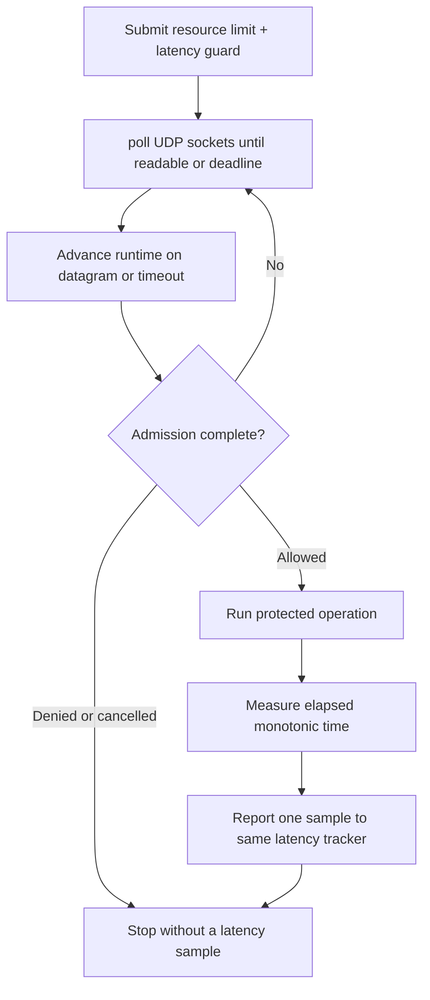

# Latency tracker with `poll`

> **Prerequisites.** You can read C and know what a UDP socket is. Building
> requires Linux or macOS, a C11 compiler, OpenSSL development files, and Make
> or CMake. Everything else is explained here.

## TL;DR

POSIX `poll` drives a request containing both a resource rate limit and a
pre-work latency guard. After admission, the example measures simulated work
and reports one post-work latency sample; denied, cancelled, or failed work
produces no sample.

## What this example teaches

This self-contained example shows the full admission lifecycle without a
third-party event-loop dependency. It drives UDP readiness and deadlines with
POSIX `poll`, performs a simulated protected operation only after admission,
measures that operation with a monotonic clock, and reports exactly one sample.

The example intentionally does not report denied or cancelled work. Those
paths did not complete an operation, so a fabricated duration would corrupt
the server-side tracker used by later guards.

## Build and run

Build `librclient.a` first, then use either build file in this directory:

```sh
make -C ../..
make
./latency-tracker-example
```

```sh
cmake -S . -B build
cmake --build build
./build/latency-tracker-example
```

`RATELIMITLY_EXAMPLE_WORK_MS` selects the simulated duration from 0 through
60000 milliseconds; the default is 25 milliseconds. These are code-defined
demonstration settings in [the example source](main.c), not measured latency
recommendations.

## Configuration

`RATELIMITLY_AUTH_KEY` is required. With no overrides, the runtime decodes the
key ID, derives `c-<key-id>.p0.ratelimitly.com`, and discovers
`_ratelimitly._udp.c-<key-id>.p0.ratelimitly.com`.

`RATELIMITLY_TENANT` optionally replaces the key-derived tenant DNS name. A
fixed development responder uses `RATELIMITLY_EXAMPLE_SERVER_HOST` and
`RATELIMITLY_EXAMPLE_SERVER_PORT`; set both or neither. Leave all three
overrides unset for key-derived P0 discovery.

```sh
export RATELIMITLY_AUTH_KEY='rl-aes1...'
export RATELIMITLY_EXAMPLE_WORK_MS=25
# Optional fixed development endpoint; set both or neither.
export RATELIMITLY_EXAMPLE_SERVER_HOST=127.0.0.1
export RATELIMITLY_EXAMPLE_SERVER_PORT=39082
./latency-tracker-example
```

## Control flow



## Guard first, sample afterward

The latency guard asks whether existing server-side samples for
`example-inventory-backend` satisfy the configured threshold before new work
runs. It is distinct from the post-work observation: after admission,
`perform_protected_work()` records monotonic start and finish times, then
`r_client_admission_report_latency()` sends that elapsed duration using the
same tracker identity.

The simulated `nanosleep` is deliberately synchronous. An event-loop service
must not copy that blocking behavior: start asynchronous work after admission,
retain the request identity and monotonic start time, and report once from its
successful completion callback.

## Platform and verification

This loop uses POSIX `poll` and `nanosleep`, so this source targets Linux and
macOS; use the native Win32 example for Windows. Ubuntu CI verifies allow,
resource denial, latency denial, one matching report on success, and no report
on either denial using the synthetic responder. Trusted `main` runs also test
key-derived production P0 discovery and admission; the unacknowledged UDP
report proves its local send path, not server receipt.

Keep `r_admission_request_t` storage alive until completion or cancellation,
and choose real policy names and thresholds that match the protected service.

## Glossary

| Term | Meaning |
|---|---|
| POSIX | Portable operating-system interface standard implemented by Unix-like systems. |
| `poll` | POSIX function that waits for socket readiness or a timeout. |
| monotonic clock | Clock that does not jump when wall-clock time is corrected, making it suitable for elapsed durations. |
| latency guard | Pre-work decision based on existing samples and a configured threshold. |
| latency tracker | Server-side sample history identified by the service and tracker configuration. |
| latency sample | Post-work elapsed duration sent after successful admitted work. |

## API references

- [Example source](main.c)
- [Public runtime API](../../include/r_client_runtime.h)
- [Combined admission workflow](../../include/r_client_workflow.h)
- [POSIX `poll`](https://pubs.opengroup.org/onlinepubs/9799919799/functions/poll.html)
- [POSIX `clock_gettime`](https://pubs.opengroup.org/onlinepubs/9799919799/functions/clock_gettime.html)
- [Deterministic one-shot test runner](../../tests/run_one_shot_example.sh)
