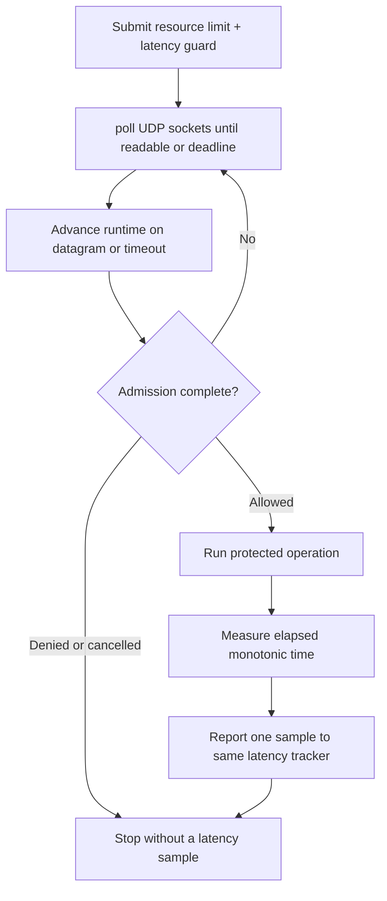

# Latency tracker with `poll`

This self-contained example shows the complete admission lifecycle without a
third-party event-loop dependency. It submits one resource limit and one
latency guard, drives the client with POSIX `poll`, performs a simulated
protected operation only after admission, measures that operation with a
monotonic clock, and reports exactly one latency sample.

The example intentionally does not report denied or cancelled work. Those
paths did not complete an operation, so manufacturing a sample would corrupt
the server-side tracker.

## Control flow



## Build and run

Build `librclient.a` first, then use either build file in this directory:

```sh
make -C ../..
make
./latency-tracker-example
```

```sh
cmake -S . -B build
cmake --build build
./build/latency-tracker-example
```

Set `RATELIMITLY_TENANT` and `RATELIMITLY_AUTH_KEY` before running. Optional
`RATELIMITLY_EXAMPLE_WORK_MS` controls the simulated operation duration.
For local testing, set `RATELIMITLY_EXAMPLE_SERVER_HOST` and
`RATELIMITLY_EXAMPLE_SERVER_PORT` to the repository test responder.

## Platform support

This particular loop uses POSIX `poll` and therefore targets Linux and macOS.
The public runtime and workflow it demonstrates also support WinSock; use the
native Win32 example when integrating a Windows message/socket event loop.

## Production notes

- Replace the simulated sleep with the real protected operation.
- In an event-loop application, start asynchronous work after admission and
  report from its completion callback; never sleep on the loop thread.
- Keep the request storage alive until completion or explicit cancellation.
- Tune rate and latency policy values for the service SLO and key quotas.

## API references

- [Linux `poll(2)` manual](https://man7.org/linux/man-pages/man2/poll.2.html)
  explains the readiness and timeout semantics used by the standalone loop.
