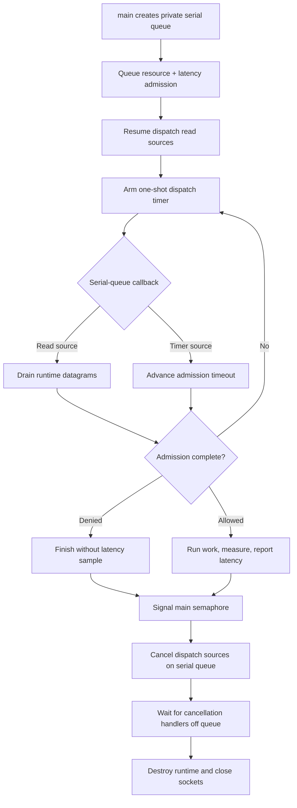

# libdispatch integration

> **Prerequisites.** You can read C and know what a UDP socket is. The tested
> build requires macOS, Xcode command-line tools, OpenSSL development files,
> and Make or CMake. Everything else is explained here.

## TL;DR

A private libdispatch queue drives a request containing a resource rate limit
and a pre-work latency guard. Allowed work is measured afterward and reported
as one latency sample, while denied, cancelled, or failed work produces no
sample and source cancellation completes before socket teardown.

## What this example teaches

This example serializes all client calls on a private dispatch queue. Read
sources observe runtime-owned UDP sockets, a one-shot timer source follows the
admission deadline, and a semaphore gives `main` a finite shutdown path.

The rate limit protects a named resource, while the latency guard checks
existing service history before work starts. Only admitted, successfully
completed work is measured and reported.

## Build and run on macOS

Build the client library and then this folder:

```sh
make -C ../..
make
./libdispatch-example
```

```sh
cmake -S . -B build
cmake --build build
./build/libdispatch-example
```

## Configuration

`RATELIMITLY_AUTH_KEY` is required. With no overrides, the runtime decodes the
key ID, derives `c-<key-id>.p0.ratelimitly.com`, and discovers
`_ratelimitly._udp.c-<key-id>.p0.ratelimitly.com`.

`RATELIMITLY_TENANT` optionally replaces the key-derived tenant DNS name. For
a fixed development responder, set `RATELIMITLY_EXAMPLE_SERVER_HOST` and
`RATELIMITLY_EXAMPLE_SERVER_PORT` together; setting only one is invalid. Leave
all three overrides unset for key-derived P0 discovery.

```sh
export RATELIMITLY_AUTH_KEY='rl-aes1...'
# Optional fixed development endpoint; set both or neither.
export RATELIMITLY_EXAMPLE_SERVER_HOST=127.0.0.1
export RATELIMITLY_EXAMPLE_SERVER_PORT=39082
./libdispatch-example
```

## Control flow



## Guard first, sample afterward

The latency guard evaluates existing tracker history before the protected
operation begins. After the guard and rate limit allow the request,
`r_runtime_admission_run_and_report()` measures the synchronous
`prepare_response()` callback with a monotonic clock and sends one post-work
sample. Denied, cancelled, and failed work sends none.

The synchronous callback is for demonstration. Production queue handlers
should start asynchronous work, retain request identity and a monotonic start
time, and report once from successful completion; blocking the private serial
queue also prevents socket and timer callbacks from advancing.

## Platform, ownership, shutdown, and verification

The application owns the serial queue, dispatch sources, cancellation group,
semaphore, request, and copied outcome. The runtime owns the client and UDP
sockets; every client transition and source cancellation stays on the serial
queue.

`dispatch_source_cancel` starts asynchronous cancellation. Each resumed source
enters a group and leaves it from its cancellation handler; `main` waits outside
the serial queue until the group empties, then destroys the runtime and its
sockets. Waiting on the queue itself would deadlock those handlers.
Only after all cancellation handlers have run is it safe to close the
descriptors those sources monitored.

The CMake file can locate open-source libdispatch on POSIX hosts, but this
repository's behavioral claim is narrower: the example is tested locally on
macOS. `bash tests/test_macos_examples.sh` verifies allow, resource denial,
latency denial, and exact report pairing with the synthetic responder. The
suite is deliberately outside CI, and no production P0 coverage is claimed for
this example.

## Glossary

| Term | Meaning |
|---|---|
| POSIX | Portable operating-system interface standard implemented by Unix-like systems. |
| serial dispatch queue | Queue that executes one submitted handler at a time. |
| dispatch source | libdispatch object that turns a timer or descriptor event into a queued handler. |
| dispatch group | Counter-like object used to wait until every source cancellation handler finishes. |
| cancellation handler | Callback confirming a dispatch source has stopped monitoring its underlying object. |
| semaphore | Counter used here to wake `main` after admission finishes. |
| latency sample | Post-work duration sent after successful admitted work. |

## API references

- [Example source](main.c)
- [Public runtime API](../../include/r_client_runtime.h)
- [Combined admission workflow](../../include/r_client_workflow.h)
- [Apple dispatch source cancellation](https://developer.apple.com/documentation/dispatch/dispatch_source_cancel)
- [Local macOS example suite](../../tests/test_macos_examples.sh)
