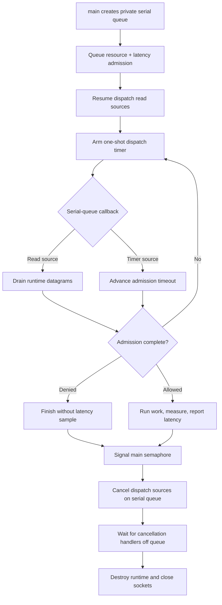

# libdispatch integration

This example serializes all client calls on a private dispatch queue. Read
sources observe runtime-owned UDP sockets, a one-shot timer source follows the
admission deadline, and a semaphore gives `main` a finite shutdown path.

Each request contains a resource rate limit and a latency guard. Only admitted,
successfully completed work is measured and reported.

## Control flow



## Build and run

On macOS, build the client library and then this folder:

```sh
make -C ../..
make
./libdispatch-example
```

```sh
cmake -S . -B build
cmake --build build
./build/libdispatch-example
```

Set `RATELIMITLY_TENANT` and `RATELIMITLY_AUTH_KEY`; fixed responder variables
are optional for local tests.

## Platform support

libdispatch is native on macOS and is also available as open source on some
Linux distributions. This example targets POSIX socket handles and is tested on
macOS. Use native Win32, libuv, libevent, or GLib on Windows.

## Ownership and shutdown

The application owns the queue, sources, cancellation group, semaphore,
request, and copied outcome. Client transitions and source cancellation run on
the serial queue.

`dispatch_source_cancel` is asynchronous. Apple requires a monitored descriptor
to remain open until its source's cancellation handler runs. Each source enters
a dispatch group before it is resumed and leaves from its cancellation handler.
`main` waits until all cancellation handlers have run before the runtime closes
its sockets. The wait happens outside the serial queue so those handlers can
execute.

A private queue plus semaphore is used instead of `dispatch_main`, which never
returns and would obscure teardown in a teaching example.

## API references

- [Dispatch source cancellation](https://developer.apple.com/documentation/dispatch/dispatch_source_cancel)
- [Dispatch Source Programming Guide: canceling a dispatch source](https://developer.apple.com/library/archive/documentation/General/Conceptual/ConcurrencyProgrammingGuide/GCDWorkQueues/GCDWorkQueues.html)
