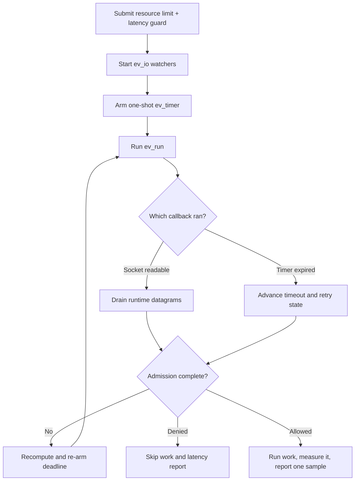

# libev integration

> **Prerequisites.** You can read C, understand readiness-based event loops,
> and have a C11 compiler, OpenSSL, the rl-c-client source tree, and libev
> development files installed.

## TL;DR

This example submits one resource rate limit and one latency guard without
blocking on Ratelimitly network I/O. After admission, successful work is
measured and one latency report is submitted; denied work runs neither step.

## What this example teaches

This self-contained program uses one `ev_io` watcher per runtime-owned UDP socket
and a one-shot `ev_timer` for the active admission deadline. Read callbacks drain
response datagrams, timer callbacks advance retries, and the completion callback
decides whether protected work may run.

The application owns the loop, watchers, timer, request, and copied outcome.
The runtime owns the client and sockets, so watchers must stop before runtime
destruction closes those sockets.

## Control flow



## Build and run

Install libev, then build the client library and this folder:

```sh
sudo apt-get install libev-dev       # Debian or Ubuntu
brew install libev                  # macOS

make -C ../..
make
export RATELIMITLY_AUTH_KEY=rl-aes1...
./libev-example
```

The equivalent CMake build is:

```sh
cmake -S . -B build
cmake --build build
RATELIMITLY_AUTH_KEY=rl-aes1... ./build/libev-example
```

An admitted run exits 0 and prints the response plus measured latency. A policy
denial exits 2 and names the resource limit, latency guard, or both; setup and
transport failures exit 1.

## Configuration

`RATELIMITLY_AUTH_KEY` is required. Its encoded key ID selects production P0
discovery at:

```text
_ratelimitly._udp.c-<key-id>.p0.ratelimitly.com
```

`RATELIMITLY_TENANT` is optional and overrides that key-derived tenant name. In
normal production use, leave the following local-test variables unset:

```sh
export RATELIMITLY_EXAMPLE_SERVER_HOST=127.0.0.1
export RATELIMITLY_EXAMPLE_SERVER_PORT=39082
```

Set `RATELIMITLY_EXAMPLE_SERVER_HOST` and `RATELIMITLY_EXAMPLE_SERVER_PORT`
together, or set neither. Supplying only one is a configuration error. When
both are set, the runtime uses that fixed UDP endpoint instead of DNS discovery.
Do not commit authentication keys.

## Rate limiting and latency tracking

The latency guard is a pre-work admission decision based on samples already
stored for `libev-protected-service`. The observed latency is a different,
post-work value: `r_runtime_admission_run_and_report()` measures the successful
`prepare_response()` call with a monotonic clock and reports one sample back to the
same tracker.

Resource denial or latency-guard denial skips `prepare_response()`. Cancellation,
transport failure, and protected-work failure also produce no latency sample.

## Adapting the synchronous demo

`prepare_response()` is intentionally short and synchronous so event-loop plumbing
stays visible. Real protected work must not block the libev thread. After
admission, start the asynchronous operation, retain connection and request
state, record a monotonic start time, and call
`r_client_admission_report_latency()` only after successful completion. Marshal
that completion back to the loop thread before touching the client.

Re-arm `ev_timer` after every timeout transition because a retry can publish a
new deadline. Stop all `ev_io` watchers and the timer before destroying the
runtime.

## Platform and test evidence

This source targets libev Unix file-descriptor backends on Linux and macOS. It
does not narrow a WinSock `SOCKET` into libev's `int` watcher field; use libuv,
libevent, or the native Win32 example on Windows.

Ubuntu CI builds and runs this binary against a synthetic responder for allowed,
resource-denied, and latency-denied outcomes. Trusted main runs also exercise
key-derived production P0 discovery and admission. macOS compatibility is a
source/build claim here, not an execution claim from this repository's CI.
Production latency reporting is fire-and-forget; the per-example P0 run proves
local report submission, not server acknowledgement of that datagram.

## Glossary

| Term | Meaning here |
| --- | --- |
| `ev_io` | A libev watcher that invokes a callback when a socket is readable. |
| `ev_timer` | A libev timer watcher; this example reuses it as a one-shot admission deadline. |
| `SOCKET` | WinSock's native socket-handle type, which this Unix-focused example deliberately does not narrow. |
| latency guard | The pre-work policy check against previously reported service latency. |
| latency sample | The post-work duration reported only after admitted work succeeds. |
| P0 | The production Ratelimitly DNS and service tier selected from the key. |

## API references

- [Example source](main.c)
- [libev documentation](https://software.schmorp.de/pkg/libev.html)
- [rl-c-client workflow API](../../include/r_client_workflow.h)
- [Linux one-shot CI matrix](../../tests/linux-one-shot-examples.txt)
