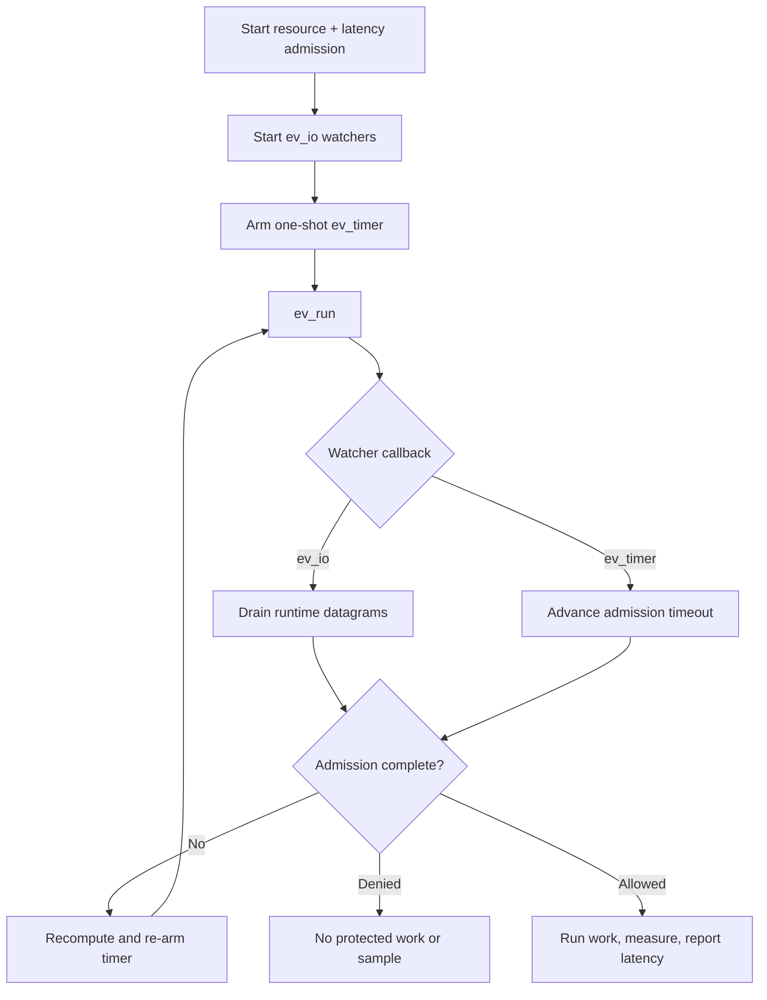

# libev integration

This example uses one `ev_io` watcher per client UDP socket and a one-shot
`ev_timer` for the active admission deadline. The request combines a resource
rate limit with a latency guard. Only admitted and successfully completed work
is measured and reported.

## Control flow



## Build and run

Install libev development files and build the client library first:

```sh
make -C ../..
make
./libev-example
```

```sh
cmake -S . -B build
cmake --build build
./build/libev-example
```

Set `RATELIMITLY_TENANT` and `RATELIMITLY_AUTH_KEY`; fixed responder variables
are optional for local testing.

## Platform support

This source targets libev's normal Unix fd backends and supports Linux and
macOS. Although libev has limited Windows backend options, this example does
not narrow a WinSock `SOCKET` into libev's `int` watcher field; use libuv,
libevent, GLib, or the native Win32 example on Windows.

## Ownership and production use

The application owns the loop, watchers, timer, request, and copied outcome.
The runtime owns the client and sockets. Stop watchers before destroying the
runtime. Keep calls on the loop thread, and re-arm the timer after each timeout
transition because retries can change the deadline.
