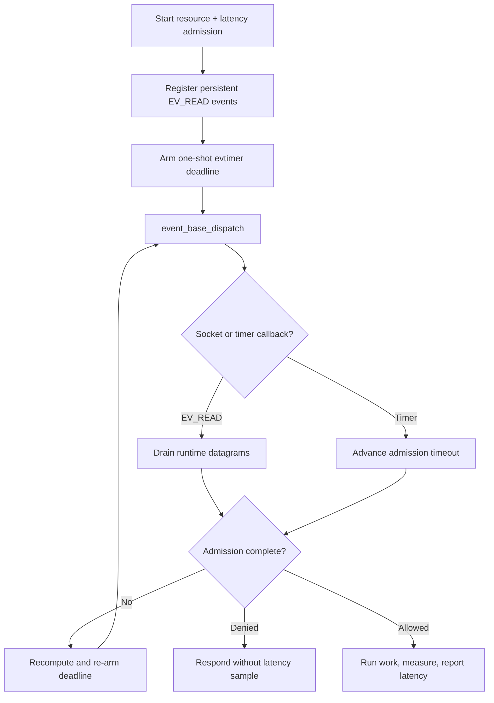

# libevent integration

This self-contained example attaches the client runtime's UDP sockets to
persistent `EV_READ` events and maps the active request deadline to a one-shot
libevent timer. Every request carries both a resource rate limit and a latency
guard.

The admitted path measures a small response-construction function and reports
one latency sample. Replace that function with the operation your application
actually protects. Rate-denied, latency-denied, cancelled, and failed work does
not report a sample.

## Control flow



## Build and run

Install libevent, build `librclient.a`, then choose either build system:

```sh
make -C ../..
make
./libevent-example
```

```sh
cmake -S . -B build
cmake --build build
./build/libevent-example
```

CMake compiles `rl-c-client` with the selected compiler. This keeps native
Visual Studio builds on one object format and C runtime instead of importing a
Unix/MinGW `librclient.a`.

Set `RATELIMITLY_TENANT` and `RATELIMITLY_AUTH_KEY`. A local responder can be
selected with `RATELIMITLY_EXAMPLE_SERVER_HOST` and
`RATELIMITLY_EXAMPLE_SERVER_PORT`.

## Platform support

libevent and this example support Linux, macOS, and Windows. Socket values stay
in `evutil_socket_t`, which is wide enough for a WinSock `SOCKET`. Windows links
`ws2_32` and `dnsapi`; Unix builds link the resolver library.

## Ownership and production use

The application owns the event base, events, request storage, and copied
outcome. The runtime owns the client and sockets. Free all socket and timer
events before destroying the runtime. Keep client calls on the event-base
thread, and re-arm the timer after every timeout transition because retries may
publish a different absolute deadline.
