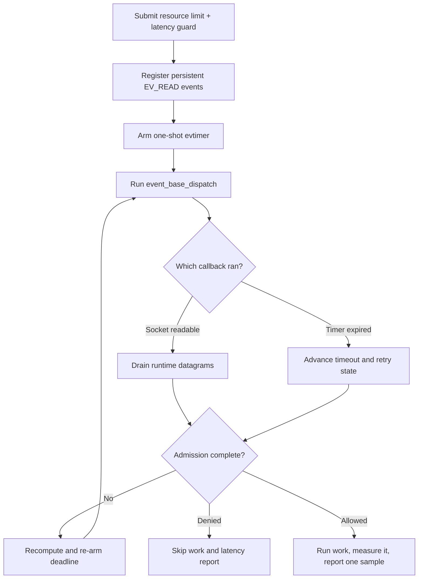

# libevent integration

> **Prerequisites.** You can read C, understand socket-readiness callbacks, and
> have a C11 compiler, OpenSSL, the rl-c-client source tree, and libevent
> development files built for your target compiler.

## TL;DR

This example drives one resource rate limit and one latency guard from a
libevent base. Only an allowed request runs protected work and reports its
measured latency.

## What this example teaches

This self-contained program attaches persistent `EV_READ` events to the runtime's
UDP sockets and maps the current admission deadline to a one-shot libevent
timer. Socket and timer callbacks advance the same request until its completion
callback copies the decision.

The application owns the event base, events, request storage, and copied
outcome. The runtime owns the client and sockets. Free every socket event and
the timer before destroying the runtime.

## Control flow



## Build and run

Install libevent, then build the client library and this folder:

```sh
sudo apt-get install libevent-dev       # Debian or Ubuntu
brew install libevent                  # macOS

make -C ../..
make
export RATELIMITLY_AUTH_KEY=rl-aes1...
./libevent-example
```

The CMake path compiles rl-c-client with the selected compiler. That matters on
Windows, where Visual Studio cannot import a Unix or MinGW archive:

```sh
cmake -S . -B build
cmake --build build
RATELIMITLY_AUTH_KEY=rl-aes1... ./build/libevent-example
```

An admitted run exits 0. A policy denial exits 2; setup or transport failure
exits 1.

## Configuration

`RATELIMITLY_AUTH_KEY` is required. The runtime extracts its key ID and defaults
production P0 discovery to:

```text
_ratelimitly._udp.c-<key-id>.p0.ratelimitly.com
```

`RATELIMITLY_TENANT` optionally overrides that key-derived tenant name. A local
responder can bypass DNS discovery:

```sh
export RATELIMITLY_EXAMPLE_SERVER_HOST=127.0.0.1
export RATELIMITLY_EXAMPLE_SERVER_PORT=39082
```

Set `RATELIMITLY_EXAMPLE_SERVER_HOST` and `RATELIMITLY_EXAMPLE_SERVER_PORT`
together, or set neither. One without the other is a configuration error.
Leave both unset for key-derived production discovery, and never commit the
authentication key.

## Rate limiting and latency tracking

The latency guard checks earlier samples for `libevent-protected-service` before
work starts. It is not the latency printed after admission. That later value is
the duration of `prepare_response()`, measured with a monotonic clock and sent as
one new sample by `r_runtime_admission_run_and_report()`.

Resource-denied, latency-denied, cancelled, failed, and unsuccessful-work paths
do not report a sample. This prevents rejected work from contaminating the
tracker that controls future admission.

## Adapting the synchronous demo

`prepare_response()` is deliberately synchronous and tiny. Production loop code
should launch nonblocking work after admission, retain the request and
connection state, and measure from start to successful asynchronous completion.
Then call `r_client_admission_report_latency()` once on the event-base thread.

Keep all client operations on that thread unless the application adds explicit
serialization. Re-add the one-shot timer after every timeout transition because
retries may change the absolute deadline.

## Platform and test evidence

The source and CMake build preserve socket values in `evutil_socket_t` and include
the Windows socket and DNS libraries, so they target Linux, macOS, and Windows.
The current integration CI builds and executes this example on Ubuntu; it does
not execute this binary on macOS or Windows.

Ubuntu CI verifies allowed, resource-denied, and latency-denied behavior against
a synthetic responder. Trusted main runs additionally cover key-derived
production P0 discovery and admission. The production report API is
fire-and-forget, so that per-example run proves local submission rather than
server acknowledgement.

## Glossary

| Term | Meaning here |
| --- | --- |
| event base | The libevent object that owns dispatch and registered events. |
| `EV_READ` | The readiness flag used when a runtime UDP socket can be drained. |
| persistent event | An event that remains registered after its callback; the UDP watchers use this mode. |
| `evutil_socket_t` | libevent's portable socket type, wide enough to retain a native Windows socket handle. |
| latency guard | The pre-work decision based on existing service-latency samples. |
| latency sample | The duration reported after admitted work completes successfully. |
| CMake | Cross-platform build-system generator provided as an alternative to Make. |

## API references

- [Example source](main.c)
- [libevent event API](https://libevent.org/doc/event_8h.html)
- [libevent event-loop guide](https://libevent.org/libevent-book/Ref3_eventloop.html)
- [libevent utility socket type](https://libevent.org/doc/util_8h.html)
- [rl-c-client workflow API](../../include/r_client_workflow.h)
- [Linux one-shot CI matrix](../../tests/linux-one-shot-examples.txt)
