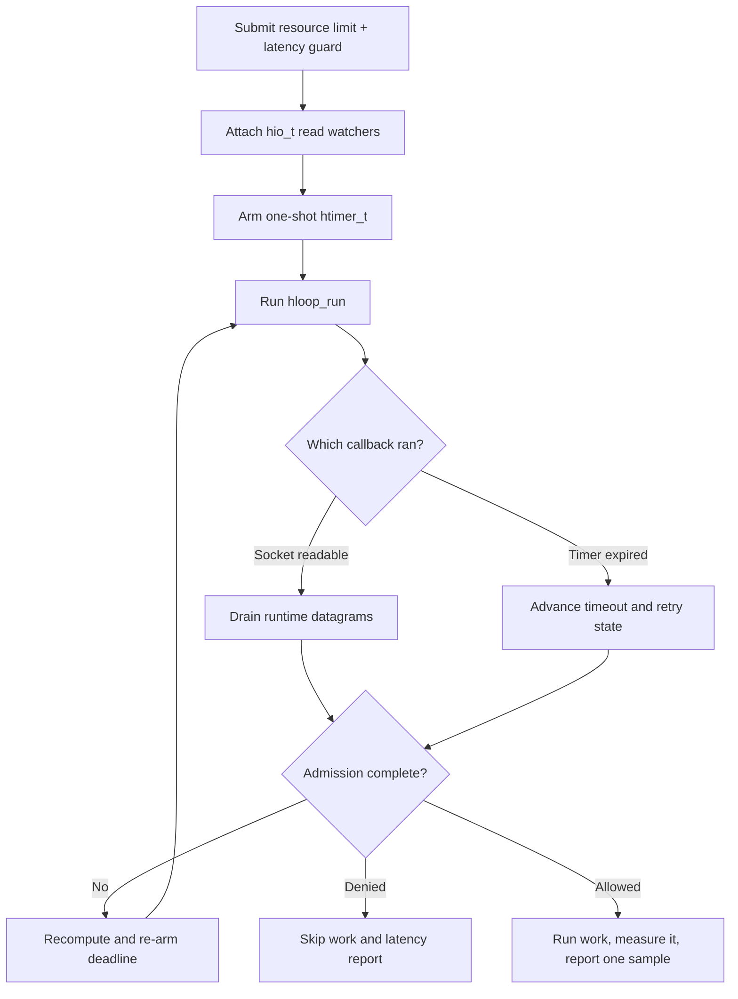

# libhv integration

> **Prerequisites.** You can read C, understand readiness-driven event loops,
> and have a C11 compiler, OpenSSL, the rl-c-client source tree, and libhv
> headers and libraries installed.

## TL;DR

This example drives a resource rate limit and latency guard with libhv socket
and timer callbacks. It runs protected work only after both checks allow it,
then reports that work's measured latency to the tracker.

## What this example teaches

This self-contained program obtains one `hio_t` watcher for each runtime-owned UDP
socket and uses a one-shot `htimer_t` for the current admission deadline. Read and
timeout callbacks advance the public rl-c-client workflow; the admission
callback stops the loop after deciding whether work may run.

The runtime owns the sockets. The libhv loop owns its `hio_t` and `htimer_t`
objects, while the application owns request state and the copied outcome.
Detach watchers before runtime teardown closes their descriptors.

## Control flow



## Build and run

CI pins libhv v1.3.4, commit `71770e04becaa149e0ef8ffc4d3900c5466ddddb`.
With libhv installed under a custom prefix:

```sh
make -C ../..
make LIBHV_PREFIX=/path/to/libhv-install
export RATELIMITLY_AUTH_KEY=rl-aes1...
./libhv-example
```

Or let CMake find an installed libhv package:

```sh
cmake -S . -B build -DCMAKE_PREFIX_PATH=/path/to/libhv-install
cmake --build build
RATELIMITLY_AUTH_KEY=rl-aes1... ./build/libhv-example
```

CMake compiles rl-c-client with the selected compiler instead of importing an
archive made for another object format or C runtime. An admitted run exits 0, a
policy denial exits 2, and setup or transport failure exits 1.

## Configuration

`RATELIMITLY_AUTH_KEY` is required. Its encoded key ID defaults production P0
discovery to:

```text
_ratelimitly._udp.c-<key-id>.p0.ratelimitly.com
```

`RATELIMITLY_TENANT` optionally overrides that key-derived tenant name. For a
local synthetic responder, bypass DNS with both fixed-endpoint values:

```sh
export RATELIMITLY_EXAMPLE_SERVER_HOST=127.0.0.1
export RATELIMITLY_EXAMPLE_SERVER_PORT=39082
```

Set `RATELIMITLY_EXAMPLE_SERVER_HOST` and `RATELIMITLY_EXAMPLE_SERVER_PORT`
together, or set neither; a partial pair is a configuration error. Leave both
unset for production discovery. Never commit authentication keys.

## Rate limiting and latency tracking

The request's latency guard evaluates previously stored latency for
`libhv-protected-service` before protected work begins. After admission,
`r_runtime_admission_run_and_report()` measures `prepare_response()` with a monotonic
clock and submits that new duration to the same tracker. The guard and sample
therefore face opposite directions in the feedback loop: one reads prior
latency, while the other records newly completed work.

Denied, cancelled, failed, and unsuccessful-work paths submit no latency
sample.

## Adapting the synchronous demo

The example's snprintf-based work is synchronous only to keep the integration
small. In production, start asynchronous work from the allowed callback, keep
the request and application state alive, measure across the operation with a
monotonic clock, and call `r_client_admission_report_latency()` once after success.
Return completion to the libhv loop thread before using the client.

libhv's repeat value of 1 means the timer runs once. Recreate that timer after
each timeout transition because retry processing may publish a new deadline.

## Platform and test evidence

This source runs on libhv's integer descriptor interface and is exercised on
Linux. It also targets macOS. libhv supports Windows, and the build files
contain MSVC branches, but this example has no Win64 handle-width execution
proof; verify that a chosen libhv build preserves native `SOCKET` width or use
the native Win32, libuv, or libevent example.

Ubuntu CI builds the pinned libhv revision and verifies allowed,
resource-denied, and latency-denied outcomes. Trusted main runs also exercise
key-derived production P0 discovery and admission. macOS and Windows are not
execution-tested for this example in repository CI. The P0 run proves a local
fire-and-forget report send, not server acknowledgement.

## Glossary

| Term | Meaning here |
| --- | --- |
| `hio_t` | A libhv I/O object attached to one runtime UDP descriptor. |
| `htimer_t` | A libhv timer object used for the current one-shot deadline. |
| `SOCKET` | WinSock's native socket-handle type, whose width a Win64 libhv build must preserve. |
| readiness | Notification that a socket can be drained without blocking. |
| latency guard | The pre-work check against the tracker's existing samples. |
| latency sample | One measured duration submitted after admitted work succeeds. |

## API references

- [Example source](main.c)
- [Pinned libhv source used by CI](https://github.com/ithewei/libhv/tree/71770e04becaa149e0ef8ffc4d3900c5466ddddb)
- [Pinned libhv event-loop documentation](https://github.com/ithewei/libhv/tree/71770e04becaa149e0ef8ffc4d3900c5466ddddb/docs)
- [libhv v1.3.4 event-loop header](https://github.com/ithewei/libhv/blob/v1.3.4/event/hloop.h)
- [rl-c-client workflow API](../../include/r_client_workflow.h)
- [Linux one-shot CI matrix](../../tests/linux-one-shot-examples.txt)
