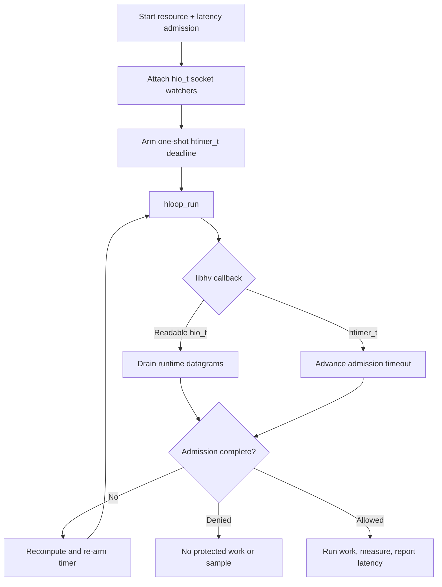

# libhv integration

This example uses libhv `hio_t` watchers for runtime-owned UDP sockets and a
one-shot `htimer_t` for the admission deadline. Every request contains a
resource rate limit and a latency guard. Only admitted, completed work is
measured and reported.

## Control flow



## Build and run

Install libhv, build `librclient.a`, then choose a build system:

```sh
make -C ../..
make
./libhv-example
```

```sh
cmake -S . -B build
cmake --build build
./build/libhv-example
```

Set `RATELIMITLY_TENANT` and `RATELIMITLY_AUTH_KEY`; local fixed responder
variables are optional.

## Platform support

libhv supports Linux, macOS, and Windows. This concise source uses libhv's
integer fd accessor and is tested on Unix; applications targeting Win64 should
verify their libhv build preserves native `SOCKET` width or use the native
Win32/libuv/libevent examples.

## Ownership and production use

The application owns the loop, watchers, timer, request, and copied outcome.
The runtime owns sockets. Remove watchers and the timer before runtime teardown,
and keep client calls on the libhv loop thread.
