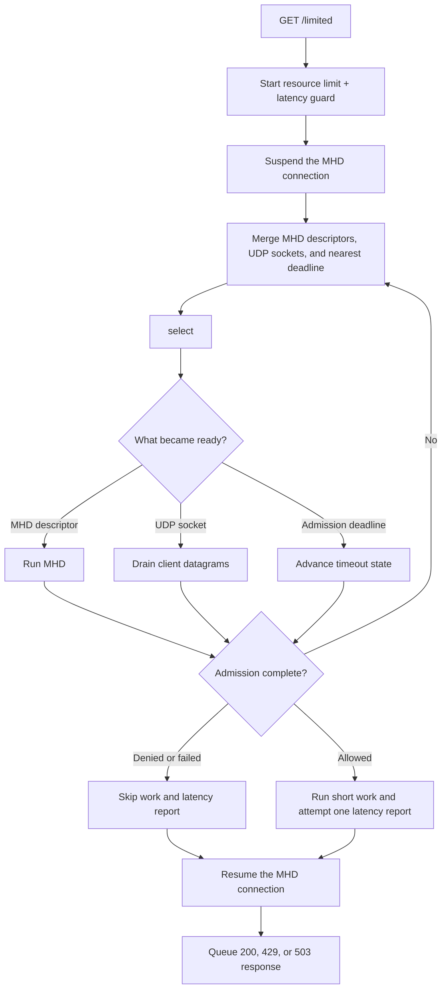

# GNU libmicrohttpd external event-loop integration

> **Prerequisites.** You can read C, understand an HTTP request and response,
> and recognize socket-readiness waiting with `select()`. Building requires a
> C11 compiler, OpenSSL, GNU libmicrohttpd, `pkg-config`, and the rl-c-client
> source tree. Everything else is explained here.

## TL;DR

One external `select()` loop drives a resource rate limit and a pre-work
latency guard; when both admit, it runs short work and submits a post-work
latency sample. This is a teaching adapter, not a drop-in production server:
its suspended-connection shutdown limitation is documented explicitly.

## What this example teaches

GNU libmicrohttpd (MHD) can expose its descriptors and next timeout instead of
running an internal polling thread. This example merges those values with the
rl-c-client runtime's nonblocking UDP sockets and current admission deadline,
then performs one blocking `select()` call.

`GET /limited` starts one combined admission request. The resource limit
protects finite capacity; the latency guard asks the server whether recent
samples for `libmicrohttpd-protected-service` are below the configured
threshold. The connection is suspended while that decision is pending, so MHD
does not repeatedly call the access handler.

The external loop thread owns the runtime and pending-request list. MHD owns
the HTTP connection and the per-request context pointer. A pending object must
stay alive until MHD's completion callback releases it.

## Control flow



## Build and run

Install the framework and build tools for your platform:

```sh
# Debian or Ubuntu
sudo apt-get install build-essential cmake libmicrohttpd-dev libssl-dev pkg-config

# macOS with Homebrew
brew install cmake libmicrohttpd openssl@3 pkg-config
```

From this folder, build the client archive first and then the example:

```sh
make -C ../..

# Linux:
make

# macOS (use this instead of the Linux command):
make OPENSSL_PREFIX="$(brew --prefix openssl@3)"

export RATELIMITLY_AUTH_KEY='rl-aes1...'
./libmicrohttpd-example
curl -i http://127.0.0.1:8000/limited
```

The equivalent CMake build still expects `../../librclient.a` to exist:

```sh
cmake -S . -B build
cmake --build build
RATELIMITLY_AUTH_KEY='rl-aes1...' ./build/libmicrohttpd-example
```

## Configuration and production discovery

`RATELIMITLY_AUTH_KEY` is required. With no discovery override, rl-c-client
decodes the key ID, derives the tenant name
`c-<key-id>.p0.ratelimitly.com`, and resolves this production P0 service
record:

```text
_ratelimitly._udp.c-<key-id>.p0.ratelimitly.com
```

`RATELIMITLY_TENANT` optionally replaces the key-derived tenant DNS name. For
a fixed development responder, set the host and port together:

```sh
export RATELIMITLY_AUTH_KEY='rl-aes1...'
export RATELIMITLY_EXAMPLE_SERVER_HOST=127.0.0.1
export RATELIMITLY_EXAMPLE_SERVER_PORT=39082
./libmicrohttpd-example
```

Setting only one fixed-endpoint variable is a configuration error. A fixed
endpoint bypasses service discovery but still uses the authentication key.
Leave all three overrides unset for key-derived production discovery, and
never commit a real key.

## Guard first, latency sample afterward

The latency guard is a **pre-work** admission decision based on tracker history
already held by the service. It does not measure the request currently waiting
to run.

Only an allowed request calls `r_runtime_admission_run_and_report()`. That
helper measures `prepare_protected_response()` with a monotonic clock, then
submits one **post-work** duration to the same service tracker. A monotonic
clock measures elapsed time without jumping when the wall clock is corrected.
Resource-denied, latency-denied, cancelled, and failed-work paths must not add
a sample, because rejected or unsuccessful work would corrupt the history used
by later guards.

Latency reporting is a UDP send without a per-report acknowledgement. A
successful helper return means local submission succeeded; it does not prove
the server stored that individual sample.

## HTTP decisions and report failures

- `200`: the admission decision allowed the request.
- `429`: the resource rate limit denied it, either alone or with the latency
  guard.
- `503`: only the latency guard denied it, or admission setup or transport
  failed.
- `404` and `405`: the path or method did not match `GET /limited`.

The current callback logs a nonzero return from
`r_runtime_admission_run_and_report()` but does **not** replace the already
allowed admission outcome. A clock failure, protected-work failure, or local
latency-report failure can therefore still lead to HTTP 200; if work never
prepared the body, that response can also be empty. Production code should
choose an explicit policy—fail the request, retry telemetry separately, or
record a durable metric—instead of treating 200 as proof that reporting
succeeded.

## Adapting the synchronous work

`prepare_protected_response()` is deliberately short and synchronous. Slow
database, file, or RPC work would block this single external loop and delay
every HTTP connection and admission request.

For asynchronous work, keep the connection suspended after admission, retain
its request state, record a monotonic start time, and launch nonblocking work.
On successful completion, measure the duration, call
`r_client_admission_report_latency()` once on the owner thread, prepare the
response, and resume the connection. On cancellation or work failure, resume
with the chosen error response and do not report a latency sample.

## Suspended disconnect and shutdown limitation

MHD's pinned flow-control contract says that it cannot detect a peer disconnect
while a connection is suspended. Consequently, this example does not cancel
admission immediately when such a peer leaves: the check can run until its
callback or timeout, and an allowed callback can still run and report protected
work before the connection is resumed and MHD observes the disconnect.

There is also a known shutdown defect in the current example. A signal stops
the external loop and `main()` calls `MHD_stop_daemon()` without first
cancelling and resuming every pending suspended connection. MHD documents that
sequence as an API violation that can leak resources or cause undefined
behavior. Before production use, quiesce new accepts, cancel pending admissions,
mark each request with a shutdown response, resume every suspended connection,
run MHD until it processes those resumptions, and only then stop the daemon.

The completion callback remains useful after MHD has actually observed request
completion, but it is not an immediate suspended-disconnect detector and does
not make the current shutdown path clean.

## Platform and test evidence

This folder declares Linux and macOS support. Its build intentionally rejects
native Windows because the adapter uses POSIX resolver linkage and
`select()`-style descriptors; use the Mongoose or native Win32 example there.
The `select()` design is also bounded by `FD_SETSIZE`.

Current integration CI builds and executes this example on Ubuntu 24.04, not
macOS. The synthetic responder verifies an allowed request with exactly one
matching latency report, a resource denial with no report, and a latency denial
with no report. Trusted `main` runs additionally exercise key-derived P0
discovery and an allowed admission path; that live smoke sees local report
submission, not acknowledgement of each report by production.

## Glossary

| Term | Meaning here |
| --- | --- |
| GNU | Free-software project that maintains libmicrohttpd. |
| C11 | 2011 revision of the C language standard used to compile this example. |
| CMake | Cross-platform build-system generator provided as an alternative to Make. |
| POSIX | Portable operating-system interface family used by this example's Unix-style sockets and resolver linkage. |
| MHD | GNU libmicrohttpd, the HTTP server library used by this folder. |
| external event loop | Application-owned wait/dispatch loop; MHD contributes descriptors and a timeout instead of polling internally. |
| admission | One server decision combining the resource rate limit and latency guard. |
| resource rate limit | Pre-work budget that admits or denies tokens from a named bucket and time window. |
| latency guard | Pre-work policy check against recent samples for a named service. |
| latency tracker | Server-side rolling sample set for a named service; the latency guard reads it and successful work adds to it. |
| latency sample | Post-work duration submitted after an admitted operation completes successfully. |
| tenant | Key-associated namespace used to construct the production service-discovery name. |
| UDP | Datagram transport used by rl-c-client for admissions and latency reports. |
| fire-and-forget | Submission with no reply confirming that this individual report was stored. |
| SRV | DNS service-record type that supplies the production host and port. |
| P0 | Production Ratelimitly DNS environment encoded in the default tenant suffix. |
| `FD_SETSIZE` | Compile-time descriptor-count limit represented by an `fd_set`. |

## API references

- [Example source](main.c)
- [Combined admission workflow](../../include/r_client_workflow.h)
- [Public runtime adapter](../../include/r_client_runtime.h)
- [GNU libmicrohttpd v1.0.0 flow-control contract](https://gitlab.com/libmicrohttpd/libmicrohttpd/-/blob/v1.0.0/doc/libmicrohttpd.texi#L3016-3047)
- [GNU libmicrohttpd flow-control manual](https://www.gnu.org/software/libmicrohttpd/manual/html_node/microhttpd_002dflow.html)
- [Linux HTTP CI matrix](../../tests/linux-http-examples.txt)
- [Deterministic HTTP scenario runner](../../tests/run_http_example.sh)
