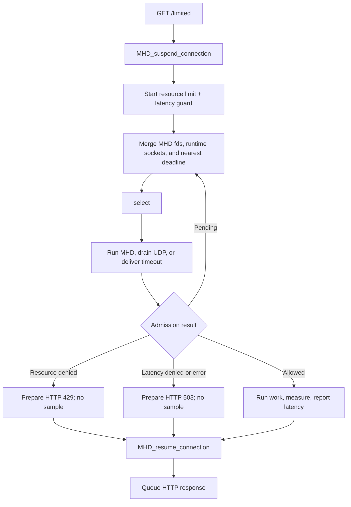

# GNU libmicrohttpd external event loop

This self-contained example uses libmicrohttpd's external-`select()` mode. One
wait combines MHD's descriptors and timeout with rl-c-client's UDP sockets and
nearest admission deadline. `GET /limited` contains both a resource rate limit
and a latency guard.

The connection is suspended while admission is pending. Allowed requests run a
protected application operation, measure it monotonically, report that sample,
and then resume the connection. Replace `prepare_protected_response()` with the
database query, RPC, or other work the endpoint actually protects.

## Control flow



## Build and run

Install libmicrohttpd and its pkg-config metadata, then build:

```sh
make -C ../..
make
RATELIMITLY_AUTH_KEY=rl-aes1... \
./libmicrohttpd-example
curl -i http://127.0.0.1:8000/limited
```

The encoded key supplies the tenant ID and defaults discovery to
`_ratelimitly._udp.c-<key-id>.p0.ratelimitly.com`. Set optional
`RATELIMITLY_TENANT` only to override that production DNS name.

Or use CMake:

```sh
cmake -S . -B build
cmake --build build
./build/libmicrohttpd-example
```

## Decision mapping

- `200`: admitted; protected work completed and latency was reported.
- `429`: resource rate limit denied the request (alone or with the guard).
- `503`: latency guard alone denied it, or admission infrastructure failed.

Denied requests do not run protected work and never report latency.

## Ownership and disconnects

The external event-loop thread owns the runtime and pending list. MHD owns each
connection and stores the associated request pointer. Completion notification
cancels active admission before freeing the request, including on disconnect or
daemon shutdown. Save `next` before timeout delivery because callbacks may
unlink a completed request immediately.

Suspension avoids repeatedly invoking the access handler while admission is
pending. This feature requires `MHD_ALLOW_SUSPEND_RESUME`.

## Platform support

The example is tested on Linux and macOS. Its `select()` model is portable to
other POSIX hosts, subject to `FD_SETSIZE`. libmicrohttpd can support Windows,
but this example intentionally uses POSIX resolver/runtime linkage; use the
Mongoose or native Win32 example as the Windows starting point.

## API references

- [GNU libmicrohttpd manual](https://www.gnu.org/software/libmicrohttpd/manual/libmicrohttpd.html)
  covers external loops, suspended connections, and completion callbacks.
