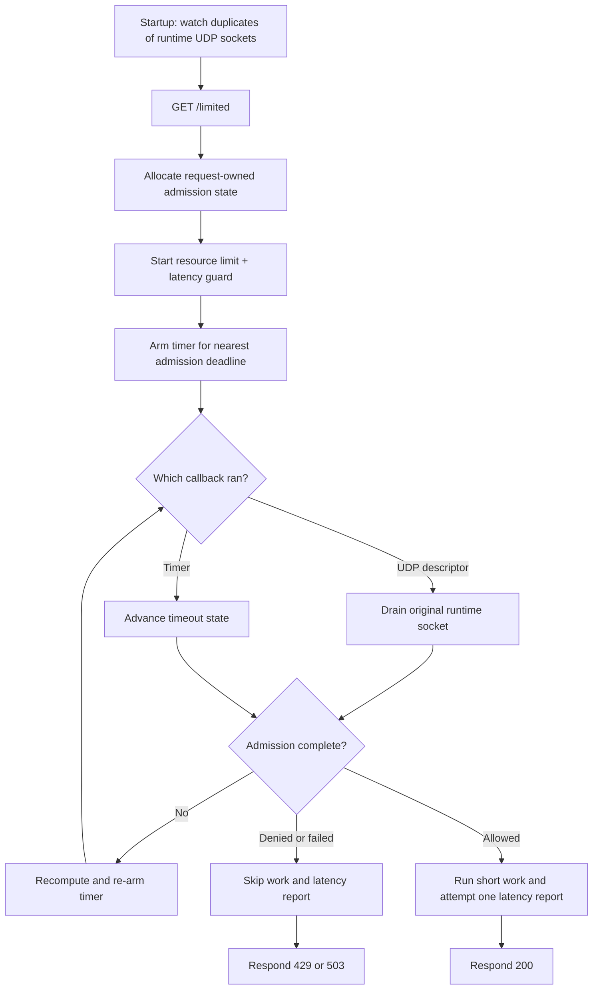

# libreactor v3 integration

> **Prerequisites.** You can read C, understand an HTTP request and response,
> and know that nonblocking UDP sockets become readable when datagrams arrive.
> Building requires Linux, a C11 compiler, OpenSSL, `pkg-config`, libreactor v3,
> and the rl-c-client source tree. Everything else is explained here.

## TL;DR

libreactor descriptors and a one-shot timer drive a resource rate limit and a
pre-work latency guard. Allowed requests run short work, then submit one
post-work latency sample before the HTTP response is released.

## What this example teaches

The rl-c-client runtime owns its UDP sockets, while a libreactor descriptor
closes the descriptor it watches during destruction. The adapter therefore
calls `dup()` for each socket, lets libreactor own the duplicate, and drains
datagrams through the original runtime-owned descriptor. Both descriptor
numbers refer to the same kernel socket and receive queue.

Each `GET /limited` request owns an admission object and a reactor timer. The
timer represents the request's nearest timeout or retry deadline; UDP readiness
delivers service responses. Either event can advance the request, so the
adapter recomputes the timer after every transition that remains pending.

The reactor thread owns the runtime and all request state. The
`defer_completion` flag handles a callback that completes while a start or
timeout operation still owns the current stack, preventing reentrant
destruction of the pending object.

## Control flow



## Build and run

The integration CI uses libreactor commit
`64afa5364c445736317e44e820a85f09aa88dfc0`. A matching local installation
looks like this:

```sh
sudo apt-get install autoconf automake build-essential cmake \
  libssl-dev libtool pkg-config

git clone https://github.com/fredrikwidlund/libreactor.git /tmp/libreactor
git -C /tmp/libreactor checkout 64afa5364c445736317e44e820a85f09aa88dfc0
(
  cd /tmp/libreactor
  ./autogen.sh
  ./configure --prefix="$HOME/.local"
  make
  make install
)
export PKG_CONFIG_PATH="$HOME/.local/lib/pkgconfig${PKG_CONFIG_PATH:+:$PKG_CONFIG_PATH}"
```

From this example folder, build and run:

```sh
make -C ../..
make
export RATELIMITLY_AUTH_KEY='rl-aes1...'
./libreactor-example
curl -i http://127.0.0.1:8000/limited
```

The CMake path also expects `../../librclient.a` to exist:

```sh
cmake -S . -B build
cmake --build build
RATELIMITLY_AUTH_KEY='rl-aes1...' ./build/libreactor-example
```

## Configuration and production discovery

`RATELIMITLY_AUTH_KEY` is required. With no override, rl-c-client decodes its
key ID, derives `c-<key-id>.p0.ratelimitly.com`, and resolves the production P0
service record:

```text
_ratelimitly._udp.c-<key-id>.p0.ratelimitly.com
```

`RATELIMITLY_TENANT` optionally replaces the derived tenant DNS name. For a
fixed development responder, set both endpoint variables:

```sh
export RATELIMITLY_AUTH_KEY='rl-aes1...'
export RATELIMITLY_EXAMPLE_SERVER_HOST=127.0.0.1
export RATELIMITLY_EXAMPLE_SERVER_PORT=39082
./libreactor-example
```

Setting only the host or only the port is invalid. The fixed endpoint bypasses
service discovery but still uses the authentication key. Leave the tenant,
host, and port overrides unset for key-derived production discovery, and never
commit a real key.

## Guard first, latency sample afterward

The latency guard is a **pre-work** decision based on existing tracker samples
for `libreactor-protected-service`. It is separate from the operation this HTTP
request may run.

After both admission controls allow the request,
`r_runtime_admission_run_and_report()` measures
`perform_protected_work()` with a monotonic clock and submits one **post-work**
sample to that same tracker. A monotonic clock measures elapsed time without
jumping when the wall clock is corrected. Denied, cancelled, and failed-work
paths submit no sample. The report uses UDP and has no individual server
acknowledgement, so a successful helper return proves local submission, not
durable server storage.

## HTTP decisions and report failures

- `200`: admission allowed the request.
- `429`: the resource limit denied it, alone or together with the latency
  guard.
- `503`: only the latency guard denied it, or admission infrastructure failed.
- `404`: the method or target did not match `GET /limited`.

The example logs a failure from `r_runtime_admission_run_and_report()` but
still maps the copied allowed outcome to HTTP 200. Thus 200 does not prove the
monotonic clock, protected-work callback, and latency-report submission all
succeeded. Production code should propagate a work failure to the response and
give telemetry failure an explicit retry, metric, or fail-open policy.

## Reentrancy, ownership, and disconnects

libreactor's pinned server implementation holds a handling reference before it
dispatches a request. If the peer disconnects, the connection reference is
released, but the handling reference keeps `server_request` alive until this
adapter eventually calls `server_respond()`. On a closed request that call
suppresses the write and releases the final reference.

The pending admission object owns its timer. Stop the timer and cancel any
active admission before freeing that object. The application must also destroy
each duplicate socket watcher before destroying the runtime-owned original
sockets.

## Adapting the synchronous work

`perform_protected_work()` only sets a boolean, so running it on the reactor
thread is harmless. A real blocking database query or RPC would stall every
descriptor and timer callback.

For asynchronous work, destroy the completed admission timer, retain the
pending object and `server_request`, record a monotonic start time, and launch
nonblocking work. Its completion must return to the reactor thread, report one
sample with `r_client_admission_report_latency()` only after successful work,
send the HTTP response, and then free the pending object. Do not measure only
the time needed to schedule the operation.

## Platform and test evidence

libreactor v3 uses Linux `epoll`, `timerfd`, and `accept4`; this example and its
CMake build therefore declare Linux-only support. It is not a macOS or Windows
example.

Ubuntu 24.04 CI builds and executes it against a synthetic responder. The
runner verifies one allowed request with exactly one matching latency report,
one resource denial with no report, and one latency denial with no report.
Trusted `main` runs also exercise key-derived production P0 discovery and an
allowed admission path; because reporting is fire-and-forget UDP, that live
smoke proves local submission rather than per-report server acknowledgement.

## Glossary

| Term | Meaning here |
| --- | --- |
| C11 | 2011 revision of the C language standard used to compile this example. |
| CMake | Build-system generator provided as an alternative to Make. |
| admission | One asynchronous decision combining a resource rate limit and latency guard. |
| resource rate limit | Pre-work budget that admits or denies tokens from a named bucket and time window. |
| descriptor duplicate | A second descriptor number created by `dup()` for the same kernel socket; libreactor may close it without closing the runtime's original. |
| reentrant callback | Completion invoked before the function that triggered it has returned. |
| admission deadline | Next time the client must advance timeout or retry state. |
| latency guard | Pre-work policy check against recent samples for a named service. |
| latency tracker | Server-side rolling sample set for a named service; the latency guard reads it and successful work adds to it. |
| latency sample | Post-work duration submitted after successful admitted work. |
| tenant | Key-associated namespace used to construct the production service-discovery name. |
| UDP | Datagram transport used for admission packets and latency reports. |
| fire-and-forget | Submission with no reply confirming that this individual report was stored. |
| SRV | DNS service-record type that supplies a service host and port. |
| P0 | Production Ratelimitly DNS environment encoded in the default tenant suffix. |

## API references

- [Example source](main.c)
- [Combined admission workflow](../../include/r_client_workflow.h)
- [libreactor v3 source tree at the CI-pinned commit](https://github.com/fredrikwidlund/libreactor/tree/64afa5364c445736317e44e820a85f09aa88dfc0)
- [Pinned descriptor ownership implementation](https://github.com/fredrikwidlund/libreactor/blob/64afa5364c445736317e44e820a85f09aa88dfc0/src/reactor/descriptor.c)
- [Pinned timer API](https://github.com/fredrikwidlund/libreactor/blob/64afa5364c445736317e44e820a85f09aa88dfc0/src/reactor/timer.h)
- [Pinned server request lifetime](https://github.com/fredrikwidlund/libreactor/blob/64afa5364c445736317e44e820a85f09aa88dfc0/src/reactor/server.c)
- [Linux HTTP CI matrix](../../tests/linux-http-examples.txt)
- [Deterministic HTTP scenario runner](../../tests/run_http_example.sh)
