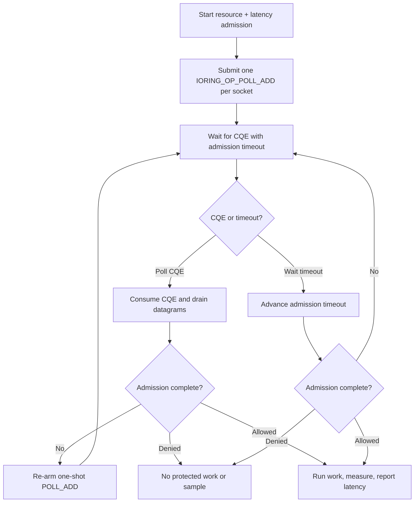

# liburing integration

This Linux-only example uses liburing to submit one `IORING_OP_POLL_ADD` for
each client UDP socket. Because poll requests are one-shot, every consumed CQE
is followed by socket draining and re-arming. A timed CQE wait also covers the
current admission deadline.

The request combines a resource rate limit with a latency guard. Admitted work
is measured and reported once; denied, cancelled, or failed work is not.

## Control flow



## Build and run

Install liburing development files and build the library first:

```sh
make -C ../..
make
./liburing-example
```

```sh
cmake -S . -B build
cmake --build build
./build/liburing-example
```

Set `RATELIMITLY_AUTH_KEY`. The key defaults discovery to
`_ratelimitly._udp.c-<key-id>.p0.ratelimitly.com`; optional
`RATELIMITLY_TENANT` overrides it. Fixed responder variables documented in the
top-level examples guide are optional.

## Platform support

liburing wraps Linux `io_uring`; there is no macOS or Windows build. The host
kernel and security policy must allow `io_uring_setup`.

## Production notes

- Consume every CQE exactly once before reusing its user-data identity.
- Reserve a non-overlapping user-data namespace when sharing the ring.
- Re-arm `POLL_ADD` after every completion.
- Cancel or retire outstanding polls before closing their socket targets.
- Recompute the timeout after every transition because retry deadlines change.

## API references

- [`io_uring_prep_poll_add(3)`](https://man7.org/linux/man-pages/man3/io_uring_prep_poll_add.3.html)
  defines one-shot poll submission and completion behavior.
