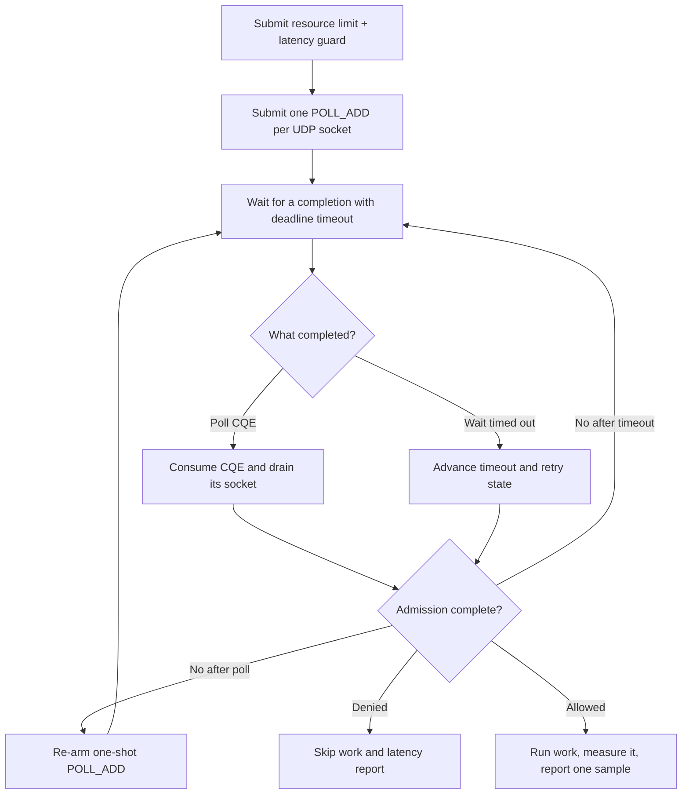

# liburing integration

> **Prerequisites.** You can read C, know the difference between submission and
> completion queues, and have Linux, a C11 compiler, OpenSSL, the rl-c-client
> source tree, and liburing development files installed.

## TL;DR

This Linux example drives one resource rate limit and one latency guard through
liburing poll completions. Only admitted work executes; successful work is
measured and submitted as one post-work latency sample.

## What this example teaches

This self-contained program submits one `IORING_OP_POLL_ADD` for each
runtime-owned UDP socket. Poll requests are one-shot, so every consumed
completion is followed by socket draining and re-arming. A timed completion
wait also follows the active admission deadline.

The application owns the ring, request, completion identities, and copied
outcome. The runtime owns the sockets. Outstanding polls must be cancelled or
retired before those socket targets are closed.

## Control flow



## Build and run

Install liburing and build the client library plus this folder:

```sh
sudo apt-get install liburing-dev

make -C ../..
make
export RATELIMITLY_AUTH_KEY=rl-aes1...
./liburing-example
```

The equivalent CMake build is:

```sh
cmake -S . -B build
cmake --build build
RATELIMITLY_AUTH_KEY=rl-aes1... ./build/liburing-example
```

The kernel and security policy must permit `io_uring_setup`. An admitted run
exits 0, a policy denial exits 2, and setup or transport failure exits 1.

## Configuration

`RATELIMITLY_AUTH_KEY` is required. The runtime derives the key ID and defaults
production P0 discovery to:

```text
_ratelimitly._udp.c-<key-id>.p0.ratelimitly.com
```

`RATELIMITLY_TENANT` optionally replaces that key-derived tenant name. A local
responder can bypass DNS:

```sh
export RATELIMITLY_EXAMPLE_SERVER_HOST=127.0.0.1
export RATELIMITLY_EXAMPLE_SERVER_PORT=39082
```

Set `RATELIMITLY_EXAMPLE_SERVER_HOST` and `RATELIMITLY_EXAMPLE_SERVER_PORT`
together, or set neither. Supplying only one is a configuration error. Leave
both unset for production discovery, and never commit the authentication key.

## Rate limiting and latency tracking

The latency guard is evaluated before work from samples already associated with
`liburing-protected-service`. The later observed latency is a new measurement:
`r_runtime_admission_run_and_report()` times `prepare_response()` with a monotonic
clock and reports one successful duration to that same tracker.

No latency sample is sent for resource denial, latency denial, cancellation,
transport failure, or failed protected work.

## Adapting the synchronous demo

`prepare_response()` is synchronous so the example can stop after one decision.
Production code should submit protected asynchronous work after admission,
retain the admission request until completion, and reserve distinct `user_data`
values for application operations and rl-c-client socket polls. Measure the
operation with a monotonic clock, then call
`r_client_admission_report_latency()` once after successful completion.

Consume every `CQE` exactly once before reusing its `user_data` identity. Re-arm
`POLL_ADD` after every completion, recompute the timeout after every transition,
and cancel or drain outstanding operations during shutdown.

## Platform and test evidence

liburing wraps Linux `io_uring`, so this source does not build on macOS or
Windows. The raw io_uring example in the neighboring folder demonstrates the
same workflow without the wrapper library.

Ubuntu 24.04 CI builds and runs this binary against a synthetic responder for
allowed, resource-denied, and latency-denied outcomes. Trusted main runs also
exercise key-derived production P0 discovery and admission. The per-example P0
lane proves local submission of the fire-and-forget report; it does not prove
server acknowledgement.

## Glossary

| Term | Meaning here |
| --- | --- |
| SQE | A submission queue entry describing an operation sent to io_uring. |
| CQE | A completion queue entry that reports an operation's result. |
| `POLL_ADD` | The one-shot io_uring operation used to watch a UDP socket. |
| `user_data` | Caller-controlled identity copied from an SQE to its matching CQE. |
| latency guard | The pre-work decision based on previously stored latency samples. |
| latency sample | The post-work duration reported after successful admitted work. |

## API references

- [Example source](main.c)
- [Pinned liburing 2.5 poll documentation](https://github.com/axboe/liburing/blob/liburing-2.5/man/io_uring_prep_poll_add.3)
- [Pinned liburing 2.5 timed-wait documentation](https://github.com/axboe/liburing/blob/liburing-2.5/man/io_uring_wait_cqe_timeout.3)
- [rl-c-client workflow API](../../include/r_client_workflow.h)
- [Linux one-shot CI matrix](../../tests/linux-one-shot-examples.txt)
