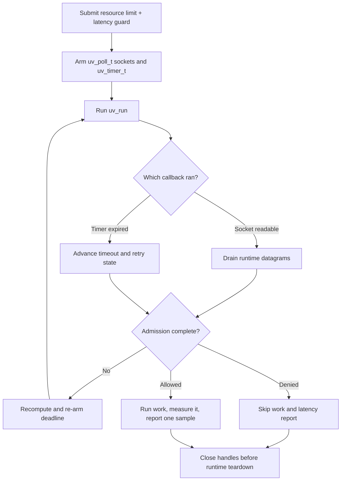

# libuv integration

> **Prerequisites.** You can read C, understand event-loop callbacks, and have
> a C11 compiler, OpenSSL, the rl-c-client source tree, and libuv development
> files available for the target compiler.

## TL;DR

This example integrates one resource rate limit and one latency guard with a
libuv loop. Allowed work runs once and reports one measured latency sample;
denied work does neither.

## What this example teaches

This self-contained program uses `uv_poll_t` handles to observe the runtime's
nonblocking UDP sockets and a one-shot `uv_timer_t` for the request deadline.
Socket callbacks drain datagrams, timer callbacks advance retries, and the
admission callback copies the result before stopping the loop.

The application owns the loop handles and request storage. The runtime owns the
client and sockets. Stop and close every libuv handle, run the loop until close
callbacks drain, and only then destroy the runtime.

## Control flow



## Build and run

Install libuv, then build the client library and this folder:

```sh
sudo apt-get install libuv1-dev       # Debian or Ubuntu
brew install libuv                   # macOS

make -C ../..
make
export RATELIMITLY_AUTH_KEY=rl-aes1...
./libuv-example
```

The CMake path builds rl-c-client with the selected compiler, which avoids
mixing Visual Studio objects with a Unix or MinGW archive:

```sh
cmake -S . -B build
cmake --build build
RATELIMITLY_AUTH_KEY=rl-aes1... ./build/libuv-example
```

An admitted run exits 0. A policy denial exits 2; setup or transport failure
exits 1.

## Configuration

`RATELIMITLY_AUTH_KEY` is required. Its encoded key ID defaults production P0
discovery to:

```text
_ratelimitly._udp.c-<key-id>.p0.ratelimitly.com
```

`RATELIMITLY_TENANT` optionally overrides that key-derived tenant name. For local
testing, bypass DNS with a complete fixed-endpoint pair:

```sh
export RATELIMITLY_EXAMPLE_SERVER_HOST=127.0.0.1
export RATELIMITLY_EXAMPLE_SERVER_PORT=39082
```

Set `RATELIMITLY_EXAMPLE_SERVER_HOST` and `RATELIMITLY_EXAMPLE_SERVER_PORT`
together, or set neither. One without the other is a configuration error.
Leave both unset in production, and never commit authentication keys.

## Rate limiting and latency tracking

The latency guard checks existing samples for `libuv-protected-service` before
work begins. The latency printed after admission is a different value:
`perform_protected_work()` measures its small `snprintf` response construction
with a monotonic clock and reports one new duration to the same tracker.

Resource-denied, latency-denied, cancelled, failed, and unsuccessful-work paths
do not report a sample.

## Adapting the synchronous demo

`perform_protected_work()` is intentionally tiny and synchronous. For real nonblocking
work, start the operation only after admission, retain request and connection
state, and measure from asynchronous start to successful completion with a
monotonic clock. Call `r_client_admission_report_latency()` once on the libuv loop
thread when that operation finishes.

Keep client calls on the loop thread unless explicit serialization is added.
Re-arm the one-shot deadline after each timeout transition because a retry may
publish a different deadline. Use `uv_async_t` if a worker thread must notify
the loop.

libuv can deliver spurious poll readiness, so a readable callback must tolerate
the runtime reaching `EAGAIN` without a datagram. Keep exactly one active
`uv_poll_t` per socket, stop every poll handle before `uv_close()`, and let close
callbacks drain before destroying runtime-owned sockets.

## Platform and test evidence

The source uses `uv_poll_init_socket`, preserving a native WinSock `SOCKET`, and the
build files link the required Windows socket and DNS libraries. It therefore
targets Linux, macOS, and Windows. Current repository integration CI executes
this binary only on Ubuntu; macOS and Windows are source/build support claims
for this example, not CI execution claims.

Ubuntu CI verifies allowed, resource-denied, and latency-denied behavior against
a synthetic responder. Trusted main runs additionally cover key-derived
production P0 discovery and admission. The production latency report is
fire-and-forget, so the per-example run proves local send success rather than
server acknowledgement.

## Glossary

| Term | Meaning here |
| --- | --- |
| `uv_poll_t` | A libuv handle that watches an existing socket for readiness. |
| `uv_timer_t` | A libuv timer handle used here as a one-shot admission deadline. |
| `SOCKET` | WinSock's native socket-handle type, preserved by `uv_poll_init_socket`. |
| loop thread | The thread calling `uv_run()` and all client callbacks in this example. |
| latency guard | The pre-work check against previously collected service latency. |
| latency sample | The duration recorded after admitted work completes successfully. |
| CMake | Cross-platform build-system generator provided as an alternative to Make. |

## API references

- [Example source](main.c)
- [libuv 1.x poll-handle documentation](https://docs.libuv.org/en/v1.x/poll.html)
- [libuv 1.x timer documentation](https://docs.libuv.org/en/v1.x/timer.html)
- [libuv 1.x handle lifecycle](https://docs.libuv.org/en/v1.x/handle.html)
- [libuv 1.x async handles](https://docs.libuv.org/en/v1.x/async.html)
- [rl-c-client workflow API](../../include/r_client_workflow.h)
- [Linux one-shot CI matrix](../../tests/linux-one-shot-examples.txt)
