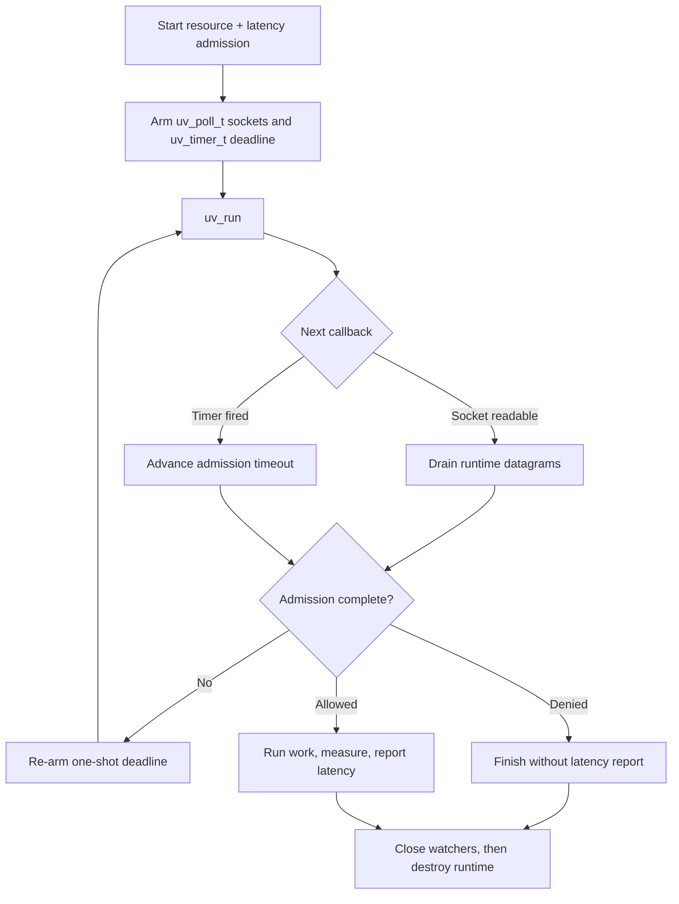

# libuv integration

This example integrates one `rl-c-client` instance with a libuv loop. It uses
`uv_poll_t` to observe the runtime's nonblocking UDP sockets and a one-shot
`uv_timer_t` for the request deadline. The request always contains both a
resource rate limit and a latency guard.

After admission, the example measures a small response-construction function
and reports that completed work. Replace that function with the asynchronous
operation protected by your application. Denied and cancelled requests do not
produce latency samples.

## Control flow



## Build and run

Install libuv and make its `pkg-config` metadata available, then build the
library and example:

```sh
make -C ../..
make
./libuv-example
```

Or use CMake:

```sh
cmake -S . -B build
cmake --build build
./build/libuv-example
```

CMake compiles `rl-c-client` with the selected compiler. This is required for
Visual Studio builds, which cannot consume the Unix/MinGW `librclient.a`.

Set `RATELIMITLY_TENANT` and `RATELIMITLY_AUTH_KEY`. The optional
`RATELIMITLY_EXAMPLE_SERVER_HOST` and `RATELIMITLY_EXAMPLE_SERVER_PORT`
variables select a fixed development responder instead of SRV discovery.

## Platform support

libuv and this example support Linux, macOS, and Windows. The code uses
`uv_poll_init_socket`, not the Unix-only descriptor initializer, so a native
WinSock `SOCKET` is preserved on Windows. Link Win32 builds with `ws2_32` and
`dnsapi`; Unix builds link the resolver library.

## Ownership and shutdown

The application owns libuv handles and request storage. The public runtime owns
the client and sockets. Stop and close every watcher, drain libuv's close
callbacks, and only then destroy the runtime. Keep all client calls on the loop
thread unless the application adds explicit serialization.

## API references

- [libuv poll handles](https://docs.libuv.org/en/stable/poll.html) documents
  socket initialization, level-triggered readiness, and handle lifetime.
