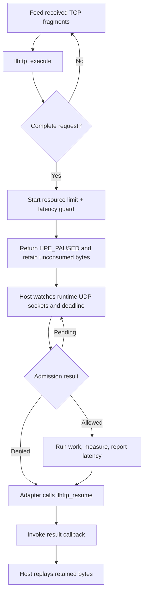

# llhttp parser integration

llhttp is an HTTP parser, not an event loop. This self-contained example parses
one synthetic request and uses `select()` only to make the host-side contract
executable. In a server, call the same adapter from your existing TCP loop.

At a complete request boundary, the adapter starts one combined resource rate
limit and latency guard, then returns `HPE_PAUSED`. The host retains unconsumed
TCP bytes while it drives rl-c-client's UDP sockets and deadline. An allowed
operation is measured with a monotonic clock and reported to the same latency
tracker; rejected work is never run or reported.

## Control flow



## Build and run

Install llhttp 9.x and its pkg-config metadata first. For example:

```sh
brew install llhttp                                      # macOS
sudo apt-get install libllhttp-dev                       # packaged Debian
```

On Linux distributions without that package, build an official release:

```sh
git clone --depth 1 --branch release/v9.4.2 \
  https://github.com/nodejs/llhttp.git
cmake -S llhttp -B llhttp-build \
  -DLLHTTP_BUILD_SHARED_LIBS=OFF \
  -DLLHTTP_BUILD_STATIC_LIBS=ON \
  -DCMAKE_INSTALL_PREFIX="$HOME/.local"
cmake --build llhttp-build
cmake --install llhttp-build
export PKG_CONFIG_PATH="$HOME/.local/lib/pkgconfig:$PKG_CONFIG_PATH"
```

Then build the library and this folder:

```sh
make -C ../..
make

export RATELIMITLY_AUTH_KEY=rl-aes1...
./llhttp-example
```

The encoded key supplies the tenant ID and defaults discovery to
`_ratelimitly._udp.c-<key-id>.p0.ratelimitly.com`. Set optional
`RATELIMITLY_TENANT` only to override that production DNS name.

The CMake build uses the same `libllhttp.pc` metadata:

```sh
cmake -S . -B build
cmake --build build
./build/llhttp-example
```

CMake compiles `rl-c-client` with the selected compiler. This is important for
Visual Studio, where an imported Unix/MinGW `librclient.a` is not link-compatible.

If llhttp is in a custom prefix, set `PKG_CONFIG_PATH`. The Makefile also accepts
explicit `LLHTTP_CFLAGS` and `LLHTTP_LIBS` values. CMake accepts
`-DLLHTTP_ROOT=/path/to/prefix` when pkg-config is unavailable, which is useful
for Visual Studio and MinGW builds.

## Host-loop contract

1. Create one `rl_llhttp_adapter_t` per accepted TCP connection.
2. Pass every received fragment to `rl_llhttp_adapter_feed()`.
3. If it returns `HPE_PAUSED`, retain bytes at and after the reported `consumed`
   offset. Watch every runtime UDP socket and the pending admission deadline.
4. The result callback runs after the adapter calls `llhttp_resume()`. It is now
   safe to replay retained bytes and continue parsing a pipelined connection.
5. Call `rl_llhttp_adapter_finish()` after clean EOF and only when no request is
   paused. Call `rl_llhttp_adapter_dispose()` before freeing connection state.

URL query data is intentionally excluded from the bucket key: user input and
secrets must not create unbounded bucket cardinality. Overlong URLs fail instead
of being silently truncated into a different key.

## Platform support

llhttp, the adapter, and the public runtime are portable across Linux, macOS,
and Windows. `select()` is used here because it works with POSIX sockets and
WinSock; production hosts should use their native loop. The Makefile adds the
Unix resolver library or the Windows WinSock/DNS libraries as appropriate.

## Ownership and error handling

The host owns TCP buffers, the runtime, adapter storage, and connection lifetime.
The adapter borrows the runtime and owns its parser and pending admission state.
Keep it alive until completion or explicitly cancel it with `dispose`. Parser
errors are returned as `llhttp_errno_t`; `rl_llhttp_adapter_last_client_status()`
separately identifies submission failures from rl-c-client.

## API references

- [llhttp callback and pause semantics](https://github.com/nodejs/llhttp#pause)
  define pausing in callbacks, error positions, and parser resumption.
