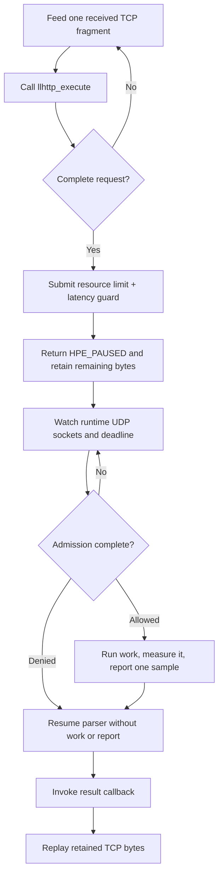

# llhttp parser integration

> **Prerequisites.** You can read C, understand fragmented HTTP input and host
> event loops, and have a C11 compiler, OpenSSL, the rl-c-client source tree,
> and llhttp 9.x headers and libraries installed.

## TL;DR

This parser adapter pauses at a complete HTTP request while one resource
rate-limit check and one latency guard are evaluated. Allowed work runs and
reports one latency sample; denied work is resumed without work or a report.

## What this example teaches

llhttp is an HTTP parser, not an event loop. This self-contained program parses
one deliberately fragmented request and uses `select()` only to make the host-side
contract executable. A server should call the same adapter from its existing
TCP loop.

At a complete request boundary, the adapter starts combined admission and
returns `HPE_PAUSED`. The host retains unconsumed TCP bytes while it drives
rl-c-client's UDP sockets and deadline. Completion resumes the parser before
the result callback allows the host to replay retained bytes.

## Control flow



## Build and run

Install llhttp 9.x:

```sh
brew install llhttp                    # macOS
sudo apt-get install libllhttp-dev     # Debian or Ubuntu when packaged
pkg-config --modversion libllhttp
```

Distribution package versions vary; verify a compatible 9.x result before
building. Otherwise use the pinned source fallback.

If no package is available, build the same revision used by CI:

```sh
git clone https://github.com/nodejs/llhttp.git
git -C llhttp checkout f831650b4f693bc1b4a6fe08f1b8ae25196e9f6a
cmake -S llhttp -B llhttp-build \
  -DLLHTTP_BUILD_SHARED_LIBS=OFF \
  -DLLHTTP_BUILD_STATIC_LIBS=ON \
  -DCMAKE_INSTALL_PREFIX="$HOME/.local"
cmake --build llhttp-build
cmake --install llhttp-build
export PKG_CONFIG_PATH="$HOME/.local/lib/pkgconfig:$PKG_CONFIG_PATH"
```

Then build and run:

```sh
make -C ../..
make
export RATELIMITLY_AUTH_KEY=rl-aes1...
./llhttp-example
```

The CMake build accepts LLHTTP_ROOT when pkg-config is unavailable:

```sh
cmake -S . -B build -DLLHTTP_ROOT=/path/to/llhttp-prefix
cmake --build build
RATELIMITLY_AUTH_KEY=rl-aes1... ./build/llhttp-example
```

## Configuration

`RATELIMITLY_AUTH_KEY` is required. Its key ID selects production P0 discovery:

```text
_ratelimitly._udp.c-<key-id>.p0.ratelimitly.com
```

`RATELIMITLY_TENANT` optionally overrides that key-derived tenant name. Local
tests can bypass DNS with:

```sh
export RATELIMITLY_EXAMPLE_SERVER_HOST=127.0.0.1
export RATELIMITLY_EXAMPLE_SERVER_PORT=39082
```

Set `RATELIMITLY_EXAMPLE_SERVER_HOST` and `RATELIMITLY_EXAMPLE_SERVER_PORT`
together, or set neither. A partial pair is a configuration error. Leave both
unset for production discovery, and never commit authentication keys.

## Host-loop contract

1. Allocate one `rl_llhttp_adapter_t` for each accepted TCP connection.
2. Pass every received fragment to `rl_llhttp_adapter_feed()`.
3. On `HPE_PAUSED`, retain bytes at and after the returned `consumed` offset. Watch
   each runtime UDP socket plus the pending admission deadline.
4. The result callback runs after `llhttp_resume()`. Replay retained bytes there and
   continue parsing pipelined input.
5. Call `rl_llhttp_adapter_finish()` after clean EOF only when no request is paused.
   Call `rl_llhttp_adapter_dispose()` before releasing connection state.

Query data is excluded from the bucket identity, preventing user input or
secrets from creating unbounded bucket cardinality. An overlong URL fails
instead of being truncated into a different identity.

## Rate limiting and latency tracking

The latency guard evaluates samples already stored for
`llhttp-protected-service` before the request handler runs. On admission, the
adapter measures `print_protected_response()` with a monotonic clock and reports
that newly completed duration. The pre-work guard and post-work sample are
distinct stages of the feedback loop.

Resource denial, latency denial, cancellation, parser failure, and protected
work failure produce no sample.

## Adapting the synchronous demo

`select()` makes this one-shot host wait synchronously, and the current
protected-work callback is also synchronous. A production server should return
to its normal loop after `HPE_PAUSED` and register UDP readiness plus the current
deadline alongside its TCP connection.

For asynchronous protected work, split admission completion from the current
run-and-report callback: retain the adapter and connection, start work only
after admission, measure through its asynchronous completion, then call
`r_client_admission_report_latency()` once before resuming application processing.
Do not block the parser's event-loop thread.

## Platform and test evidence

llhttp, the adapter, and `select()`-based driver target Linux, macOS, and Windows.
The Make and CMake files select Unix resolver libraries or Windows socket and
DNS libraries. Current repository integration CI builds and executes this
example only on Ubuntu; macOS and Windows are not execution-tested here.

Ubuntu CI uses the pinned llhttp commit and verifies allowed, resource-denied,
and latency-denied paths with a synthetic responder. Trusted main runs also
exercise key-derived production P0 discovery and admission. Its
fire-and-forget latency report is checked for local send success, not server
acknowledgement.

## Glossary

| Term | Meaning here |
| --- | --- |
| llhttp | A callback-driven HTTP parser; it provides neither sockets nor an event loop. |
| `HPE_PAUSED` | The parser status that transfers control and byte ownership back to the host. |
| backpressure | Pausing parsing while admission is pending so more work is not accepted. |
| consumed offset | The boundary before which input was accepted and after which bytes must be retained. |
| EOF | End-of-file notification from the TCP host after a clean peer shutdown. |
| latency guard | The pre-work decision using existing service-latency samples. |
| latency sample | The post-work duration reported after admitted work succeeds. |

## API references

- [Example source](main.c)
- [Adapter source](llhttp_adapter.c)
- [Adapter interface](llhttp_adapter.h)
- [llhttp release/v9.4.2 documentation](https://github.com/nodejs/llhttp/blob/release/v9.4.2/README.md)
- [Pinned llhttp source used by CI](https://github.com/nodejs/llhttp/tree/f831650b4f693bc1b4a6fe08f1b8ae25196e9f6a)
- [rl-c-client workflow API](../../include/r_client_workflow.h)
- [Linux one-shot CI matrix](../../tests/linux-one-shot-examples.txt)
