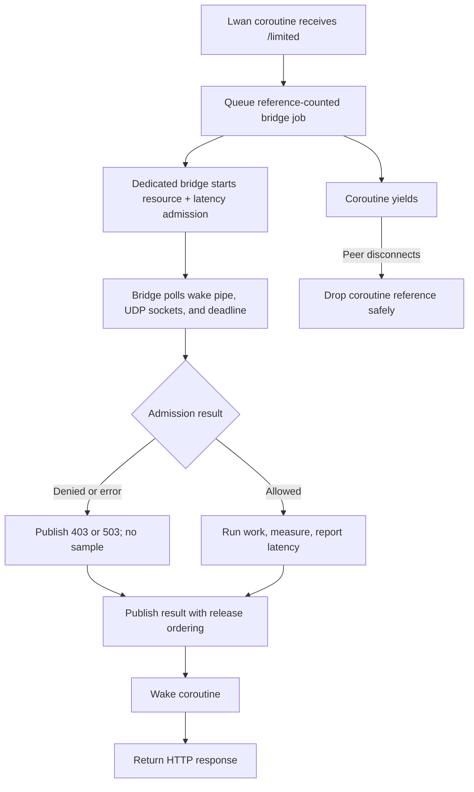

# Lwan coroutine bridge

This self-contained example serves `/limited` with Lwan. A Lwan coroutine
queues admission work and yields, while one dedicated bridge thread owns the
runtime, UDP sockets, active deadlines, and callbacks. Each admission contains
both a resource rate limit and a latency guard.

Allowed requests run a protected operation on the bridge, measure it
monotonically, and report its latency before waking the coroutine. Replace
`perform_protected_work()` with the database query, RPC, or other work the route
should protect.

## Control flow



## Build and run

Build Lwan first, then provide its source and build directories:

```sh
make -C ../..
make LWAN_ROOT=/path/to/lwan LWAN_BUILD=/path/to/lwan/build
RATELIMITLY_TENANT=example \
RATELIMITLY_AUTH_KEY=secret \
./lwan-example
curl -i http://127.0.0.1:8080/limited
```

The equivalent CMake build is:

```sh
cmake -S . -B example-build \
  -DLWAN_ROOT=/path/to/lwan \
  -DLWAN_BUILD=/path/to/lwan/build
cmake --build example-build
```

The whole-archive link flags retain Lwan's linker-discovered module table.
Both example build files also read the `lwan.pc` generated in `LWAN_BUILD`.
That metadata supplies the optional dependencies selected by the exact Lwan
configuration, such as Brotli and Zstd, instead of assuming a fixed feature set.

## Decisions and latency

- `200`: admitted; protected work completed and its latency was reported.
- `403`: resource rate limiting denied the request. Lwan's public status table
  omits 429, and passing an unknown status triggers an assertion.
- `503`: the latency guard alone denied work, or admission infrastructure failed.

Denied requests never run protected work or emit latency samples.

## Ownership and disconnect safety

Each heap job starts with two references: one held by coroutine cleanup and one
held by the bridge. Release/acquire publication makes the result fields visible
before the coroutine sees `done`. If a peer disconnects while the coroutine is
sleeping, deferred cleanup drops its reference while the bridge safely retains
the other until callback or cancellation.

Only the bridge touches rl-c-client. This avoids placing client state on Lwan's
small coroutine stacks and prevents concurrent entry from worker coroutines.

## Platform support

Lwan's event loop and this bridge target Linux. The CMake file rejects other
platforms explicitly. On macOS or Windows, use one of the portable framework
examples such as Mongoose.

## API references

- [Lwan upstream documentation](https://github.com/lpereira/lwan) covers URL
  maps, coroutine handlers, build options, and optional dependencies.
