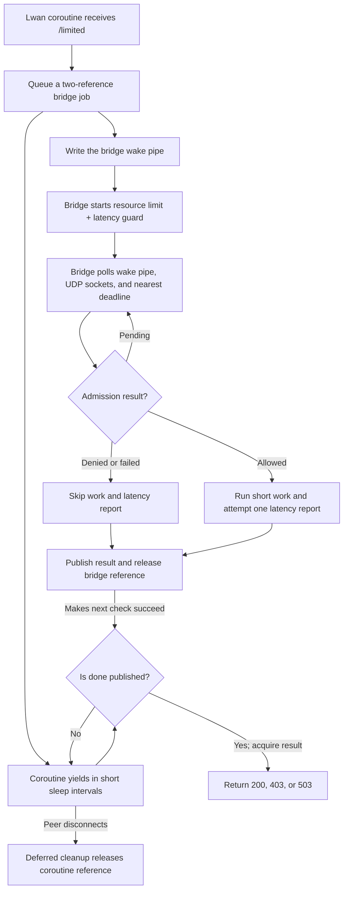

# Lwan coroutine bridge

> **Prerequisites.** You can read C, understand an HTTP request and response,
> and know that nonblocking UDP sockets become readable when datagrams arrive.
> Building requires Linux, a C11 compiler, OpenSSL, POSIX threads, Lwan, and the
> rl-c-client source tree. Everything else is explained here.

## TL;DR

A Lwan request coroutine submits a resource rate limit and pre-work latency
guard to one client-owning bridge thread. Allowed work runs briefly on that
bridge, then submits a post-work latency sample before the coroutine responds.

## What this example teaches

Lwan serves requests in coroutines, but rl-c-client needs one owner to drive
its UDP sockets, deadlines, and callbacks consistently. This adapter gives
that ownership to a dedicated bridge thread. The coroutine allocates a job,
places it on a mutex-protected queue, writes a wake pipe, and yields in short
`lwan_request_sleep()` intervals until the bridge publishes completion.

Each job starts with two references. The bridge owns one; a deferred coroutine
cleanup owns the other. If a peer disconnects while the coroutine is sleeping,
that cleanup releases only the coroutine's reference, while the bridge retains
valid storage through admission callback or cancellation.

The bridge stores result fields, then publishes `done` with release ordering.
The coroutine loads `done` with acquire ordering before reading those fields.
This memory-order pair makes the result visible without allowing either owner
to free the job too early.

## Control flow



## Build and run

The integration CI uses Lwan commit
`0927e3eb8f08ab8a4e238bcb7cc2388f6082163b`. Build that revision first:

```sh
sudo apt-get install build-essential cmake libssl-dev pkg-config zlib1g-dev

git clone https://github.com/lpereira/lwan.git /tmp/lwan
git -C /tmp/lwan checkout 0927e3eb8f08ab8a4e238bcb7cc2388f6082163b
cmake -S /tmp/lwan -B /tmp/lwan-build \
  -DCMAKE_BUILD_TYPE=Release \
  -DENABLE_BROTLI=OFF \
  -DENABLE_ZSTD=OFF \
  -DMTUNE_NATIVE=OFF
cmake --build /tmp/lwan-build
```

From this folder, build the client archive and example:

```sh
make -C ../..
make LWAN_ROOT=/tmp/lwan LWAN_BUILD=/tmp/lwan-build

export RATELIMITLY_AUTH_KEY='rl-aes1...'
./lwan-example
curl -i http://127.0.0.1:8080/limited
```

The equivalent example CMake build also expects `../../librclient.a`:

```sh
cmake -S . -B example-build \
  -DLWAN_ROOT=/tmp/lwan \
  -DLWAN_BUILD=/tmp/lwan-build
cmake --build example-build
RATELIMITLY_AUTH_KEY='rl-aes1...' ./example-build/lwan-example
```

Both build files read `lwan.pc` from the exact Lwan build tree. That metadata
supplies dependencies selected by that build, while whole-archive linker flags
retain Lwan's linker-discovered module table. If Brotli, Zstd, Lua, or another
optional feature is enabled, install its development library before building
this example.

## Configuration and production discovery

`RATELIMITLY_AUTH_KEY` is required. With no override, rl-c-client decodes its
key ID, derives `c-<key-id>.p0.ratelimitly.com`, and resolves the production P0
service record:

```text
_ratelimitly._udp.c-<key-id>.p0.ratelimitly.com
```

`RATELIMITLY_TENANT` optionally replaces the derived tenant DNS name. For a
fixed development responder, set both endpoint variables:

```sh
export RATELIMITLY_AUTH_KEY='rl-aes1...'
export RATELIMITLY_EXAMPLE_SERVER_HOST=127.0.0.1
export RATELIMITLY_EXAMPLE_SERVER_PORT=39082
./lwan-example
```

Setting only the host or only the port is invalid. A fixed endpoint bypasses
service discovery but still uses the authentication key. Leave the tenant,
host, and port overrides unset for key-derived production discovery, and never
commit a real key.

## Guard first, latency sample afterward

The latency guard is a **pre-work** policy decision over existing samples for
`lwan-protected-service`; it does not measure the request currently waiting in
the coroutine. The resource limit is evaluated in the same admission packet.

After both controls allow the request,
`r_runtime_admission_run_and_report()` measures
`perform_protected_work()` with a monotonic clock and submits one **post-work**
sample to that service tracker. A monotonic clock measures elapsed time without
jumping when the wall clock is corrected. Denied, cancelled, and failed-work
paths do not submit samples. The report is a UDP send without an individual
server acknowledgement, so helper success means local submission succeeded,
not that the server confirmed storage.

## HTTP decisions, the 403 compromise, and report failures

- `200`: admission allowed the request.
- `403`: the resource limit denied it, alone or together with the latency
  guard.
- `503`: only the latency guard denied it, or admission infrastructure failed.

HTTP 429 is the semantically correct status for rate limiting. The
CI-pinned Lwan status table has no 429 entry, while its response path expects a
status from that table, so this example uses supported `HTTP_FORBIDDEN` (403).
That is an explicit compatibility compromise. If a later Lwan revision exposes
429—or the application owns raw response serialization—map resource denial to
429 instead.

The bridge logs a nonzero return from
`r_runtime_admission_run_and_report()` but leaves the allowed admission outcome
unchanged, so the coroutine still returns HTTP 200. A clock, protected-work, or
local report-submission failure is therefore not reflected in the current HTTP
status. Production code should propagate work failure and give telemetry
failure an explicit retry, metric, or fail-open policy.

## Adapting the synchronous work

The sample `perform_protected_work()` only sets a boolean. Real blocking work
must not replace it directly: the single bridge thread also owns every client
socket, deadline, and admission callback, so a slow database query or RPC there
would stall all rate-limit decisions.

For longer work, dispatch the admitted operation to an asynchronous service or
worker pool while retaining the bridge's job reference and a monotonic start
time. Post completion back through a bridge-owned queue, report one latency
sample only for successful work, publish the result, then release the bridge
reference. Do not let worker threads enter rl-c-client concurrently, and do not
measure only the time needed to enqueue work.

## Ownership and shutdown

Only the bridge thread calls rl-c-client. The queue mutex protects jobs moving
from request coroutines to that thread; the active list needs no mutex because
the bridge alone reads and writes it. The nonblocking wake pipe coalesces
notifications safely when it is already full.

On bridge failure or shutdown, the bridge cancels every active admission and
publishes an error for queued jobs before releasing its references. Coroutine
deferred cleanup then releases the other reference during normal return or
disconnect.

## Platform and test evidence

Lwan uses a Linux-focused event loop, and this bridge uses Linux/POSIX build
and linker facilities. The CMake file rejects macOS and Windows explicitly;
this folder therefore declares Linux-only support.

Ubuntu 24.04 CI builds the pinned Lwan revision and executes this example
against a synthetic responder. It verifies one allowed request with exactly
one matching latency report, one resource denial returning the documented 403
with no report, and one latency denial with no report. Trusted `main` runs also
exercise key-derived production P0 discovery and allowed admission; because
the report path is fire-and-forget UDP, that live smoke proves local submission
rather than per-report production acknowledgement.

## Glossary

| Term | Meaning here |
| --- | --- |
| C11 | 2011 revision of the C language standard used to compile this example. |
| CMake | Build-system generator provided as an alternative to Make. |
| POSIX | Portable operating-system interface family that includes the threads and pipe APIs used here. |
| coroutine | Suspendable request function that yields to Lwan and later resumes without occupying an operating-system thread while asleep. |
| bridge thread | Single thread that owns rl-c-client, its UDP sockets, active deadlines, and callbacks. |
| admission | One asynchronous decision combining a resource rate limit and latency guard. |
| resource rate limit | Pre-work budget that admits or denies tokens from a named bucket and time window. |
| release ordering | Producer side of the atomic publication pair that makes earlier result writes visible to an acquiring consumer. |
| acquire ordering | Consumer side of the atomic publication pair; later result reads observe writes published before `done`. |
| latency guard | Pre-work policy check against recent samples for a named service. |
| latency tracker | Server-side rolling sample set for a named service; the latency guard reads it and successful work adds to it. |
| latency sample | Post-work duration submitted after successful admitted work. |
| tenant | Key-associated namespace used to construct the production service-discovery name. |
| UDP | Datagram transport used for admission packets and latency reports. |
| fire-and-forget | Submission with no reply confirming that this individual report was stored. |
| wake pipe | Nonblocking pipe used to interrupt the bridge's `poll()` when new jobs arrive. |
| SRV | DNS service-record type that supplies a service host and port. |
| P0 | Production Ratelimitly DNS environment encoded in the default tenant suffix. |

## API references

- [Example source](main.c)
- [Combined admission workflow](../../include/r_client_workflow.h)
- [Lwan status table at the CI-pinned commit](https://github.com/lpereira/lwan/blob/0927e3eb8f08ab8a4e238bcb7cc2388f6082163b/src/lib/lwan-http-status.h)
- [HTTP 429 specification](https://www.rfc-editor.org/rfc/rfc6585#section-4)
- [Pinned Lwan request sleep API](https://github.com/lpereira/lwan/blob/0927e3eb8f08ab8a4e238bcb7cc2388f6082163b/src/lib/lwan.h)
- [Pinned Lwan deferred-cleanup API](https://github.com/lpereira/lwan/blob/0927e3eb8f08ab8a4e238bcb7cc2388f6082163b/src/lib/lwan-coro.h)
- [Linux HTTP CI matrix](../../tests/linux-http-examples.txt)
- [Deterministic HTTP scenario runner](../../tests/run_http_example.sh)
