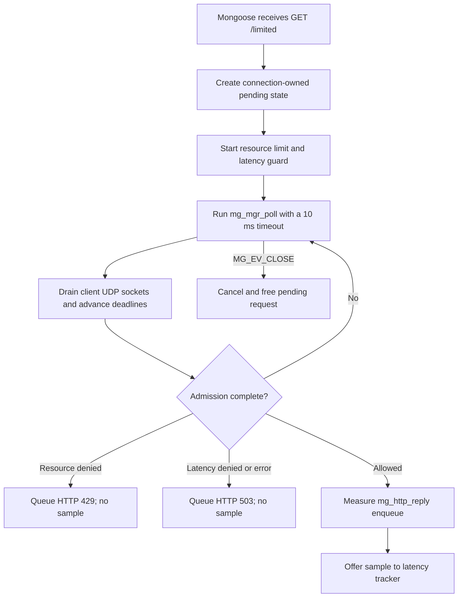

# Mongoose HTTP integration

> **Prerequisites.** You can read C and understand HTTP handlers and event
> loops. Everything specific to Mongoose and Ratelimitly is explained here.

## TL;DR

One Mongoose manager keeps `GET /limited` pending while it asynchronously
checks a resource rate limit and a latency guard. After admission, this compact
demo measures only `mg_http_reply()` formatting/enqueue time and reports that
sample to the latency tracker; it does not measure backend work or a network
write.

## What this example teaches

This self-contained server shows how to drive Mongoose and `rl-c-client` from
one thread without blocking while admission is in flight. Pending state ties a
Mongoose connection to one combined admission request, the manager loop drains
the client's User Datagram Protocol (UDP) sockets and deadlines, and
`MG_EV_CLOSE` cancels work for a disconnected peer.

The two latency operations serve different purposes:

1. The **latency guard** is a pre-work admission check. It can reject new work
   using recent latency already held by the service's tracker.
2. The **latency report** is post-work feedback. Only an admitted request runs
   the measured callback and offers one new sample to that same tracker.

Denied and cancelled requests therefore do not run the measured callback and
do not report a sample.

## Control flow



## Build and run

Build the client library, then fetch the Mongoose release used by CI. Release
`7.22` resolves to commit
`c288ac1f38424ffdd4d2fd5e1893fd4962642db3`:

```sh
make -C ../..
git clone --depth 1 --branch 7.22 \
  https://github.com/cesanta/mongoose.git /tmp/mongoose-7.22
test "$(git -C /tmp/mongoose-7.22 rev-parse HEAD)" = \
  c288ac1f38424ffdd4d2fd5e1893fd4962642db3
make MONGOOSE_ROOT=/tmp/mongoose-7.22
```

Supply the key through the environment rather than an argument, start the
server, then call the protected route:

```sh
export RATELIMITLY_AUTH_KEY='rl-aes1...'
./mongoose-example
curl -i http://127.0.0.1:8000/limited
```

The equivalent CMake build compiles Mongoose and `rl-c-client` with the same
selected compiler. That avoids mixing Unix, MinGW, and Microsoft Visual C/C++
(MSVC) static-library formats:

```sh
cmake -S . -B build -DMONGOOSE_ROOT=/tmp/mongoose-7.22
cmake --build build
RATELIMITLY_AUTH_KEY='rl-aes1...' ./build/mongoose-example
```

For a native Visual Studio build, make OpenSSL available to CMake (the CI lane
uses vcpkg), select an x64 generator, and run the configuration-specific
executable:

```powershell
vcpkg install openssl:x64-windows
cmake -S . -B build-msvc -A x64 `
  "-DCMAKE_TOOLCHAIN_FILE=$env:VCPKG_ROOT/scripts/buildsystems/vcpkg.cmake" `
  -DVCPKG_TARGET_TRIPLET=x64-windows `
  "-DMONGOOSE_ROOT=C:\path\to\mongoose"
cmake --build build-msvc --config Release
$env:RATELIMITLY_AUTH_KEY = 'rl-aes1...'
& .\build-msvc\Release\mongoose-example.exe
```

## Authentication and discovery

`r_runtime_options_from_env()` gives every example the same configuration
contract:

| Variable | Required | Meaning |
| --- | --- | --- |
| `RATELIMITLY_AUTH_KEY` | Yes | Encoded authentication key. The client validates it and derives the tenant/key identifier from it. |
| `RATELIMITLY_TENANT` | No | Tenant DNS-name override. Leave it unset for normal production discovery. |
| `RATELIMITLY_EXAMPLE_SERVER_HOST` | Test only | Fixed server host that bypasses production Domain Name System (DNS) service (SRV) record discovery. |
| `RATELIMITLY_EXAMPLE_SERVER_PORT` | Test only | Fixed server UDP port; it must be set together with the fixed host. |

With only the key set, the derived production DNS service query is
`_ratelimitly._udp.c-<key-id>.p0.ratelimitly.com`. This is the P0 default; the
caller does not need to copy a tenant ID from the key or configure a P1 name.

The fixed endpoint exists for local responders and integration tests. Setting
only its host or only its port is a configuration error:

```sh
export RATELIMITLY_EXAMPLE_SERVER_HOST=127.0.0.1
export RATELIMITLY_EXAMPLE_SERVER_PORT=39082
```

Do not set those fixed-endpoint variables in production: doing so deliberately
bypasses key-derived service discovery.

## Admission, response, and latency semantics

The protected route maps the combined decision as follows:

| HTTP result | Meaning |
| --- | --- |
| `200` | Admission allowed and `mg_http_reply()` was called to enqueue the response. |
| `429` | The resource rate limit denied the request, alone or with the latency guard. |
| `503` | The latency guard alone denied it, or the admission client failed. |
| `409` | The same connection already has a pending admission request. |

`r_runtime_admission_run_and_report()` reads a monotonic clock, invokes
`send_allowed_reply()`, reads the clock again, and submits the elapsed duration.
In this example `send_allowed_reply()` does nothing except call
`mg_http_reply()`. Mongoose output helpers append to the connection's send
buffer; a later `mg_mgr_poll()` writes that buffer. The reported sample
therefore covers response formatting and enqueue only—not application work,
socket transmission, or client-observed latency.

That distinction also affects failure behavior. If report submission fails
after the response is queued, the peer can still receive HTTP 200 and the
server logs `latency report failed`; the HTTP status cannot be changed safely
at that point. If the helper's first clock read fails, `mg_http_reply()` is
never called and this demonstration only logs the failure, leaving no admitted
response. Production code should make that pre-response failure explicit.

A successful report call is fire-and-forget: it proves local packet submission,
not server acknowledgement. The deterministic Linux harness observes the
packet; the repository's separate production probe verifies tracker read-back.

## Loop timing and asynchronous application work

The manager uses a configured `mg_mgr_poll(..., 10)` timeout and drives the
client immediately afterward. A newly ready client socket can consequently
wait up to one configured tick—10 ms **[modeled]** from the loop ordering—plus
operating-system scheduling and callback time. This is not a measured result or
an end-to-end latency guarantee.

The Mongoose manager thread owns all connections, pending nodes, and client
state. Mongoose documents that its core APIs must stay on that thread. Unlink a
pending node before replying because a reply can schedule teardown, and save
`next` before deadline processing because completion can free the current node.

For real database or remote procedure call (RPC) work, do not replace the
measured callback with a blocking operation on this manager thread. Instead:

1. retain the pending request after admission and record a monotonic start;
2. start the backend operation asynchronously;
3. post completion to the manager thread (Mongoose provides `mg_wakeup()` for
   cross-thread notification);
4. on that thread, report the elapsed operation latency and enqueue the HTTP
   response; and
5. discard late completion safely if `MG_EV_CLOSE` already cancelled the
   request.

That adaptation measures the protected operation rather than response enqueue
and keeps unrelated Mongoose connections moving.

## Platform and test evidence

| Environment | Evidence in this repository |
| --- | --- |
| Linux | Full CI build plus deterministic allow, resource-deny, and latency-deny scenarios. Trusted `main` also runs the example against production P0. |
| Windows with MSVC | CI builds the example with strict MSVC warnings and starts it through missing-key validation. This is a build/startup smoke test, not a Windows admission scenario. |
| macOS | Mongoose and the runtime declare support and the build files provide Unix resolver/thread linkage. This repository does not run the Mongoose HTTP scenario in macOS CI. |

Mongoose upstream supports Linux, macOS, and Windows. The narrower statements
above describe what this repository actually executes, rather than turning
upstream portability into an automated-test claim.

## Glossary

| Term | Meaning |
| --- | --- |
| admission | Combined resource and latency decision completed before protected work begins. |
| resource rate limit | Token-bucket quota check; denial maps to HTTP 429 here. |
| latency guard | Pre-work check that can shed new work using recent tracked service latency. |
| latency tracker | Server-side sample window updated by admitted work's post-work report. |
| pending request | Heap state connecting one open Mongoose connection to one in-flight admission request. |
| UDP | User Datagram Protocol, used by `rl-c-client` for admission and report packets. |
| SRV record | DNS service record that supplies the production server targets and ports. |
| MSVC | Microsoft Visual C/C++ compiler and native Windows toolchain. |
| CMake | Cross-platform build-system generator used to build the example with Makefiles or Visual Studio projects. |
| protected work | Application operation whose admission and elapsed time the rate limiter and latency tracker are meant to govern. |

## API references

- [Example source](main.c) contains the pending-list ownership, cancellation,
  admission callback, and measured `mg_http_reply()` call described above.
- [Mongoose 7.22 source](https://github.com/cesanta/mongoose/tree/c288ac1f38424ffdd4d2fd5e1893fd4962642db3)
  is the exact revision used by Linux CI.
- [Mongoose connection and event-manager documentation](https://mongoose.ws/documentation/#connections-and-event-manager)
  defines manager polling, single-threaded API ownership, and send buffers.
- [Mongoose `mg_mgr_poll()` documentation](https://mongoose.ws/documentation/#mg_mgr_poll)
  defines the configured timeout and one-iteration behavior.
- [Mongoose `mg_wakeup()` documentation](https://mongoose.ws/documentation/#mg_wakeup)
  defines the cross-thread completion adaptation.
- [`rl-c-client` workflow helper](../../src/r_client_workflow.c) defines the
  pre-work combined admission and at-most-once post-work report contract.
- [Linux HTTP test matrix](../../tests/linux-http-examples.txt) and the
  [deterministic HTTP harness](../../tests/run_http_example.sh) are the
  executable test scope.
