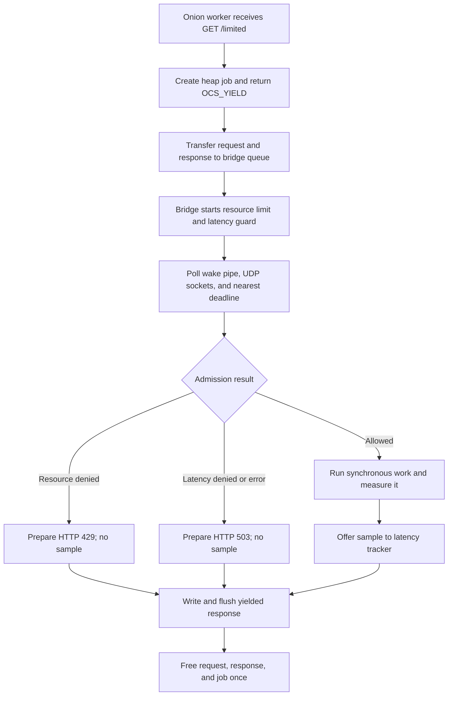

# Onion yielded-response bridge

> **Prerequisites.** You can read C and understand HTTP handlers, POSIX
> threads, mutexes, and `poll()`. Everything specific to Onion and Ratelimitly
> is explained here.

## TL;DR

An Onion worker yields `GET /limited` to one client-owning bridge thread, which
checks a resource rate limit and latency guard before work and reports admitted
work's measured duration to the latency tracker afterward. The demonstration
work is synchronous and blocks that bridge, so slow production work needs an
asynchronous completion handoff.

## What this example teaches

This self-contained server demonstrates Onion's `OCS_YIELD` lifecycle.
Returning `OCS_YIELD` removes the connection from Onion's poller and transfers
responsibility for the request and response to another execution context; here,
that context is a dedicated bridge thread.

The bridge owns the entire `rl-c-client` lifecycle: queue wakeups, User Datagram
Protocol (UDP) sockets, admission deadlines, callbacks, and shutdown. HTTP
workers only allocate and enqueue jobs. This keeps all client entry points on
one thread while Onion can continue serving other workers.

Admission has two latency phases:

1. A pre-work latency guard checks recent service latency from the tracker
   alongside the resource rate limit.
2. After an allowed decision, the bridge measures the protected callback with
   a monotonic clock and offers one sample back to the tracker.

Denied and cancelled jobs do not execute protected work or report latency.

## Control flow



## Build and run

Build the client, then build Onion v0.8. The release tag resolves to the exact
commit pinned in CI,
`46ed564fe1b91d2d253e2f968db233fcc22eeaae`:

```sh
make -C ../..
git clone --depth 1 --branch v0.8 \
  https://github.com/davidmoreno/onion.git /tmp/onion-v0.8
test "$(git -C /tmp/onion-v0.8 rev-parse HEAD)" = \
  46ed564fe1b91d2d253e2f968db233fcc22eeaae
cmake -S /tmp/onion-v0.8 -B /tmp/onion-build \
  -DCMAKE_BUILD_TYPE=Release \
  -DCMAKE_INSTALL_PREFIX=/tmp/onion-install \
  -DONION_EXAMPLES=OFF \
  -DONION_USE_BINDINGS_CPP=OFF \
  -DONION_USE_GC=OFF \
  -DONION_USE_JPEG=OFF \
  -DONION_USE_PAM=OFF \
  -DONION_USE_PNG=OFF \
  -DONION_USE_REDIS=OFF \
  -DONION_USE_SQLITE3=OFF \
  -DONION_USE_SSL=OFF \
  -DONION_USE_SYSTEMD=OFF \
  -DONION_USE_TESTS=OFF \
  -DONION_USE_XML2=OFF
cmake --build /tmp/onion-build
cmake --install /tmp/onion-build
make ONION_ROOT=/tmp/onion-install
```

Supply the key through the environment, start the server, then call the
protected route:

```sh
export RATELIMITLY_AUTH_KEY='rl-aes1...'
./onion-example
curl -i http://127.0.0.1:8000/limited
```

The equivalent example build with CMake is:

```sh
cmake -S . -B build -DONION_ROOT=/tmp/onion-install
cmake --build build
RATELIMITLY_AUTH_KEY='rl-aes1...' ./build/onion-example
```

The CI dependency build disables Onion's optional bindings, image, database,
Transport Layer Security (TLS), system-service, and test components. They are
not needed by this plain-HTTP integration; `rl-c-client` still links OpenSSL's
crypto library for its authenticated UDP protocol.

## Authentication and discovery

The example reads all runtime configuration from these variables:

| Variable | Required | Meaning |
| --- | --- | --- |
| `RATELIMITLY_AUTH_KEY` | Yes | Encoded authentication key. The client validates it and derives the tenant/key identifier from it. |
| `RATELIMITLY_TENANT` | No | Tenant DNS-name override. Leave it unset for normal production discovery. |
| `RATELIMITLY_EXAMPLE_SERVER_HOST` | Test only | Fixed server host that bypasses production Domain Name System (DNS) service (SRV) record discovery. |
| `RATELIMITLY_EXAMPLE_SERVER_PORT` | Test only | Fixed server UDP port; it must be set together with the fixed host. |

With only the key set, the production service query is
`_ratelimitly._udp.c-<key-id>.p0.ratelimitly.com`. P0 and the tenant/key ID are
derived defaults; no P1 hostname or separately copied tenant ID is required.

For a local synthetic responder, set both fixed-endpoint variables. Setting
only one is rejected:

```sh
export RATELIMITLY_EXAMPLE_SERVER_HOST=127.0.0.1
export RATELIMITLY_EXAMPLE_SERVER_PORT=39082
```

Keep both variables unset in production so the process cannot silently bypass
key-derived discovery.

## Decisions and report failures

| HTTP result | Meaning |
| --- | --- |
| `200` | Admission allowed; the adapter invoked the combined run-and-report helper, whose return value does not change this status. |
| `429` | The resource rate limit denied the job, alone or with the latency guard. |
| `503` | The latency guard alone denied it, admission failed, or the bridge was unavailable. |

The HTTP 200 mapping follows the admission outcome, not the return value from
`r_runtime_admission_run_and_report()`. If that helper fails, the example logs
`latency report failed` but still passes the original allowed outcome to
`finish_job()`. A failure before `prepare_protected_response()` can therefore
produce an empty HTTP 200 body; a report-submission failure after work can
produce the normal allowed body without a sample. This is a deliberate
demonstration limitation, not a production error contract.

`onion_response_flush()` can also fail after a peer disconnects. The example
ignores its return value because ownership cleanup is unchanged, which means a
prepared status is not proof that the peer received it.

Report submission is fire-and-forget. A successful local return is not server
acknowledgement; the deterministic Linux harness observes each packet, while
the separate production probe verifies server-side tracker read-back.

## Bridge ownership and synchronous work

The worker allocates a heap job containing the yielded Onion request and
response. Under Onion v0.8, `OCS_YIELD` removes the request from the framework
poller, so the bridge becomes responsible for flushing and freeing both Onion
objects exactly once. Queue insertion is mutex-protected; only the bridge
touches active admission state.

`prepare_protected_response()` currently runs inside the admission callback on
the bridge thread. Any blocking database call or remote procedure call (RPC)
placed there stops that thread from draining every other job's UDP response and
deadline. Keep synchronous demonstration work short.

For slow production work, adapt the ownership boundary:

1. after admission, retain the heap job and record a monotonic start time;
2. start the operation without blocking the bridge;
3. have its completion enqueue a message and wake the bridge through the
   existing nonblocking pipe;
4. on the bridge, calculate and report the sample, then flush and free the
   yielded Onion objects; and
5. make shutdown cancel or finish queued, admitted, and externally active jobs
   before destroying client state.

This keeps `rl-c-client` and Onion response mutation on the bridge while the
slow operation runs elsewhere.

## Shutdown and failure containment

The bridge marks itself stopped before draining failures, so new Onion workers
fail fast instead of queueing to a dead thread. A loop error cancels active
admissions and completes every queued or yielded response; shutdown joins the
bridge before destroying its mutex, pipe, and runtime.

Keep the bridge alive until `onion_listen()` has stopped accepting work and
Onion has completed its worker lifecycle. Otherwise a worker could enqueue
against destroyed synchronization or client state.

## Platform and test evidence

| Environment | Evidence in this repository |
| --- | --- |
| Linux | Full CI build against pinned Onion v0.8 plus deterministic allow, resource-deny, and latency-deny scenarios. Trusted `main` also runs production P0. |
| macOS | The bridge uses portable POSIX APIs, but Onion v0.8 needs compatibility fixes with current macOS Clang. A compatible prebuilt/patched Onion can be consumed; no macOS Onion scenario runs in CI. |
| Windows | Unsupported by this source. Its CMake configuration rejects Windows because the bridge depends on pthreads, `pipe()`, and POSIX `poll()`. |

## Glossary

| Term | Meaning |
| --- | --- |
| admission | Combined resource and latency decision completed before protected work begins. |
| resource rate limit | Token-bucket quota check; denial maps to HTTP 429 here. |
| latency guard | Pre-work check that can shed new work using recent tracked service latency. |
| latency tracker | Server-side sample window updated by admitted work's post-work report. |
| bridge thread | Dedicated thread that alone owns and drives `rl-c-client` and yielded responses. |
| `OCS_YIELD` | Onion handler result that removes a request from its poller so another context can manage it. |
| wake pipe | Nonblocking POSIX pipe used to notify the bridge that workers or asynchronous completions queued work. |
| UDP | User Datagram Protocol, used by `rl-c-client` for admission and report packets. |
| SRV record | DNS service record that supplies the production server targets and ports. |
| CMake | Cross-platform build-system generator used to configure Onion and this example. |
| protected work | Application operation whose admission and elapsed time the rate limiter and latency tracker are meant to govern. |

## API references

- [Example source](main.c) contains the queue, yielded-object ownership,
  admission callback, synchronous work seam, and shutdown order described here.
- [Onion v0.8 `OCS_YIELD` definition](https://github.com/davidmoreno/onion/blob/46ed564fe1b91d2d253e2f968db233fcc22eeaae/src/onion/types.h)
  defines the ownership transfer at the exact revision used by CI.
- [Onion v0.8 request processing](https://github.com/davidmoreno/onion/blob/46ed564fe1b91d2d253e2f968db233fcc22eeaae/src/onion/request.c)
  removes yielded requests from the poller and leaves their cleanup to the new
  owner.
- [Onion v0.8 response implementation](https://github.com/davidmoreno/onion/blob/46ed564fe1b91d2d253e2f968db233fcc22eeaae/src/onion/response.c)
  defines buffered writes, flush errors, and response release.
- [`rl-c-client` workflow helper](../../src/r_client_workflow.c) defines the
  pre-work combined admission and at-most-once post-work report contract.
- [Linux HTTP test matrix](../../tests/linux-http-examples.txt) and the
  [deterministic HTTP harness](../../tests/run_http_example.sh) are the
  executable Linux test scope.
