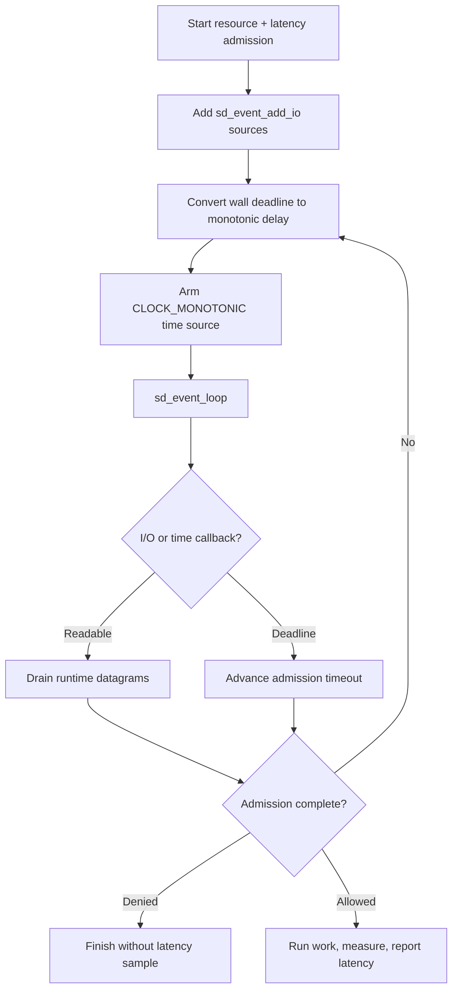

# sd-event integration

This Linux-only example integrates the client with systemd's `sd-event` loop.
`sd_event_add_io` observes the UDP sockets and a one-shot
`CLOCK_MONOTONIC` time source follows the admission deadline. The request
contains both a resource rate limit and a latency guard; only admitted,
completed work is reported.

## Control flow



## Build and run

Install libsystemd development files and build the client library:

```sh
make -C ../..
make
./sd-event-example
```

```sh
cmake -S . -B build
cmake --build build
./build/sd-event-example
```

Set `RATELIMITLY_TENANT` and `RATELIMITLY_AUTH_KEY`; local fixed responder
variables are optional.

## Platform support

sd-event is part of libsystemd and this example supports Linux only. Use GLib,
libuv, libevent, or native platform loops on macOS and Windows.

## Clock and ownership notes

The client publishes Unix-epoch deadlines. The runtime first converts that to
a relative delay; the example then adds the delay to `sd_event_now` in the
monotonic domain. Never compare wall and monotonic timestamps directly.

The application owns all event sources, request storage, and copied outcome.
Unref I/O and timer sources before destroying runtime-owned sockets.

## API references

- [`sd_event_add_io`](https://www.freedesktop.org/software/systemd/man/latest/sd_event_add_io.html)
  defines I/O source registration and ownership.
- [`sd_event_add_time`](https://www.freedesktop.org/software/systemd/man/latest/sd_event_add_time.html)
  defines monotonic timer registration.
