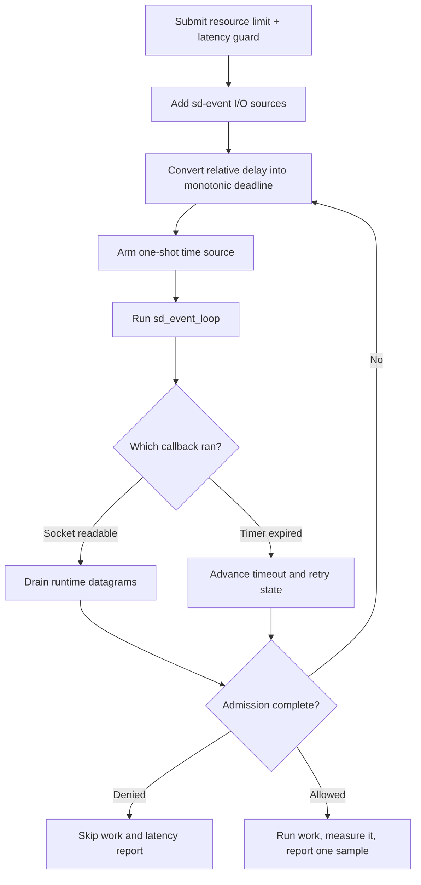

# sd-event integration

> **Prerequisites.** You can read C, understand readiness callbacks and
> monotonic clocks, and have Linux, a C11 compiler, OpenSSL, the rl-c-client
> source tree, and libsystemd development files installed.

## TL;DR

This example drives a resource rate limit and latency guard with sd-event I/O
and timer sources. Protected work executes only when both checks pass, then its
measured latency is submitted to the tracker.

## What this example teaches

This self-contained Linux program uses `sd_event_add_io()` for each runtime-owned
UDP socket and a one-shot `CLOCK_MONOTONIC` time source for the current admission
deadline. Read callbacks drain datagrams; timer callbacks advance timeout and
retry state.

The application owns the event sources, request storage, and copied outcome.
The runtime owns the client and sockets. Unref I/O and timer sources
before runtime destruction closes those sockets.

## Control flow



## Build and run

Install libsystemd, then build the client library and this folder:

```sh
sudo apt-get install libsystemd-dev

make -C ../..
make
export RATELIMITLY_AUTH_KEY=rl-aes1...
./sd-event-example
```

The equivalent CMake build is:

```sh
cmake -S . -B build
cmake --build build
RATELIMITLY_AUTH_KEY=rl-aes1... ./build/sd-event-example
```

An admitted run exits 0, a policy denial exits 2, and setup or transport failure
exits 1.

## Configuration

`RATELIMITLY_AUTH_KEY` is required. Its encoded key ID defaults production P0
discovery to:

```text
_ratelimitly._udp.c-<key-id>.p0.ratelimitly.com
```

`RATELIMITLY_TENANT` optionally overrides that key-derived tenant name. A local
responder can bypass DNS:

```sh
export RATELIMITLY_EXAMPLE_SERVER_HOST=127.0.0.1
export RATELIMITLY_EXAMPLE_SERVER_PORT=39082
```

Set `RATELIMITLY_EXAMPLE_SERVER_HOST` and `RATELIMITLY_EXAMPLE_SERVER_PORT`
together, or set neither. One without the other is a configuration error.
Leave both unset for production discovery, and never commit authentication
keys.

## Rate limiting and latency tracking

The latency guard is the pre-work decision based on samples already stored for
`sd-event-protected-service`. The post-work latency is a separate value:
`r_runtime_admission_run_and_report()` measures `prepare_response()` with a monotonic
clock and submits one new sample to the same tracker.

Resource denial, latency denial, cancellation, transport failure, and failed
protected work submit no latency sample.

## Clock handling

The client publishes an absolute Unix-epoch deadline. The runtime converts it
to a relative delay; this example adds that delay to `sd_event_now()` in the
`CLOCK_MONOTONIC` domain. Wall-clock and monotonic values are never compared
directly. Saturating arithmetic prevents an oversized delay from wrapping.

Re-enable the timer as `SD_EVENT_ONESHOT` after every timeout transition because
retry processing can change the deadline.

## Adapting the synchronous demo

`prepare_response()` is deliberately short and synchronous. Production handlers
should start nonblocking work only after admission, retain request state, and
measure across asynchronous completion with a monotonic clock. Call
`r_client_admission_report_latency()` once after successful completion on the
sd-event thread.

If worker threads perform the operation, use an `eventfd`, pipe, or another
sd-event-compatible notification source to marshal completion back to the loop
before touching the client.

## Platform and test evidence

sd-event is part of libsystemd, so this example supports Linux only. Use GLib,
libuv, libevent, or native platform loops on macOS and Windows.

Ubuntu 24.04 CI builds and runs this binary against a synthetic responder for
allowed, resource-denied, and latency-denied outcomes. Trusted main runs also
exercise key-derived production P0 discovery and admission. The per-example P0
lane proves local submission of its fire-and-forget latency report, not server
acknowledgement.

## Glossary

| Term | Meaning here |
| --- | --- |
| `sd_event_source` | A registered sd-event I/O or timer callback plus its lifetime. |
| `CLOCK_MONOTONIC` | A clock unaffected by wall-clock corrections, used for elapsed time. |
| `SD_EVENT_ONESHOT` | A source mode that disables the timer after one callback. |
| GLib | A portable core library whose main loop is an alternative on non-Linux hosts. |
| latency guard | The pre-work policy decision using existing tracker samples. |
| latency sample | The measured duration submitted after admitted work succeeds. |

## API references

- [Example source](main.c)
- [Pinned systemd v255 sd_event_add_io documentation](https://github.com/systemd/systemd/blob/v255/man/sd_event_add_io.xml)
- [Pinned systemd v255 sd_event_add_time documentation](https://github.com/systemd/systemd/blob/v255/man/sd_event_add_time.xml)
- [rl-c-client workflow API](../../include/r_client_workflow.h)
- [Linux one-shot CI matrix](../../tests/linux-one-shot-examples.txt)
