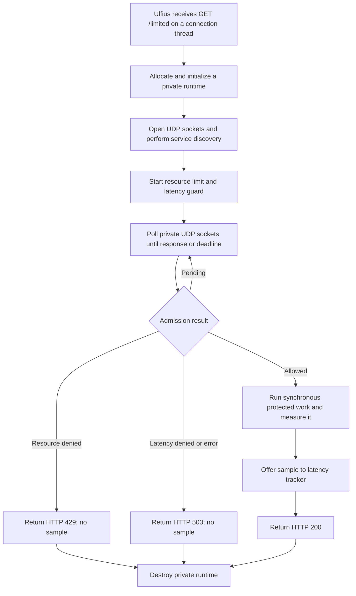

# Ulfius per-callback runtime

> **Prerequisites.** You can read C and understand HTTP callbacks, worker
> threads, sockets, and `poll()`. Everything specific to Ulfius and Ratelimitly
> is explained here.

## TL;DR

Each Ulfius `GET /limited` callback creates a private client and blocks its own
libmicrohttpd connection thread while checking a resource rate limit and
latency guard, then reports admitted work's measured duration to the latency
tracker. This simple ownership model also repeats client allocation, socket
setup, and DNS discovery for every request, so it is a teaching baseline rather
than a high-throughput architecture.

## What this example teaches

This self-contained server demonstrates the simplest thread-safe way to combine
Ulfius with `rl-c-client`: do not share mutable client state. Each endpoint
callback owns one runtime, its User Datagram Protocol (UDP) sockets, one
admission request, its synchronous poll loop, and its result from creation
through destruction.

The example makes the rate limiter and latency tracker relationship explicit:

1. Before protected work, one request checks a resource bucket and a latency
   guard. The guard uses recent samples already stored in the service tracker.
2. Only an allowed request invokes `perform_protected_work()` between two
   monotonic clock reads and offers the elapsed duration back to the tracker.

Resource-denied, latency-denied, failed, and cancelled admissions never run the
measured callback and never report a latency sample.

## Control flow



## Build and run

Install Ulfius and its `libulfius` pkg-config metadata. On Ubuntu, the CI
dependency set is available from distribution packages:

```sh
sudo apt-get update
sudo apt-get install -y \
  build-essential cmake liborcania-dev libssl-dev libulfius-dev pkg-config
make -C ../..
make
```

Supply the key through the environment, start the framework, then call the
protected route:

```sh
export RATELIMITLY_AUTH_KEY='rl-aes1...'
./ulfius-example
curl -i http://127.0.0.1:8000/limited
```

The equivalent CMake build also resolves Ulfius through pkg-config:

```sh
cmake -S . -B build
cmake --build build
RATELIMITLY_AUTH_KEY='rl-aes1...' ./build/ulfius-example
```

CI intentionally uses Ubuntu 24.04's packaged Ulfius rather than claiming an
exact upstream source revision. The API references are authoritative upstream
documentation; the pinned v2.7.15 source reference is provided for readable
mechanism inspection.

## Authentication and discovery

The example reads all runtime configuration from these variables:

| Variable | Required | Meaning |
| --- | --- | --- |
| `RATELIMITLY_AUTH_KEY` | Yes | Encoded authentication key. The client validates it and derives the tenant/key identifier from it. |
| `RATELIMITLY_TENANT` | No | Tenant DNS-name override. Leave it unset for normal production discovery. |
| `RATELIMITLY_EXAMPLE_SERVER_HOST` | Test only | Fixed server host that bypasses production Domain Name System (DNS) service (SRV) record discovery. |
| `RATELIMITLY_EXAMPLE_SERVER_PORT` | Test only | Fixed server UDP port; it must be set together with the fixed host. |

With only the key set, the production service query is
`_ratelimitly._udp.c-<key-id>.p0.ratelimitly.com`. The tenant/key ID and P0 name
are derived defaults; a separate tenant ID and P1 hostname are unnecessary.

Local responder tests bypass that service record by setting both fixed-endpoint
variables. Setting only one is rejected as incomplete configuration:

```sh
export RATELIMITLY_EXAMPLE_SERVER_HOST=127.0.0.1
export RATELIMITLY_EXAMPLE_SERVER_PORT=39082
```

Keep both fixed-endpoint variables unset in production.

## Decisions and report failures

| HTTP result | Meaning |
| --- | --- |
| `200` | Admission allowed; the adapter invoked the combined run-and-report helper, whose return value does not change this status. |
| `429` | The resource rate limit denied the request, alone or with the latency guard. |
| `503` | The latency guard alone denied it, or client initialization/admission failed. |

Ulfius sends the response after `limited()` fills its `_u_response` and returns
`U_CALLBACK_COMPLETE`. The example's `run_check()` deliberately keeps the
admission status separate from `r_runtime_admission_run_and_report()`'s return
value. A helper failure is logged as `latency report failed`, but an allowed
admission still becomes HTTP 200. If the first clock read or protected callback
failed, that 200 could claim success before protected work completed; if only
report submission failed, work completed but no sample was sent. Treat this as
a demonstration limitation, not a production status policy.

Report submission is fire-and-forget. Local success means the client accepted
the packet for sending, not that the service acknowledged or stored it. The
deterministic Linux harness observes the per-example packet; the separate
production probe verifies server-side tracker read-back.

## Per-request cost and thread occupancy

`run_check()` allocates a fresh runtime for every callback. Initialization
decodes and copies the key, allocates client state, opens a nonblocking UDP
socket for each available Internet Protocol (IP) family, and performs
synchronous DNS service and address queries unless a fixed test endpoint is
configured. Destruction closes
those sockets and releases all client state before the callback returns.

No benchmark in this repository quantifies that repeated setup cost, so this
document does not assign it a latency figure. Its mechanism is still clear: no
DNS cache, open socket, or discovered server list survives into the next HTTP
request.

Ulfius v2.7.15 starts libmicrohttpd with a thread-per-connection model. This
callback occupies its connection thread while initialization, DNS, UDP
admission, protected work, and reporting complete. Isolation is excellent for
an introductory example, but thread and discovery costs grow with concurrent
traffic.

## Adapting slow or asynchronous work

`perform_protected_work()` is synchronous. Replacing it directly with a slow
database query or remote procedure call (RPC) blocks the current connection
thread for the full operation.

For higher volume, create a long-lived client-owning bridge like the Onion or
CivetWeb (an embedded C HTTP server) examples. A true asynchronous adaptation
must retain request state using a framework-supported suspend/resume lifetime,
record time only after admission, start the backend operation, and report from
its completion path before completing the HTTP response. Do not return from the
Ulfius callback and later mutate its `_u_response` without such an ownership
contract; the normal `U_CALLBACK_COMPLETE` path tells Ulfius to finish the
transaction immediately.

If blocking one connection thread is acceptable but repeated discovery is not,
a smaller intermediate design can serialize access to a long-lived runtime.
That requires explicit synchronization and must ensure only its owner drives
UDP readiness, deadlines, callbacks, and destruction.

## Platform and test evidence

| Environment | Evidence in this repository |
| --- | --- |
| Linux | Full CI build plus deterministic allow, resource-deny, and latency-deny scenarios. Trusted `main` also runs the example against production P0. |
| macOS | The source uses Portable Operating System Interface (POSIX) `poll()`, pthread, and resolver APIs and is declared for a compatible Ulfius installation. This repository does not run the Ulfius HTTP scenario in macOS CI. |
| Windows | Unsupported by this source. CMake rejects native Windows instead of silently substituting different polling and resolver semantics. |

Ulfius itself offers broader configuration options than this deliberately
POSIX, per-callback adapter. Use the Mongoose or native Win32 example as the
Windows starting point.

## Glossary

| Term | Meaning |
| --- | --- |
| admission | Combined resource and latency decision completed before protected work begins. |
| resource rate limit | Token-bucket quota check; denial maps to HTTP 429 here. |
| latency guard | Pre-work check that can shed new work using recent tracked service latency. |
| latency tracker | Server-side sample window updated by admitted work's post-work report. |
| libmicrohttpd | C HTTP server library used as Ulfius's server backend. |
| connection thread | Worker dedicated by libmicrohttpd to processing one connection in this configuration. |
| UDP | User Datagram Protocol, used by `rl-c-client` for admission and report packets. |
| SRV record | DNS service record that supplies the production server targets and ports. |
| `U_CALLBACK_COMPLETE` | Ulfius return value that ends callback dispatch and completes the HTTP transaction. |
| CMake | Cross-platform build-system generator used to configure this example. |
| IP | Internet Protocol, the network-layer protocol used by the runtime's UDP sockets. |
| IPv4 | Internet Protocol version 4, one address family for which the runtime attempts to open a UDP socket. |
| IPv6 | Internet Protocol version 6, the other address family for which the runtime attempts to open a UDP socket. |
| CivetWeb | Embedded C HTTP server used by another repository example to demonstrate a long-lived bridge. |
| protected work | Application operation whose admission and elapsed time the rate limiter and latency tracker are meant to govern. |

## API references

- [Example source](main.c) contains the private-runtime lifecycle, blocking poll
  loop, decision mapping, and synchronous protected work seam described here.
- [Ulfius API documentation](https://babelouest.github.io/ulfius/)
  defines endpoint callbacks, response ownership, and callback return values.
- [Ulfius v2.7.15 server startup](https://github.com/babelouest/ulfius/blob/a0603447d3ed63c0880db396b9c395fb4bf6b559/src/ulfius.c)
  shows the pinned thread-per-connection libmicrohttpd flags used for the
  mechanism audit.
- [Ulfius v2.7.15 callback constants](https://github.com/babelouest/ulfius/blob/a0603447d3ed63c0880db396b9c395fb4bf6b559/include/ulfius.h)
  defines `U_CALLBACK_COMPLETE` at that release.
- [`rl-c-client` runtime](../../src/r_client_runtime.c) defines environment
  parsing, socket creation, synchronous runtime DNS, and monotonic measurement.
- [`rl-c-client` workflow helper](../../src/r_client_workflow.c) defines the
  pre-work combined admission and at-most-once post-work report contract.
- [Linux HTTP test matrix](../../tests/linux-http-examples.txt) and the
  [deterministic HTTP harness](../../tests/run_http_example.sh) are the
  executable Linux test scope.
