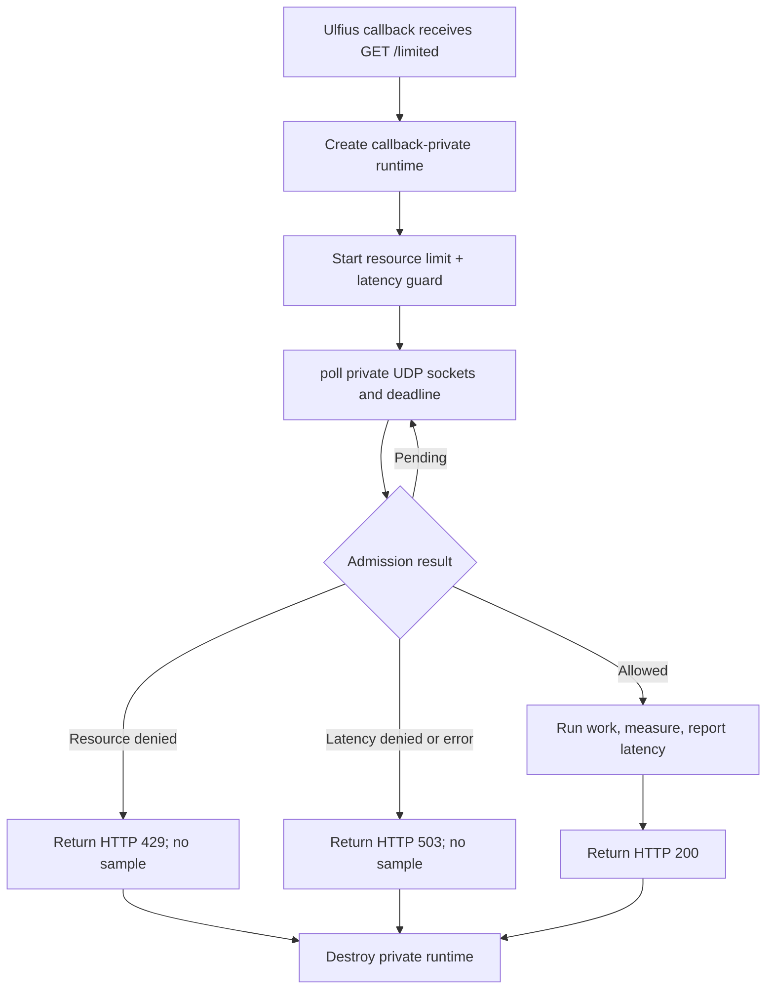

# Ulfius per-callback runtime

This self-contained example serves `GET /limited` with Ulfius. Each
libmicrohttpd connection callback owns a private runtime and polls one combined
resource/latency admission request to completion. Nothing mutable is shared
between callback threads.

Allowed requests run protected work, measure it monotonically, and report the
sample before returning the HTTP response. Replace `perform_protected_work()`
with the database query, RPC, or other operation the endpoint should protect.

## Control flow



## Build and run

Install Ulfius and its `libulfius` pkg-config metadata, then:

```sh
make -C ../..
make
RATELIMITLY_TENANT=example \
RATELIMITLY_AUTH_KEY=secret \
./ulfius-example
curl -i http://127.0.0.1:8000/limited
```

Or use CMake:

```sh
cmake -S . -B build
cmake --build build
./build/ulfius-example
```

## Decision mapping

- `200`: admitted; protected work completed and latency was reported.
- `429`: denied by the resource limit, alone or with the latency guard.
- `503`: denied only by latency, or admission infrastructure failed.

Denied requests never run or report protected work.

## Ownership and scaling tradeoff

One connection callback owns its runtime, sockets, request, poll loop, and
result. This avoids locks and leaves the listener thread unblocked, but occupies
one libmicrohttpd worker and initializes a new runtime for every HTTP request.
For high concurrency, prefer the long-lived dedicated bridge demonstrated by
CivetWeb or Onion.

## Platform support

The example is tested on Linux and macOS and uses their POSIX `poll()` API.
Although Ulfius has broader build options, this source deliberately rejects
native Windows; use Mongoose or the Win32 loop example there.
