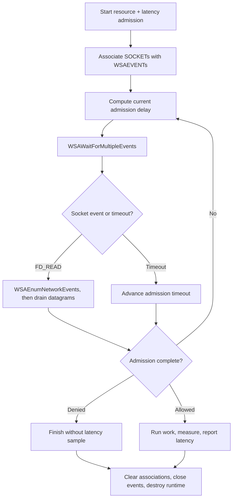

# Native Win32 integration

This example uses native WinSock event objects. `WSAEventSelect` associates a
`WSAEVENT` with each UDP `SOCKET`, and `WSAWaitForMultipleEvents` combines those
readiness notifications with the current admission timeout.

Every request contains one resource rate limit and one latency guard. Only
admitted, completed work is measured and reported; denials and cancellation do
not emit latency samples.

## Control flow



## Build with MinGW-w64

First build a Windows `librclient.a` with a Windows OpenSSL build, then:

```sh
make CC=x86_64-w64-mingw32-gcc \
  RL_CLIENT_LIBRARY=/path/to/windows/librclient.a \
  OPENSSL_PREFIX=/path/to/mingw/openssl
```

Run `win32-example.exe` directly on Windows, through Wine on Linux, or through
CrossOver on macOS. Set `RATELIMITLY_AUTH_KEY`. The key defaults discovery to
`_ratelimitly._udp.c-<key-id>.p0.ratelimitly.com`; optional
`RATELIMITLY_TENANT` overrides it. Fixed responder variables remain optional.

The repository test cross-compiles the complete client and exercises three
separate paths under Wine: allow, resource denial, and latency-guard denial.
It unsets `RATELIMITLY_TENANT` so the synthetic key supplies the tenant ID. The
allowed path must emit exactly one sample for the guard's tracker; both denial
paths must emit none. The responder remains alive through a post-exit drain so
late or duplicate reports also fail the test:

```sh
MINGW_OPENSSL_PREFIX=/path/to/mingw/openssl \
WINDOWS_RUNNER=/usr/lib/wine/wine64 \
  bash ../../tests/test_windows_example.sh
```

This deterministic test deliberately fixes the responder host and port, so it
does not exercise DNS. The runtime unit tests separately assert that a key-only
configuration formats `c-<key-id>.p0.ratelimitly.com`. Real P0 SRV discovery
belongs to the separate production smoke stage, not this deterministic fixture.

The OpenSSL prefix may use either `lib` or `lib64`. `WINDOWS_RUNNER` is optional;
without it the test still performs a strict compile and link check. CrossOver's
`wine --bottle <64-bit-bottle> win32-example.exe` can run the same binary on
macOS. To run the full responder assertions there without installing MinGW, set
`WINDOWS_EXAMPLE_BINARY` to a PE built on Linux or Windows and set
`WINDOWS_RUNNER_ARGS='--bottle <64-bit-bottle> --no-gui'`.

## Build with CMake/MSVC

Install the MSVC build of OpenSSL with vcpkg, then point CMake at vcpkg's
toolchain file. Run these commands from this example directory in PowerShell:

```powershell
vcpkg install openssl:x64-windows
cmake -S . -B build -A x64 `
  -DCMAKE_TOOLCHAIN_FILE="$env:VCPKG_ROOT/scripts/buildsystems/vcpkg.cmake" `
  -DVCPKG_TARGET_TRIPLET=x64-windows
cmake --build build --config Release
./build/Release/win32-example.exe
```

CMake compiles the client and the example with the same selected compiler. This
avoids mixing a MinGW `librclient.a` with Visual Studio's incompatible `.lib`
format and C runtime. Both targets build with `/W4 /WX`; warnings fail the build.
The same project builds `r-test-responder.exe` from the repository fixture
sources. The `windows-latest` job uses both MSVC-built executables for allow,
resource-deny, and latency-deny scenarios. It checks the exact tracker fields,
one matching report only on allow, and a post-exit drain for forbidden or
duplicate reports. The separate MinGW/Wine job provides a second ABI/toolchain
check of the same behavior.

## Platform support

This example is intentionally Windows-only and supports both native MSVC and
MinGW-w64 builds. The Makefile accepts an explicit Windows `librclient.a` for
cross-compilation; CMake builds the client sources itself for Visual Studio. Use
the epoll, kqueue/libdispatch, or portable third-party loop examples for native
Linux and macOS hosts.

## Ownership and shutdown

The runtime owns WinSock startup and every `SOCKET`. The application owns event
objects, request storage, and the copied outcome. Clear each `WSAEventSelect`
association and close its event before destroying runtime sockets. Never cast a
`SOCKET` to `int`; its type is pointer-width on 64-bit Windows.

## API references

- [`WSAEventSelect`](https://learn.microsoft.com/en-us/windows/win32/api/winsock2/nf-winsock2-wsaeventselect)
  defines event association and nonblocking socket behavior.
- [`WSAWaitForMultipleEvents`](https://learn.microsoft.com/en-us/windows/win32/api/winsock2/nf-winsock2-wsawaitformultipleevents)
  defines wait results and timeout semantics.
